# DHCP UBUNTU

- [Instalación del servicio DHCP en Ubuntu](#id1)

- [Configuración del servicio DHCP:](#id2)

    - [Creación de un ámbito nuevo asociado al dominio con el intervalo de direcciones IP que consideres conveniente.](#id3)

    - [Configurar puerta de enlace y servidores DNS a suministrar a los clientes.](#id4)

    - [Configurar resto de opciones necesarias.](#id5)

    - [Establecer una reserva de dirección asociada a un equipo específico (MAC).](#id6)

    - [Resetear el servicio de DHCP](#id7)

- [Comprobar funcionamiento DHCP configurando adecuadamente la máquina cliente y anotando parámetros recibidos](#id8)

- [Tener en cuenta que el servidor no debe estar abierto a la red (configurar adaptador en red interna) para no provocar conflictos de direcciones.](#id9)

## Instalación del servicio DHCP en Ubuntu 

Primero tenemos que instalar el servicio de DHCP, por lo tanto debemos escribir el siguiente comando que muestra en la imagen.

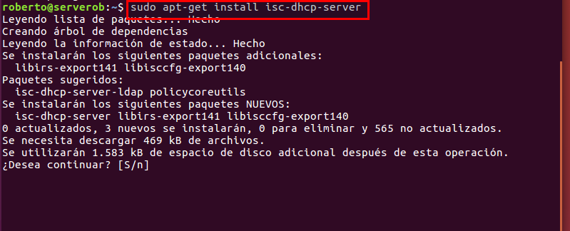

## Configuración del servicio DHCP

Para configurar los ficheros de configuración de DHCP, tenemos que ir a la siguiente ruta.

    cd /etc/dhcp/dhcpd.conf

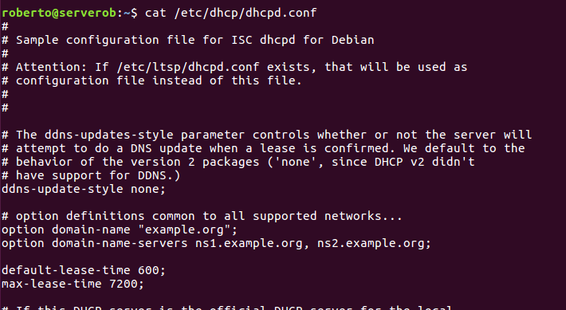

Para editar el fichero debemos utilizar un comando llamado nano o gedit.

> Importante
    Realizar una copia de seguridad del fichero dhcpd.conf.

### Creación de un ámbito nuevo asociado al dominio con el intervalo de direcciones IP que consideres conveniente. 

Tenemos que editar el fichero dhcpd.conf.

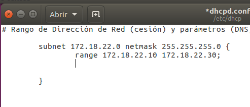

En mi caso utilizamos una red de clase B con una mascara de /24

### Configurar puerta de enlace y servidores DNS a suministrar a los clientes.

En el mismo fichero añadimos nuevos parámetros para configurar los DNS y puerta de enlace.

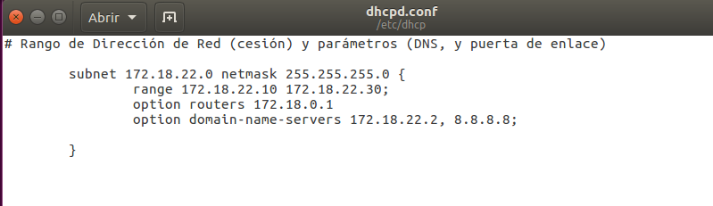

### Configurar resto de opciones necesarias.

En el mismo fichero debemos crear unos paramétros nuevos para las nuevas opciones.

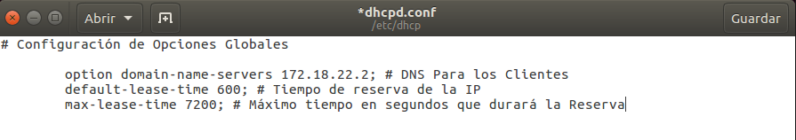

### Establecer una reserva de dirección asociada a un equipo específico (MAC). 

En el mismo ficheros escribimos las siguientes líneas y parámetros.

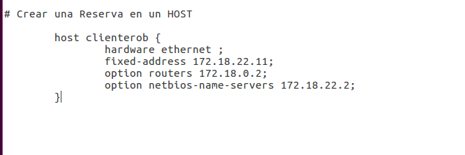

Fichero final de configuración del dhcpd.conf

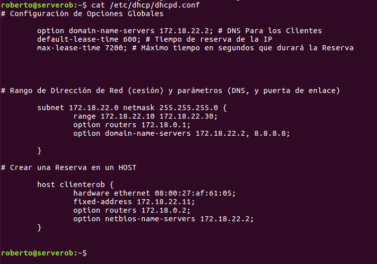

### Resetear el servicio de DHCP 

Solo tenemos que escribir el comando que tenemos en la imagen, para recargar todos los ficheros de configuración del dhcp creado.

Para ver si esta funcionando el servicio escribimos el siguiente comando.

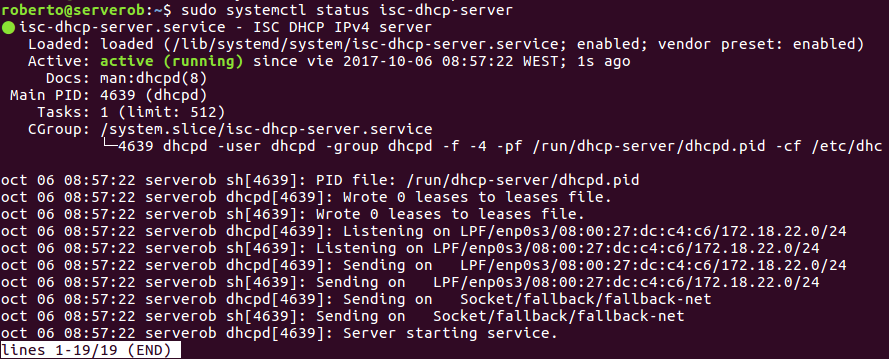

Si en algún momento el servicio te da algún error, debemos ir al fichero log, para ver que problema tiene.

    cat /var/log/syslog

### Comprobar funcionamiento DHCP configurando adecuadamente la máquina cliente y anotando parámetros recibidos. 

Se comprueba en un equipo cliente Ubuntu que obtiene un dirección IP.

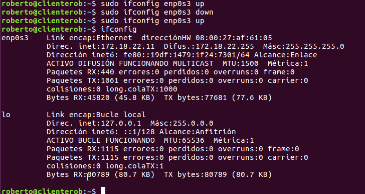

El comando ifconfig enp0s3 down y up es para activar y desactivar la tarjeta de red.

Como reserva la IP es la 172.18.22.11.

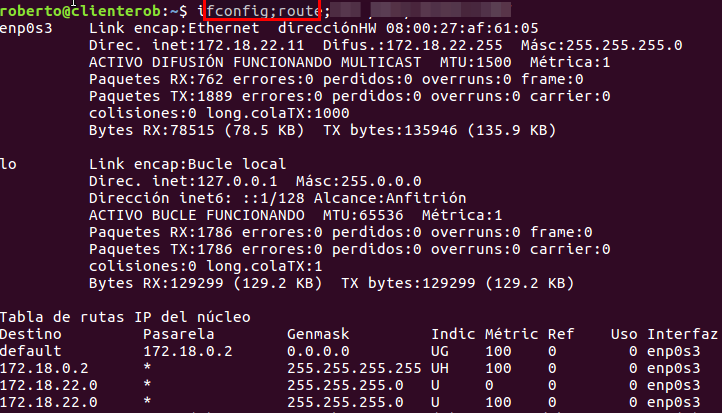

Comprobamos con el entorno gráfico.

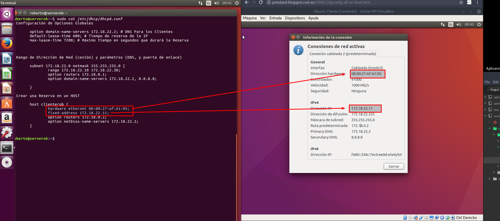

Realizamos con un Equipo de Windows para ver si le da una dirección IP

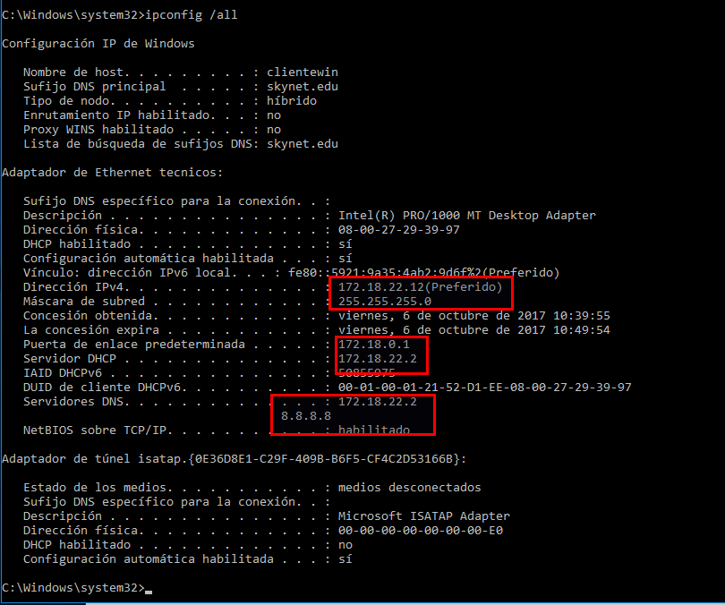

Como se comprueba no da la dirección IP 172.18.22.11, porque está reservada para el Equipo Cliente de Ubuntu.

### Tener en cuenta que el servidor no debe estar abierto a la red (configurar adaptador en red interna) para no provocar conflictos de direcciones. 

Todas las configuraciones de los Equipos cliente y el servidor tienen las tarjeta de red en modo interno con su mismo nombre.

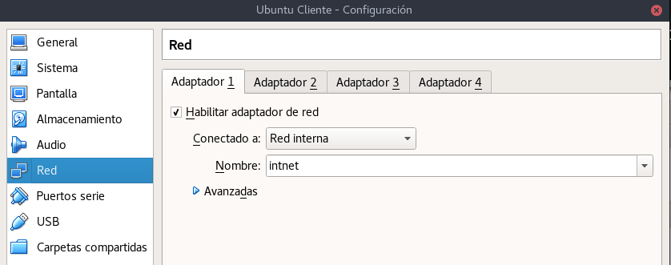
