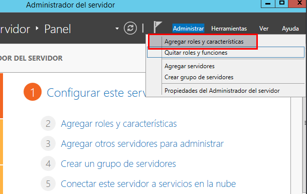
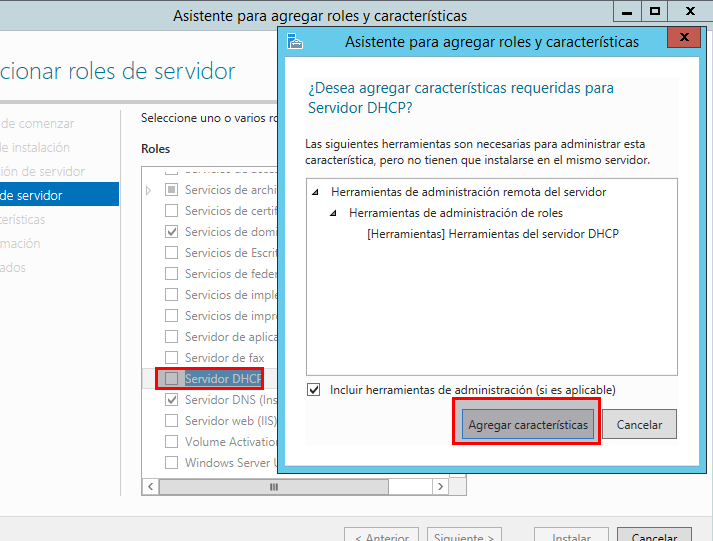
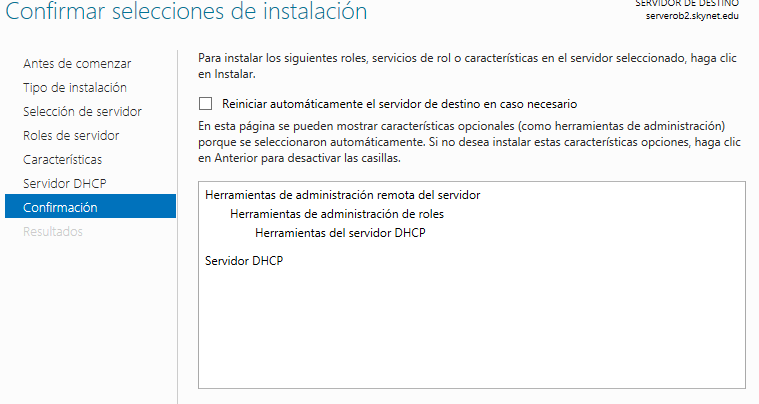

# Configuración DHCP en Windows Server 2012
 Tenemos que ir administrador, luego vamos añadir roles nuevos.

 

 Seguimos el asistente de Windows. Llegaremos al apartado que tenemos que activar el servicio DHCP

  

  Seleccionamos DHCP Server nos pedirá agregar los componentes necesarios.
  Seguimos el asistente de Windows hasta llegar a la configuración DHCP.

   
