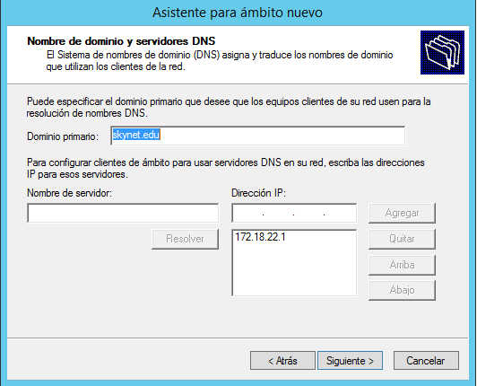
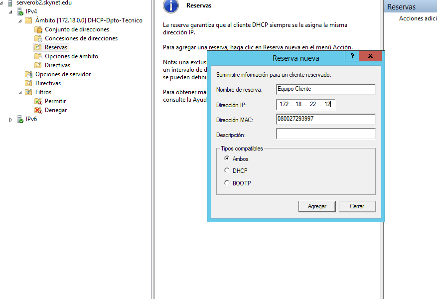
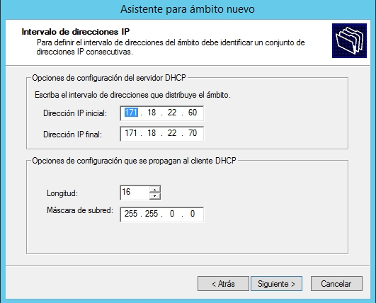

# Windows Server 2012-DHCP

- [Instalación DHCP en Windows Server 2012](#id1)

- [Configuración del servicio DHCP](#id2)

    - [Creación de un ámbito nuevo asociado al dominio con el intervalo de direcciones IP que consideres convenientes.](#id3)

    - [Agregar exclusiones de direcciones](#id4)

    - [Configurar puerta de enlace y servidores DNS a suministrar a los clientes.](#id5)

    - [Configurar resto de opciones necesarias](#id6)

    - [Establecer una reserva de dirección asociada a un equipo específico (MAC)](#id7)

    - [Configurar algunas opciones de ámbito además de las habituales](#id8)

    - [Configurar también algunas opciones de servidor (aplicables a todos los ámbitos)](#id9)

- [Comprobar funcionamiento DHCP configurando adecuadamente la máquina cliente y anotando parámetros recibidos](#id10)

- [Tener en cuenta que el servidor no debe estar abierto a la red (configurar adaptador en red interna) para no provocar conflictos de direcciones](#id11)

- [Crear un nuevo ámbito con los parámetros (rangos, exclusiones, reservas, opciones de ámbito) que te parezcan oportunas y que sea compatible con el anterior](#id12)

- [Comprobar el funcionamiento del nuevo ámbito desde el cliente](#id13)

- [Crear un superámbito DHCP que incluya a los dos ámbitos anteriores](#id14)

- [Desactivar el superámbito y comprobar que DHCP deja de prestar servicio en ambos ámbitos](#id15)

## Instalación DHCP en Windows Server 2012
 Tenemos que ir administrador, luego vamos añadir roles nuevos.

 

 Seguimos el asistente de Windows. Llegaremos al apartado que tenemos que activar el servicio DHCP

  

  Seguimos con la instalación.

  

  Seleccionamos DHCP Server nos pedirá agregar los componentes necesarios.
  Seguimos el asistente de Windows hasta llegar a la configuración DHCP.

   

  Completar la instalación, seguimos el asistente de Windows.

  

  

  

## Configuración del servicio DHCP

Tenemos que ir al administrador del servidor, seleccionamos la pestaña herramienta y elegimos DHCP.

 

 Se abre la ventana nueva para crear los ámbitos.

  

### Creación de un ámbito nuevo asociado al dominio con el intervalo de direcciones IP que consideres convenientes.

Tenemos que desplegar el IPv4 para crear un nuevo ámbito.

Seguimos el asistente de Windows.

Alquiler de una dirección IP al equipo cliente.

Se termina la creación de un nuevo ámbito.

### Agregar exclusiones de direcciones.

Para agregar exclusiones de direcciones lo podemos realizar desde que estamos creando el ámbito de DHCP.

Podemos crear nuevas exclusiones en el Servidor.

### Configurar puerta de enlace y servidores DNS a suministrar a los clientes.

Configuración de la Puerta de enlace

Configuración de los DNS

### Configurar resto de opciones necesarias.

Tenemos que ir al ámbito creado en el DHCP-dpto-tecnico y buscamos la opciones del ámbito.

Se abre una nueva ventana y dentro podemos configurar diferentes opciones, en este caso sera la de recursos compartidos en una red.

### Establecer una reserva de dirección asociada a un equipo específico (MAC). 

En el servicio de DHCP tenemos que ir a la carpeta reserva y con el botón derecho del ratón creamos una nueva.

### Configurar algunas opciones de ámbito además de las habituales.

En la carpeta de ámbito tenemos varias opciones para configurar, en este caso yo configuro una ubicación para recursos.

### Configurar también algunas opciones de servidor (aplicables a todos los ámbitos).

Se abre una nueva ventana y podemos configurar las siguientes opciones.

## Comprobar funcionamiento DHCP configurando adecuadamente la máquina cliente y anotando parámetros recibidos.

Ejecutamos un cliente Windows 10 y comprobamos que el servidor DHCP este funcionando.

## Tener en cuenta que el servidor no debe estar abierto a la red (configurar adaptador en red interna) para no provocar conflictos de direcciones.

Es importante que tengamos en el VirtualBox configurado la tarjeta de red en modo interno.

## Crear un nuevo ámbito con los parámetros (rangos, exclusiones, reservas, opciones de ámbito) que te parezcan oportunas y que sea compatible con el anterior.

Importante antes de crear un ámbito nuevo, tenemos que agregar una nueva tarjeta de red al Servidor 2012 desde el VirtualBox y en modo red interna y le cambiamos el nombre de la red interna.

Ejecutamos el Windows Server 2012 y cambiamos los nombres de la tarjeta de red por si nos equivocamos.

Creamos un nuevo ámbito. Seguimos el mismo procedimiento que el ámbito anterior.

En este caso voy a utilizar una red de clase c.

El rango de dirección IP es el siguiente:

Realizamos una reserva para la siguiente IP

## Comprobar el funcionamiento del nuevo ámbito desde el cliente.

Vamos al Equipo Cliente y le agregamos desde el VirtualBox una nueva tarjeta red, pero en modo red interna y con un nombre diferente.

Iniciamos el Windows 10, realizamos el siguiente comando.

    ipconfig /release
    ipconfig /renew

Como muestra en la siguiente imagen, a la tarjeta de red llamada tecnico, nos da un dirección IP del DHCP-Dpto Técnico y la tarjeta de red llamada comercial, nos da una dirección IP del DHCP-dpto-comercial.

## Crear un superámbito DHCP que incluya a los dos ámbitos anteriores.

Se crea un superámbito, solo tenemos que ir al servidor y con el botón secundario del ratón buscar la opción que dice superámbito. Seguimos el asistente de Windows.

Le damos siguiente

seleccionamos los ámbitos

El proceso de la creación de los super ámbito termina.

## Desactivar el superámbito y comprobar que DHCP deja de prestar servicio en ambos ámbitos.

Al desactivar el superámbito el servicio de DHCP no funciona en ninguno.

Comprobación en el Equipo Cliente que no funciona el DHCP, no tiene ninguna dirección IP

