# DHCP Failover Windows Server 2012

- [Agregar un segundo Servidor](#1)

- [DHCP del Servidor Principal](#2)

    - [Configuración conmutación por error ( DHCP Failover)](#3)

    - [DHCP secundario](#4)

    - [Equipo Cliente](#5)

- [Captura con el Servidor DHCP Principal suministrando IP al Equipo Cliente](#6)

- [Captura con el Servidor DHCP Secundario suministrando IP al Equipo Cliente](#7)

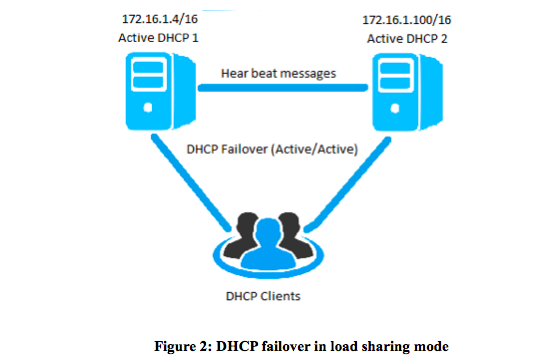

    Trabajo Realizado por:

        [Noelia Hernández Domínguez]()
        [Kevin Hernández García]()
        [Roberto Hernández Sanabria](https://github.com/xxkiroxx/servicios-red-internet/blob/master/trim1/u1/a3-dhcp-failover-windows/README.md)

## Agregar un segundo Servidor
Tenemos que ir a la ventana administrador del Servidor.

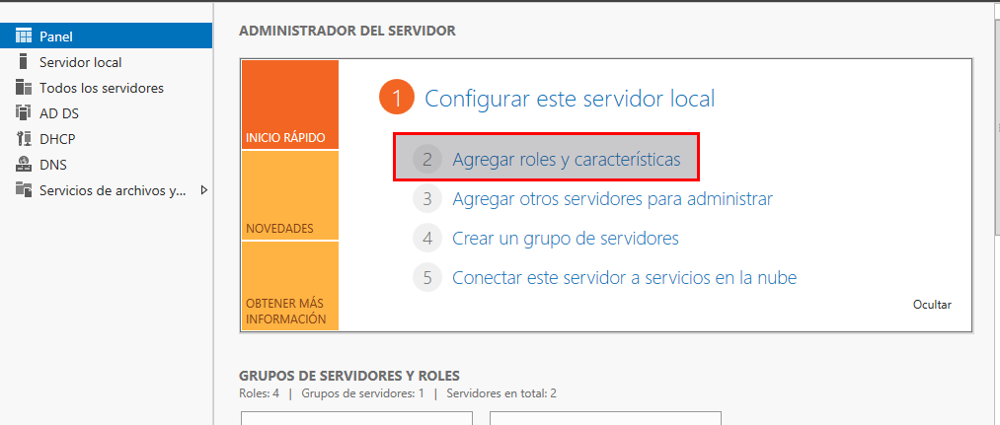

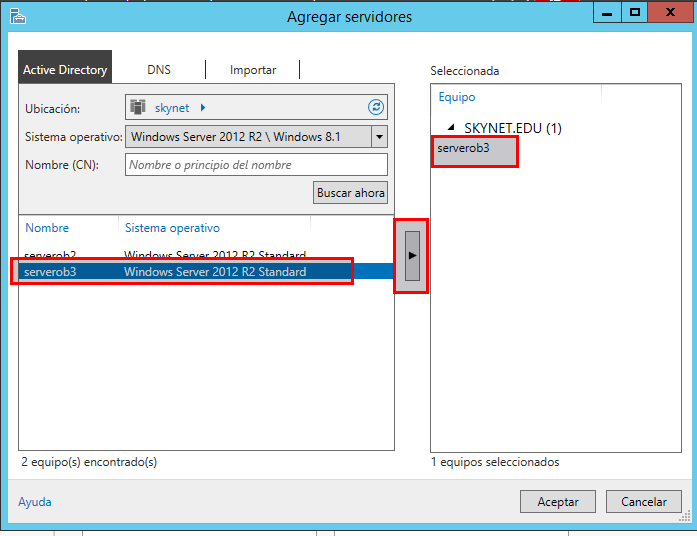

Solo tenemos que darle buscar ahora, te salen los servidores disponibles, seleccionamos el servidor y le damos a la flecha para pasarlo para el cuadro de la derecha. Los servidores ya se conocen entre ellos, dentro de su directorio activo.

## DHCP del Servidor Principal

Tenemos creado ya dos ámbitos de DHCP en el servidor principal.

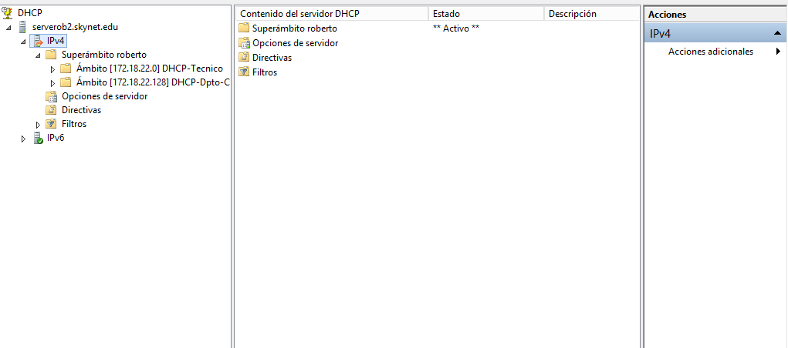

- DHCP del servidor Secundario

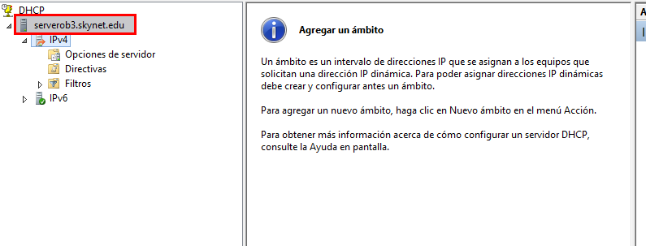

### Configuración conmutación por error ( DHCP Failover)  

Con el botón secundario del ratón en el servidor principal y seleccionamos configurar conmutación por error.

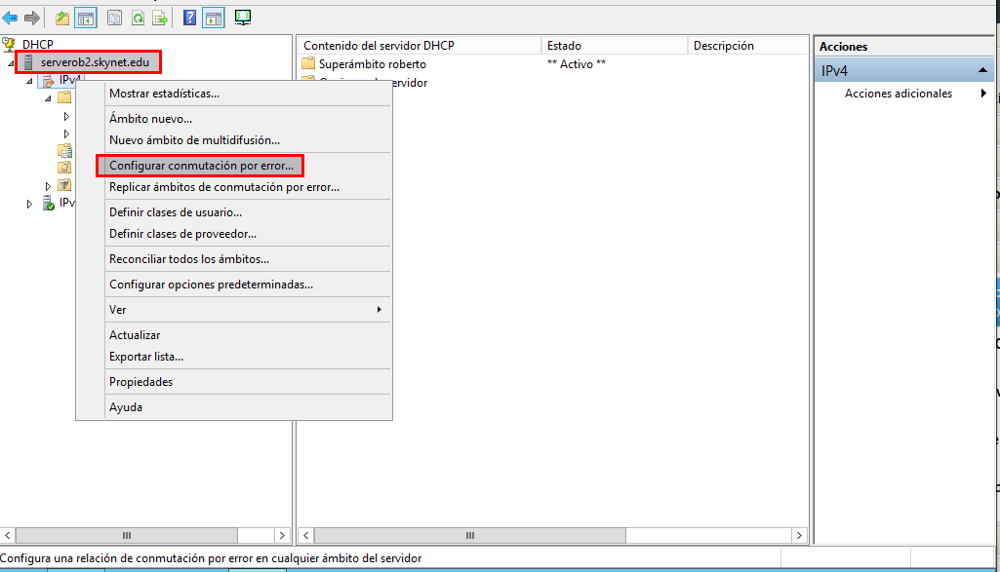

Se nos abre una nueva venta en la que seleccionamos los ámbitos.

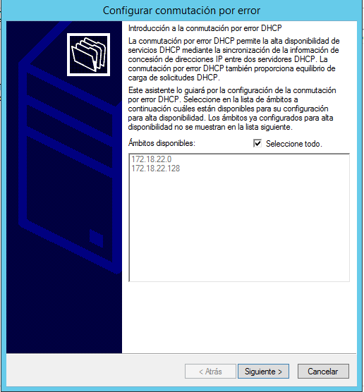

Tenemos que buscar el servidor secundario para que pueda pasar toda la información de la configuración de los ámbitos.

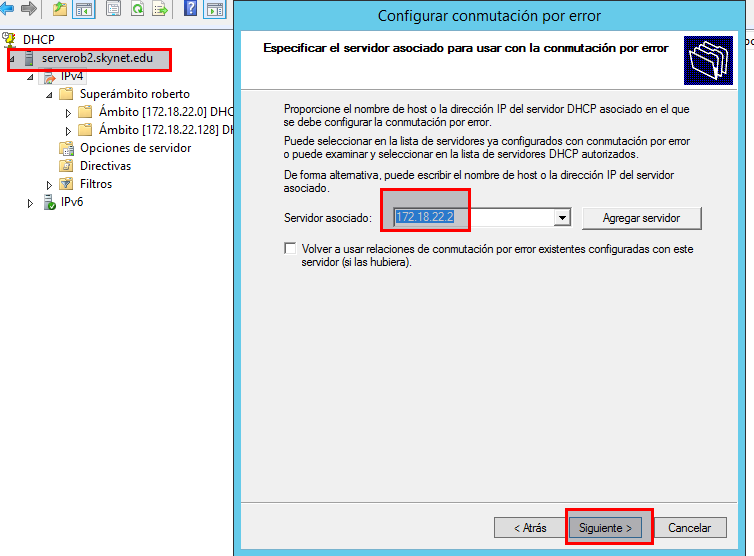

Podemos escribir la IP o ir agregar servidor.

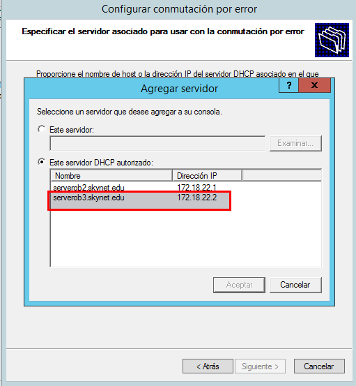

Seleccionamos el servidor secundario.

Le damos aceptar y se nos abre una nueva ventana para crear una nueva relación.

El modo es equilibrio de carga, le damos siguiente.

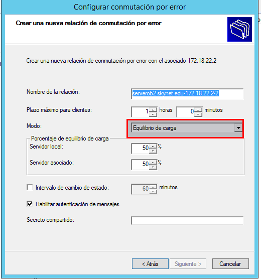

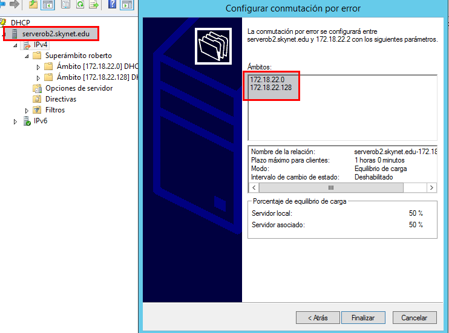

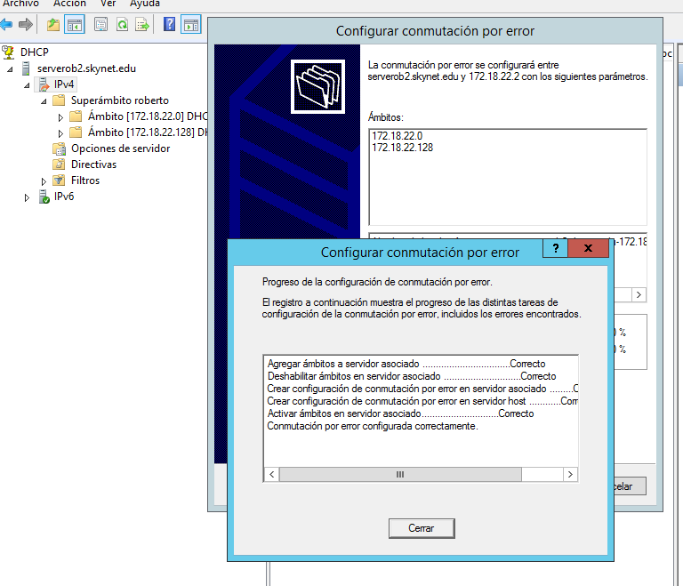

También podemos configurarlo en el modo de `espera activa, espera`. Si configuramos está opción el servidor secundario se quedá a la espera de que falle el servidor principal de DHCP.

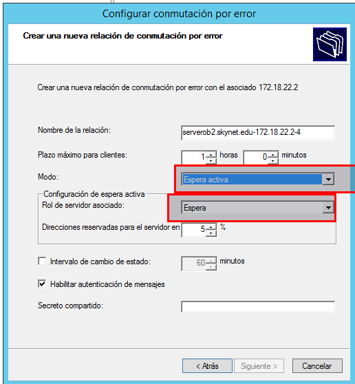

El modo de `espera activa, activa`. Si configuramos está opción el servidor secundario está siempre activo, falle o no el servidor principal.

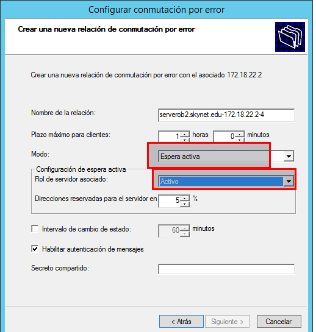

### Eliminación de Conmutaciónpor error

Solo tenemos que seleccionar el protocolo IPv4, le damos propiedades, seleccionamos la pestaña conmutación por error y eliminamos las existente.

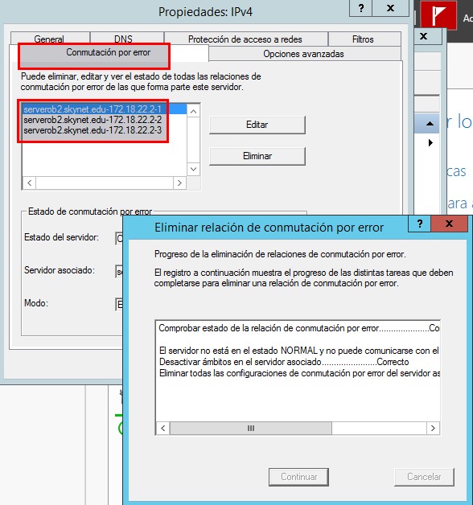

### DHCP secundario

Solo tenemos que darle actualizar y se tiene que actualizar todas las configuraciones de los ámbitos del DHCP principal.

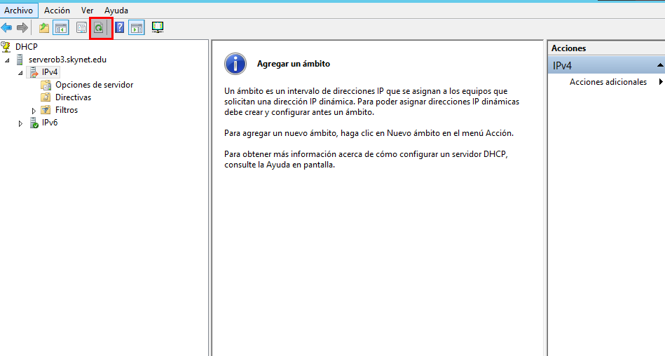

Después de actualizar.

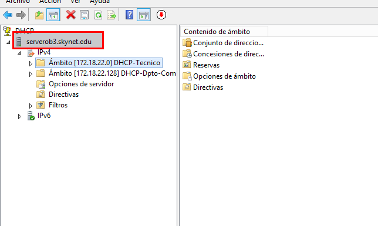

## Equipo Cliente

Realizamos un `ipconfig /release` y `ipconfig /renew`

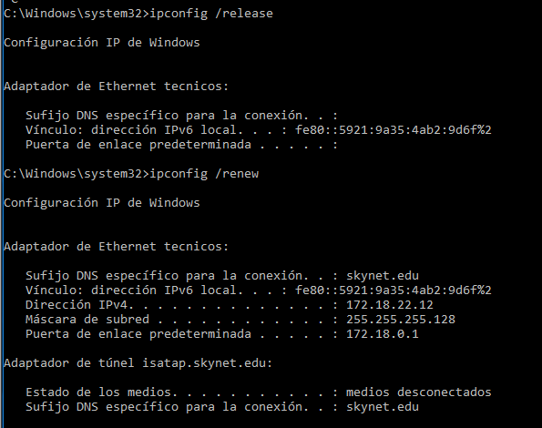

Realizamos un `ipconfig /all`

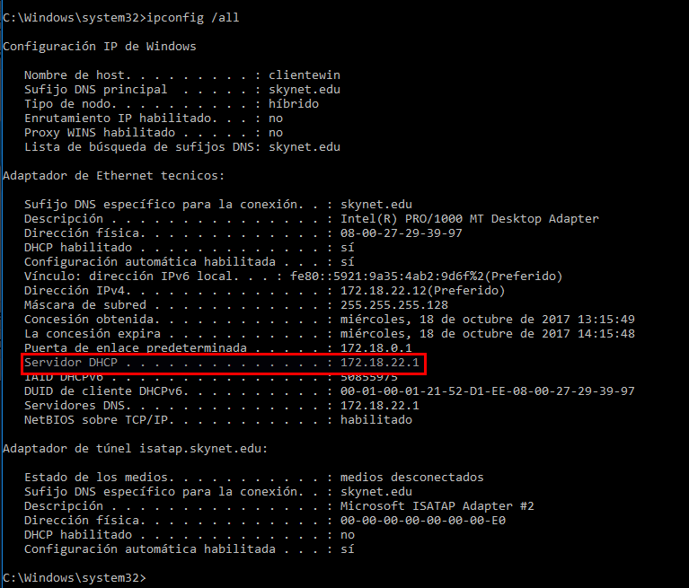

Se comprueba y el Servidor DHCP principal no está dando la dirección IP.

Para simular un fallo del servidor DHCP Principal, desactivamos el DHCP principal.

Realizamos de nuevo un Realizamos un `ipconfig /release` y `ipconfig /renew`

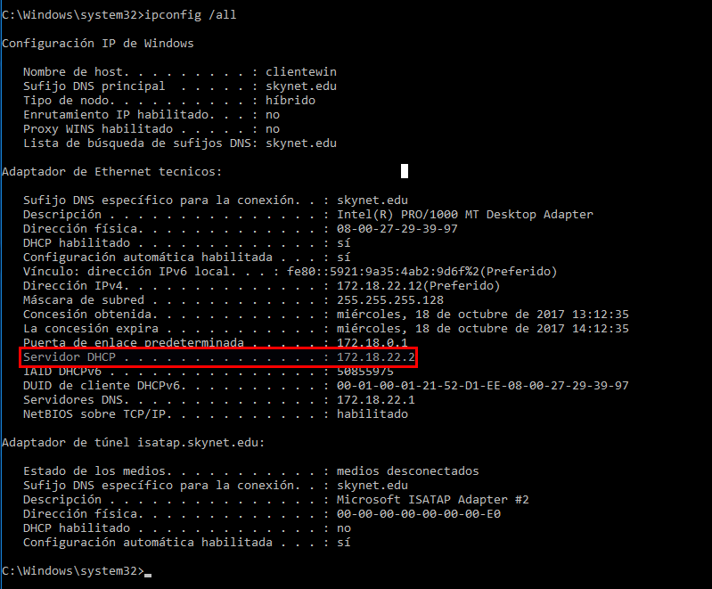

El servidor secundario DHCP está dando dirección IP al Equipo cliente.

## Captura con el Servidor DHCP Principal suministrando IP al Equipo Cliente

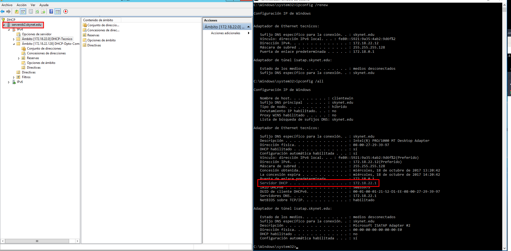

## Captura con el Servidor DHCP Secundario suministrando IP al Equipo Cliente

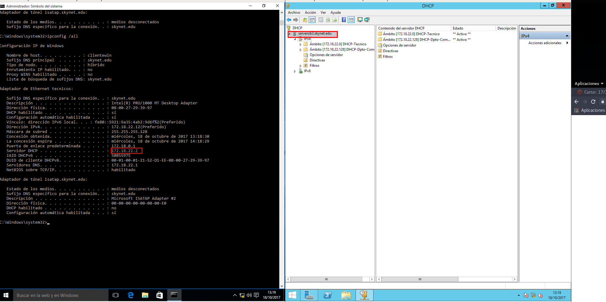
