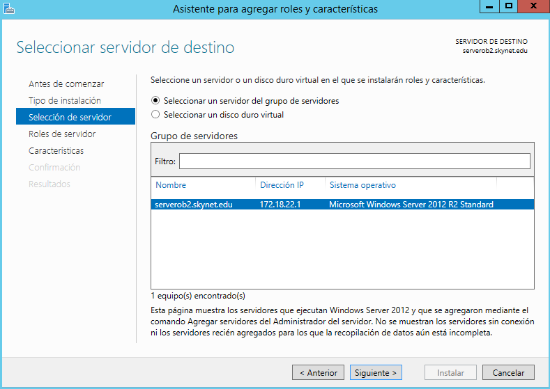
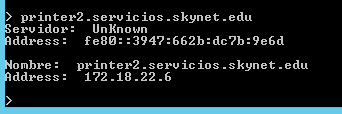
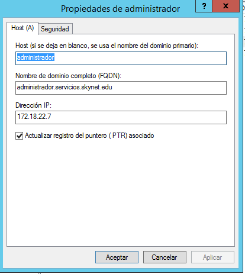
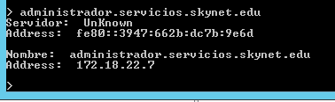
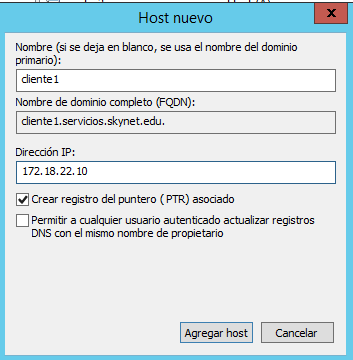

# DNS en Windows Server 2012


## Realizar la instalación y configuración de un servidor DNS en una máquina con Windows Server 2012. Se piden las siguientes acciones de configuración y prueba del funcionamiento del servicio:

Tenemos que abrir la ventana de `Administrador del servidor -> Administrar -> Agregar Roles`.


- Le damos siguiente para seleccionar el servicio `DNS`.




- Seleccionamos el Servidor `DNS`.

- En nuestro caso ya tenemos instalado el DNS porque hemos instalado en la práctica anterior un `Directorio activo` y que por defecto instala el servicio de `DNS`.


Comprobamos que tenemos el servicio instalado en el siguiente ruta `Administrador del servidor -> Herramientas -> DNS`


- Se nos abre una ventana nueva de `Administrador de DNS`, comprobamos en la `zonas de búsqueda directa`


## Creación de una nueva Zona Búsqueda Directa

Tenemos que entrar en `Administador del servidor -> Herramientas -> DNS`

- Con el botón secundario del ratón seleccionamos `Zona nueva`.


- Seleccionamos Zona Principal y le damos siguientes.


- Escribimos un nombre nuevo para la zona.


- Por lo tanto ya tenemos configurado una nueva zona Directa.

## Crear una zona de búsqueda inversa para tu subred.

En la carpeta de `Zonas de Búsqueda inversa` con el botón secundario del ratón creamos una nueva zona inversa.


- Seleccionamos `Zona Principal`


- Ya tenemos configurado la nueva `Zona de Búsqueda inversa`.


## Configurar reenviadores de DNS con fry o puerta de enlace actual y DNS público (p.e.: 195.235.113.3 / 80.58.61.250 / 8.8.8.8).

Seleccionamos nuestro servidor `serverob2 -> Propiedades -> reenviadores`


- Seleccionamos `reenviadores`


- Le damos a editar para añadir nuevos `reenviadores`


- Ya tenemos configurado los nuevos reenviadores para que se convierta en `Servidor Caché de DNS`

## Configurar el servidor para ser servidor DNS Caché (en la configuración estática de red).


### Configurar cliente para que su servidor DNS sea el servidor W2012. Comprobar el funcionamiento como caché DNS de ambas máquinas al acceder a sitios de Internet.

Configuramos la tarjeta de red con la IP del DNS del Servidor Windows Server 2012.

- Realizamos dos pruebas para ver si funciona correctamente el DNS. Desde el Equipo cliente utilizamos el comando `nslookup`.


## Configuraremos el servidor como DNS Maestro, además de Caché.

La configuración de un Servidor DNS Maestro solo con tener registros en el propio servidor de DNS, como por ejemplo, `cname, mx, a`. Ya hemos creado una zona directa y vamos a crear un alias para el servidor, para impresora y un email.

## En la zona de búsqueda directa añadir los siguientes registros:


### Comprobación con el comando `nslookup`


### Un alias para tu servidor denominado server.


### Comprobación con el comando `nslookup`


### Una impresora con IP fija denominada printer (no hace falta alias).


### Comprobación con el comando `nslookup`


### Un servidor de correo (ficticio) denominado correo, asociado a una dirección en tu servidor.

Solo tenemos que seleccionar el nuevo intercambio de correo MX.


### Comprobación con el comando `nslookup`


## Registros en la Zona de búsqueda directa

Registros de los hosts con el nombre.


## Registros en la Zona de búsqueda inversa

Registros de los hosts con la IP


## Crear una subzona denominada servicios (dominio nuevo)

Vamos a crear una nueva zona en la zona directa. Solo debemos seguir los mismos pasos.


### Agregar a ésta un servidor ftp (asociado a la misma IP del servidor)


#### Comprobación con el comando `nslookup`


### Una impresora nueva (con una IP fija)


#### Comprobación con el comando `nslookup`



### El equipo del administrador del sistema (también con IP fija).




#### Comprobación con el comando `nslookup`



### Validar un cliente en el dominio y comprobar que el nombre de su equipo aparece en la zona de búsqueda del servidor como un nuevo registro A.





### Registros en el nuevo zona de búsqueda directa, llamada `servicios`


### Comprobar desde la consola del cliente que se resuelven correctamente los nombres dados de alta en el servidor (aunque en algunos casos, si se trata de direcciones ficticias, no se obtenga respuesta).

```console

C:\Windows\system32>nslookup ftp.servicios
Servidor:  serverob2.skynet.edu
Address:  172.18.22.1

Nombre:  ftp.servicios
Address:  172.18.22.1


C:\Windows\system32>nslookup administrador.servicios
Servidor:  ftp.servicios
Address:  172.18.22.1

Nombre:  administrador.servicios
Address:  172.18.22.7


C:\Windows\system32>nslookup impresora.servicios
Servidor:  serverob2.skynet.edu
Address:  172.18.22.1

Nombre:  impresora.servicios
Address:  172.18.22.6


C:\Windows\system32>nslookup -type=mx mail
Servidor:  ftp.servicios
Address:  172.18.22.1

mail.skynet.edu MX preference = 10, mail exchanger = mailserver.skynet.edu
mailserver.skynet.edu   internet address = 172.18.22.5

C:\Windows\system32>nslookup -type=cname server
Servidor:  serverob2.skynet.edu
Address:  172.18.22.1

server.skynet.edu       canonical name = serverob2.skynet.edu

C:\Windows\system32>

```

### Realizar, también desde el cliente, algunas operaciones con nslookup tanto dentro como fuera de nuestra intranet.
