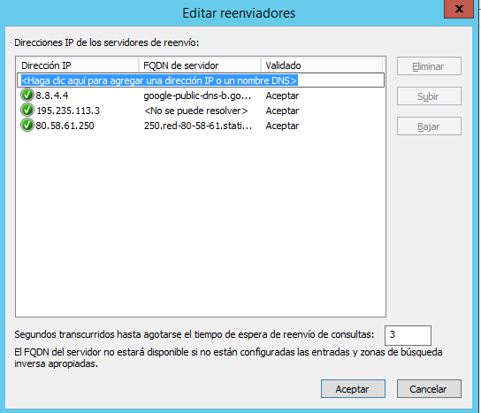

# DNS en Windows Server 2012

## Realizar la instalación y configuración de un servidor DNS en una máquina con Windows Server 2012. Se piden las siguientes acciones de configuración y prueba del funcionamiento del servicio:

Tenemos que abrir la ventana de `Administrador del servidor -> Administrar -> Agregar Roles`.

- Le damos siguiente para seleccionar el servicio `DNS`.

- Seleccionamos el Servidor `DNS`.

- En nuestro caso ya tenemos instalado el DNS porque hemos instalado en la práctica anterior un `Directorio activo` y que por defecto instala el servicio de `DNS`.

Comprobamos que tenemos el servicio instalado en el siguiente ruta `Administrador del servidor -> Herramientas -> DNS`

- Se nos abre una ventana nueva de `Administrador de DNS`, comprobamos en la `zonas de búsqueda directa`

## Creación de una nueva Zona Búsqueda Directa

Tenemos que entrar en `Administador del servidor -> Herramientas -> DNS`

- Con el botón secundario del ratón seleccionamos `Zona nueva`.

## Crear una zona de búsqueda inversa para tu subred.

## Configurar reenviadores de DNS con fry o puerta de enlace actual y DNS público (p.e.: 195.235.113.3 / 80.58.61.250 / 8.8.8.8).

## Configurar el servidor para ser servidor DNS Caché (en la configuración estática de red).

### Configurar cliente para que su servidor DNS sea el servidor W2012. Comprobar el funcionamiento como caché DNS de ambas máquinas al acceder a sitios de Internet.

Configuramos la tarjeta de red con la IP del DNS del Servidor Windows Server 2012.

## Configuraremos el servidor como DNS Maestro, además de Caché.

## En la zona de búsqueda directa añadir los siguientes registros:

### Un alias para tu servidor denominado server.

### Una impresora con IP fija denominada printer (no hace falta alias).

### Un servidor de correo (ficticio) denominado correo, asociado a una dirección en tu servidor.

Crear una subzona denominada servicios (dominio nuevo) y agregar a ésta un servidor ftp (asociado a la misma IP del servidor), una impresora nueva (con una IP fija) y el equipo del administrador del sistema (también con IP fija).
Comprobar que se resuelven los nombres desde la consola del servidor.
Validar un cliente en el dominio y comprobar que el nombre de su equipo aparece en la zona de búsqueda del servidor como un nuevo registro A.
Comprobar desde la consola del cliente que se resuelven correctamente los nombres dados de alta en el servidor (aunque en algunos casos, si se trata de direcciones ficticias, no se obtenga respuesta).
Realizar, también desde el cliente, algunas operaciones con nslookup tanto dentro como fuera de nuestra intranet.
