# Instalar IIS en Windows 2012 Server (Asistente para configurar servidor Servidor de Aplicaciones IIS). Incluir Autenticación Básica y de Windows.

Tenemos que ir agregar o quitar roles

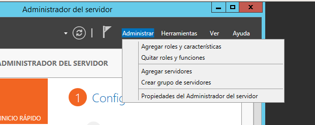

Seleccionamos IIS.

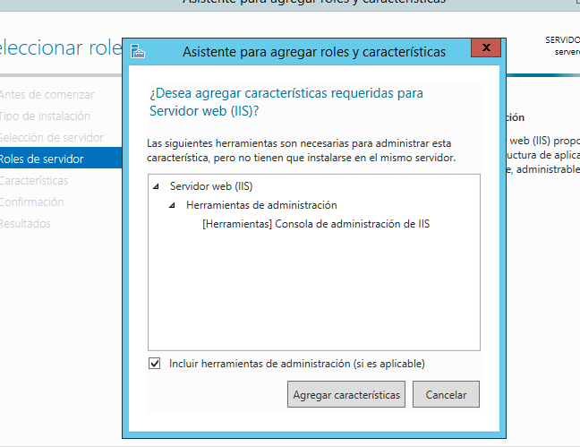

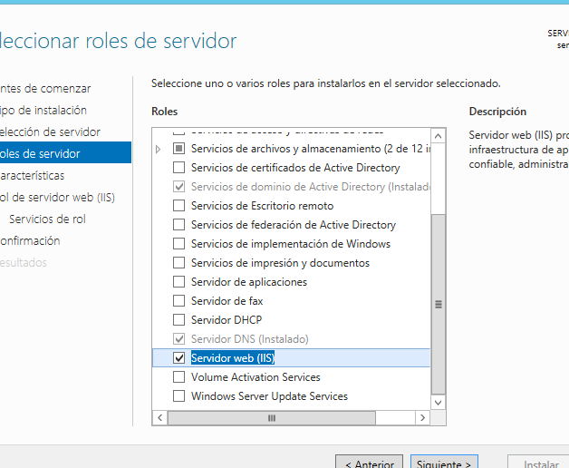

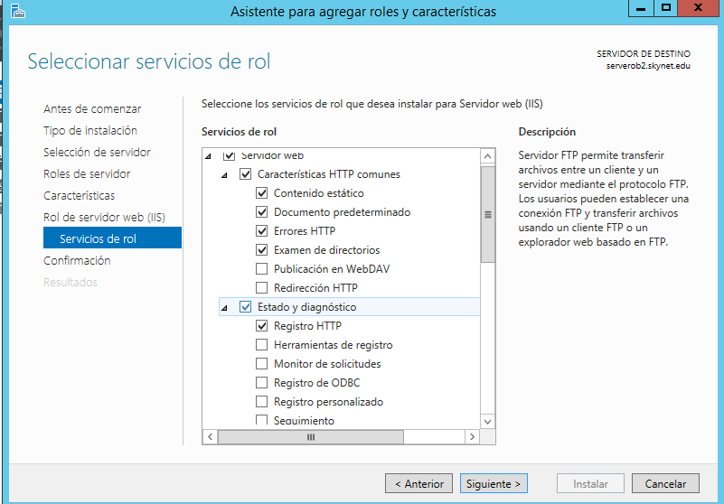

Marcamos Autenticación de Windows y Básica

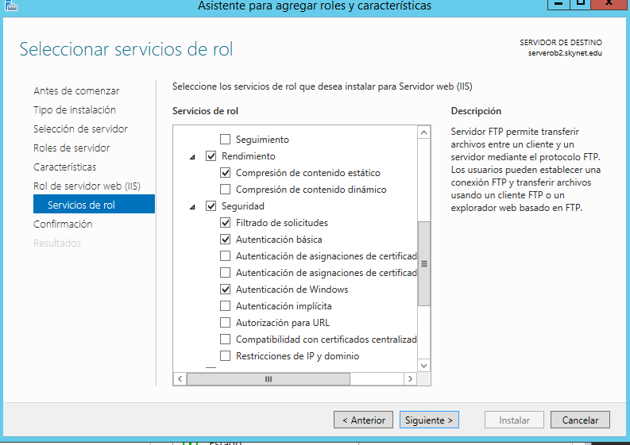

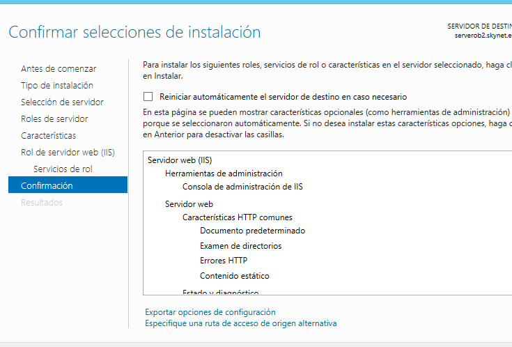

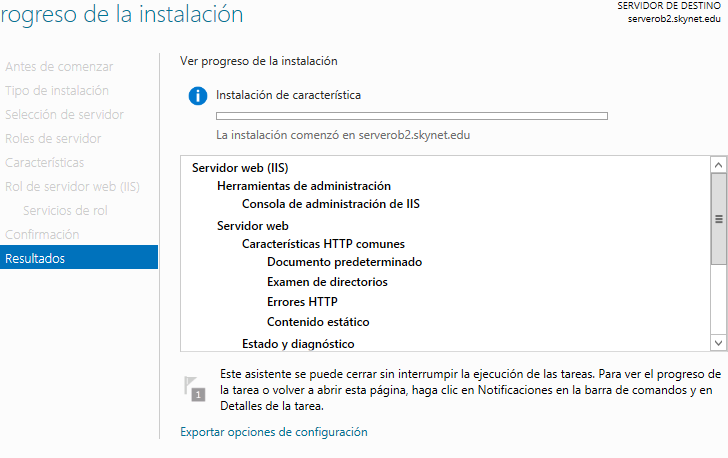

# Comprobar acceso a nuestro servidor web (localhost) desde un navegador web (debe aparecer una página en construcción).

Vamos al navegador localhost y se nos muestra una página de prueba que viene configurado de IIS.

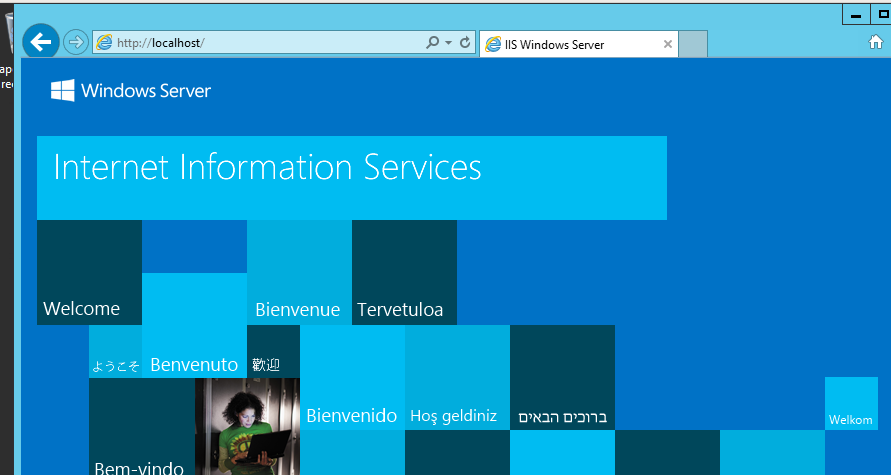

La ruta donde se encuentra el fichero index.html.

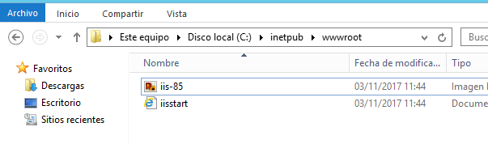

# Entrar en cliente Windows 7 y acceder, desde un navegador web, a la página principal del servidor a través de la IP del servidor.

Entramos en un equipo cliente y abrimos un navegador y escribimos la IP del servidor `http://172.18.22.1/`.

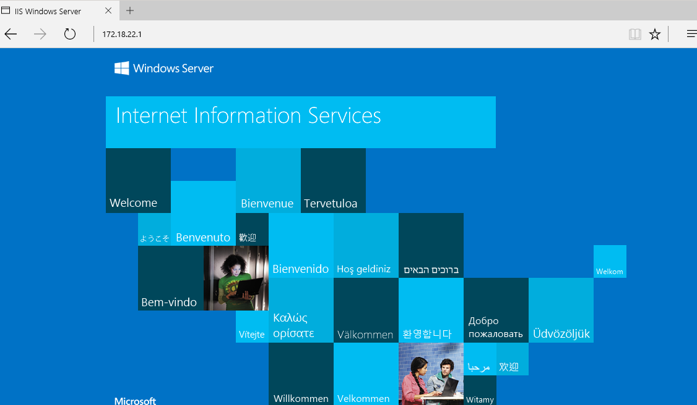

# Acceder ahora desde W7 a la misma página mediante el nombre principal del dominio y desde cualquier otro alias que haya sido definido en la configuración DNS.

Entramos en un equipo cliente y abrimos el navegador y comprobamos que podemos ver nuestra página mediante el nombre. `http://skynet.edu`

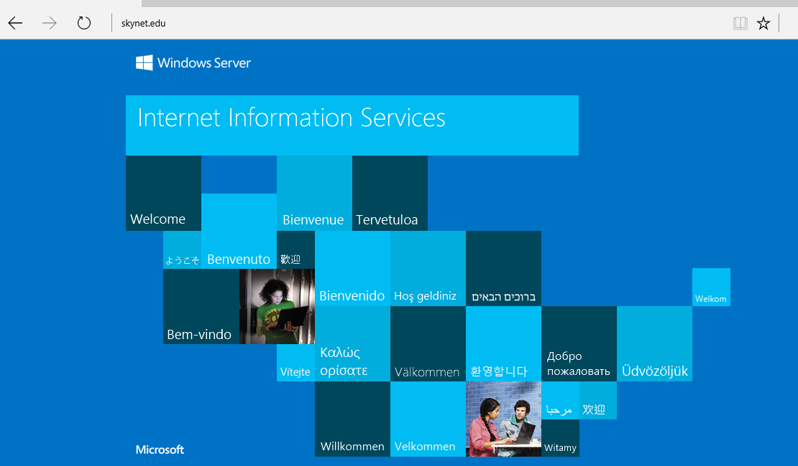

Seguimos el mismo proceso pero con el alias `http://server/`

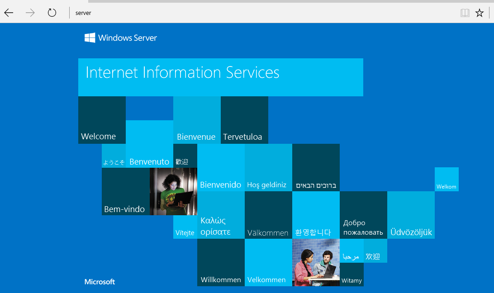

# Tratar de acceder desde W7 al sitio www del dominio principal. ¿Qué ocurre? Añade un alias en el servicio DNS que relacione el sitio www con el dominio principal. Intenta ahora acceder desde W7.

Escribimos en el navegador del cliente `http://www.skynet.edu` no funciona porqué no tenemos agregado el alias `www`

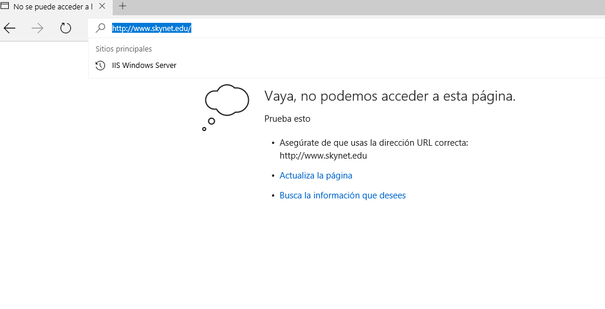

Ahora tenemos que ir al Servidor DNS y agregar un nuevo alias `www`

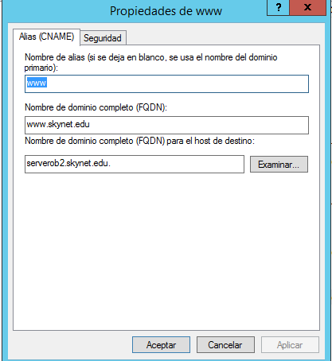

Volvemos al navegador del cliente y escribimos http://www.skynet.edu/

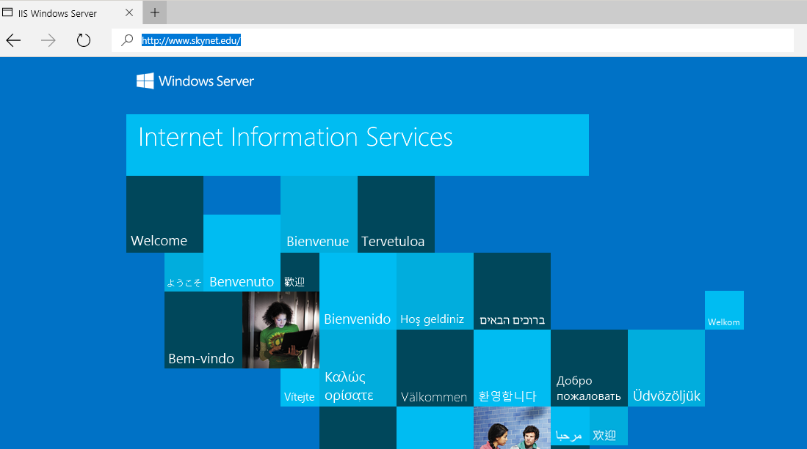

# Crea una página web HTML sencilla (index.htm) como página principal de tu dominio y colócala en C:\Inetpub\wwwroot. Comprueba el acceso a esta página desde el propio servidor y desde el cliente, utilizando los diferentes alias y direcciones configurados en el servicio DNS.

Creamos una página Web en le servidor en la ruta `c:/Inetpub\wwwroot`

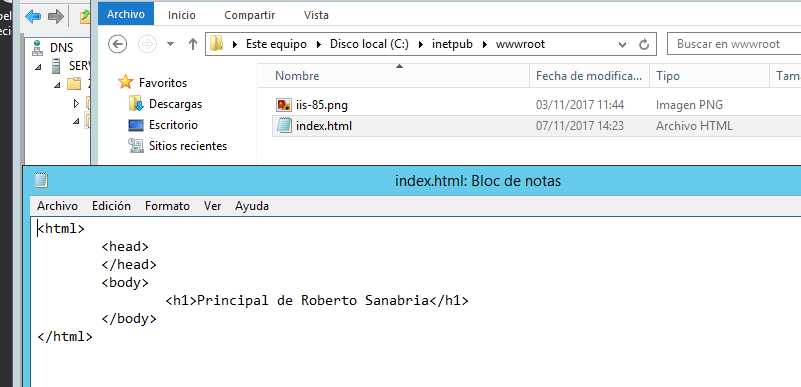

Comprobamos en el Equipo cliente con http://skynet.edu/

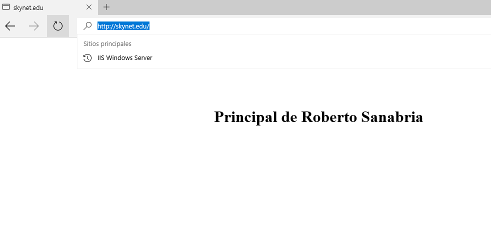

Comprobamos en el Equipo Cliente con http://www.skynet.edu/

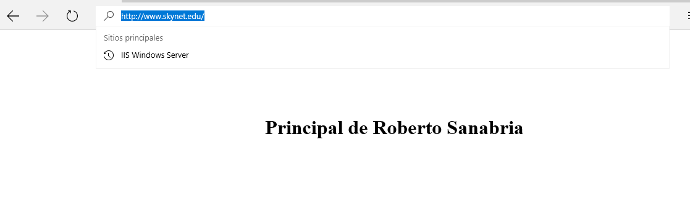

# Crea un pequeño sitio web con varias páginas e imágenes organizadas en subcarpetas de wwwroot. Abre el Administrador de Internet Information Services y comprueba la estructura del sitio creado en Sitio Web Predeterminado. Accede y navega por el sitio web tanto desde el servidor como desde el cliente W7.

Tenemos que ir a la siguiente ruta para configurar la organización de subcarpetas.

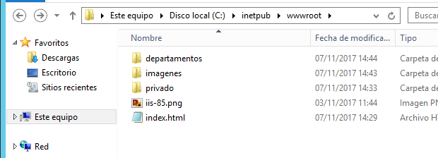

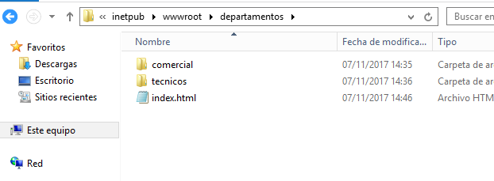

Comprobamos desde el navegador del cliente que podemos acceder a las siguientes subcarpetas creadas. `http://www.skynet.edu/departamentos/`

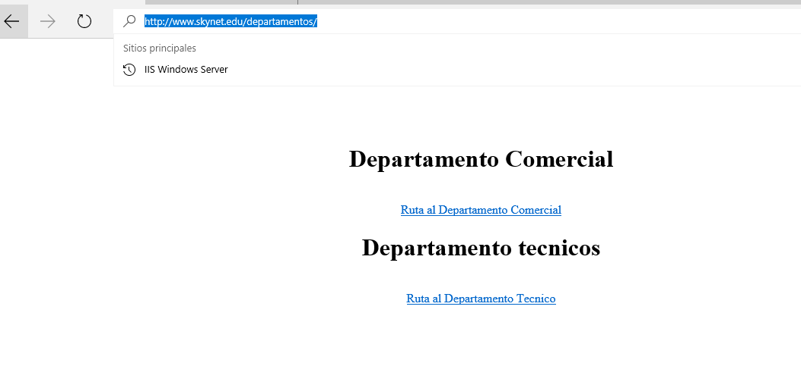

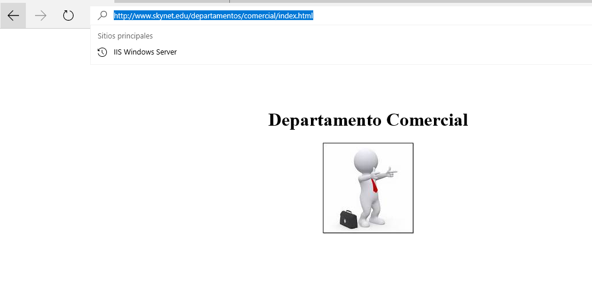

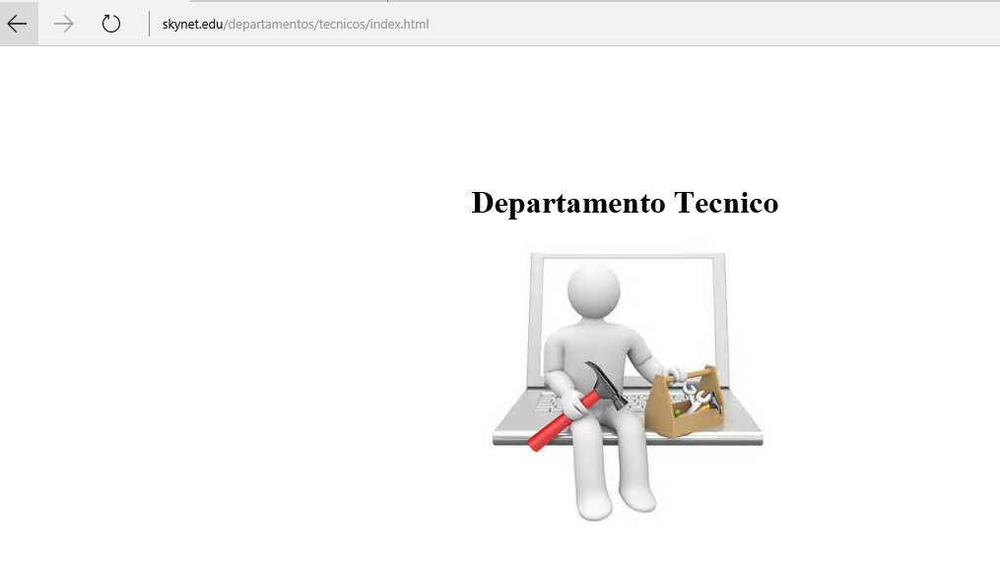
