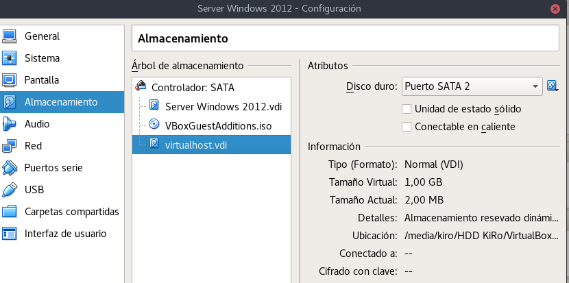

## Creación de 2 sitios Web llamado `www.terminator.edu` y `t800.terminator.edu` este es un subdominio del dominio principal de `terminator.edu`.

Lo primero que tenemos que realizar es meter en el VirtualBox del servidor Windows server 2012 un `disco duro nuevo de 1GB`.



Iniciamos el Windows Server 2012 y le damos formato al nuevo disco duro para que sea reconocible por el Sistema Operativo.


Creamos las siguientes carpetas en `E:\`.


### Comenzamos para crear dos nuevos sitios Web. Tenemos que ir `Administrador -> Internet Information Services (IIS)`


Estamos dentro de la ventana de IIS, solo tenemos que situarnos en Sitios y con el botón secundario del ratón `agregar sitio Web nuevo`.


Creamos los nuevos dos Sitios Web.

- Sitio Web 1 Dominio Principal http://www.terminator.edu


- Sitio Web 2 Subdominio del Dominio Principal http://t800.terminator.edu


- Resultado Final de los dos Dominios creados.


### Tenemos que Crear una Zona Directa nueva llamada terminator.edu

Lo primero tenemos que crear una zona directa seguimos el asistente, agregamos nuevos alias, por ejemplo `www` y tambien algún registor `A` como se muestra en la imagen.


Creamos una zona de subdominio llamada `t800`


### Realizamos Comprobación desde el Equipo para ver si podemos acceder a los Sitios Web.

- Sitio Web 1 `www.terminator.edu`


- Sitio Web 1 `www.terminator.edu/informes`


- Sitio Web 2 `t800.terminator.edu`


- Sitio Web 2 pero subcarpeta `t800.terminator.edu/t1`


Realizamos comprobación con el comando `nslookup`

```console
C:\Windows\system32>nslookup www.terminator.edu
Servidor:  t800.terminator.edu
Address:  172.18.22.1

Nombre:  serverob2.terminator.edu
Address:  172.18.22.1
Aliases:  www.terminator.edu


C:\Windows\system32>nslookup t800.terminator.edu
Servidor:  serverob2.skynet.edu
Address:  172.18.22.1

Nombre:  t800.terminator.edu
Address:  172.18.22.1


C:\Windows\system32>
```
