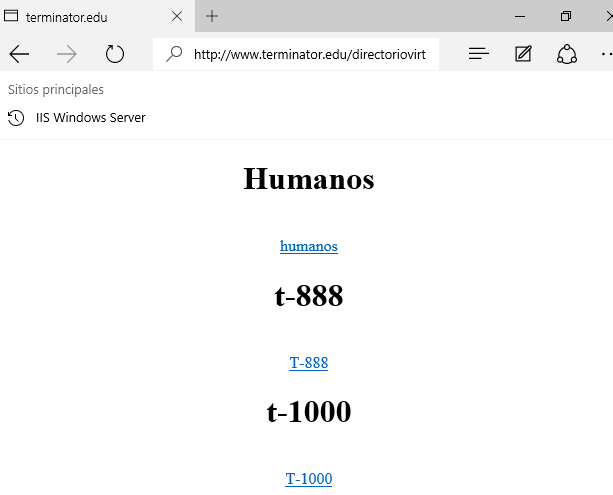

## Crea un nuevo directorio virtual en IIS (dentro del citado sitio web) y relaciónalo con la carpeta que has creado.

Lo primero que tenemos que realizar es crear el directorio principal llamado `directoriovirtual` y las subcarpetas son `humano`, `t1000`,`t888`

Cada uno de la carpetas tienen un `index.html`

### IIS Crear nuevo directorio virtual

Solo tenemos que ir `Administrador de Internet Information Services`.

Seleccionamos el Sitio Web de `www.terminator.edu` y con el botón secundario del ratón le damos agregar directorio virtual.

Por lo tanto ahora tenemos un directorio virtual totalmente ubicado en un lugar diferente al que tiene `www.terminator.edu`

Para acceder al directorio virtual nuevo solo tenemos que escribir `www.terminator.edu/directoriovirtual`

### Realizamos una comprobación desde el Equipo Cliente.

- Realizamos la comprobación desde `www.terminator.edu/directoriovirtual`

- Realizamos la comprobación desde `www.terminator.edu/directoriovirtual/humano`

- Realizamos la comprobación desde `www.terminator.edu/directoriovirtual/t888`

- Realizamos la comprobación desde `www.terminator.edu/directoriovirtual/t1000`

### Configuración del Directorio Activo para que tenga autoindex

Entramos al administrador de Internet Information Services(IIS)

Le damos al icono de examen de directorios -> le damos a habilitar.

Quitamos de la carpeta de directorio activo el index.html

Vamos al cliente y comprobamos desde el navegador que podemos ver la estructura de ficheros.

