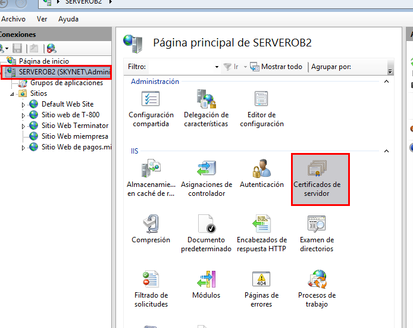
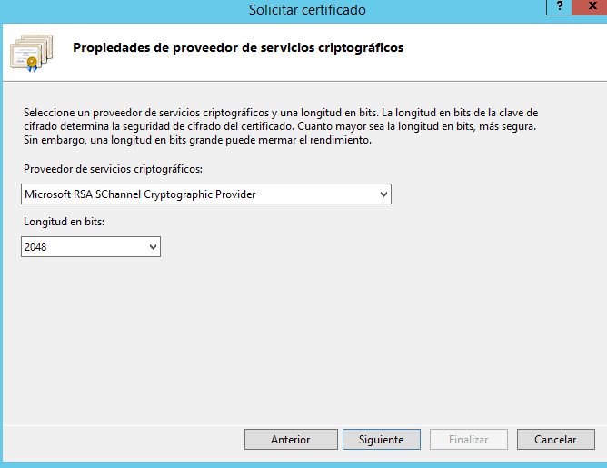
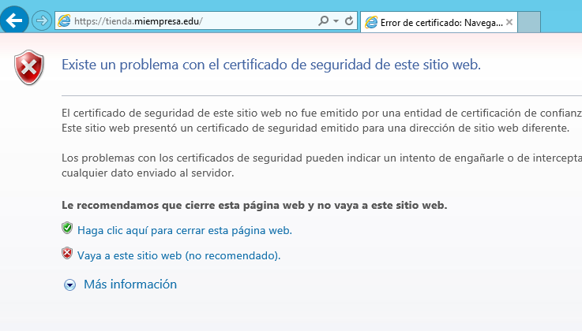

# Práctica IIS-Parte 4 Certificado SSL

## 1. Crea una nueva zona de búsqueda directa en los servicios DNS asociado al dominio miEmpresa.

Lo primero que tenemos que crear es una zona directa nueva en el DNS llamada `miempresa.edu`.

Tenemos que crear dos registros en el DNS tipo `A=serverob2` y `CNAME=www`.

### 1.1 Creación de Directorio E:\miempresa

Vamos al disco duro E:\ y creamos el directorio `miempresa`

## 2. Creación de Sitio Web en IIS

Entramos en el administrador de IIS y agregamos un `sitio web nuevo`.

Se comprueba que hemos creado el sitio web nuevo.

Ya tenemos el sitio web `www.miempresa.edu` operativa, agregamos un index.html para comprobar que funciona con el puerto 80

### 2.1 Creación de un subdominio llamado `pagos.miempresa.edu`, pero debemos configurarlo mediante conexión segura vía `https`.

- Primero tenemos que ir a los DNS para agregar un subdominio llamado `pagos`.

- Agregamos un sitio Web nuevo llamado `pagos.miempresa.edu`

Por ahora lo agregamos sin `https`, necesitamos generar un certificado autofirmado. Ese será nuestro siguiente paso.

### 2.2 Generar un certificado autofirmado desde IIS.

- Vamos al administrador de IIS y nos situamos en la página principal de serverob2 y hacemos clic en el `certificados de servidor`

- Luego vamos al cuadro de la derecha y le damos `crear certificado autofirmado`

- Se nos abre una ventana nueva, para escribir nombre del certificado.

- Ya tenemos creado el certificado

- Volvemos al sitio Web que creamos de `pagos.miempresa.edu` y con el botón secundario le damos `agregar modificaciones`.

- le damos agregar enlace de sitio y ente caso el tipo `https` y buscamos el certificado SSL.

- Luego solo tenemos que eliminar la de `http`.

- Comprobamos que funciona correctamente la página `https://pagos.miempresa.edu`

## 3 Creación de Sitio Web para `https://tienda.miempresa.edu`

Tenemos que ir al administrador de IIS y creamos el sitio Web nuevo.

### 3.1 Agregar subdominio nuevo en el DNS.

Solo tenemos que ir a los DNS y agregar el dominio de tienda.

### 3.2 Comprobamos que funciona correctamente desde el cliente.

### 3.3 Creación de Sitio Seguro `htpps://tienda.miempresa.edu` con la generación de un certificado Digital a través de la aplicación OpenSSL.

- Escribimos el nombre de la solicitud de certificado.

- Le damos siguiente y en este caso tiene que ser RSA la critográficos y longitud en bits 2048.

- La ruta donde vamos a guardar los datos que vamos a dar a una entidad certificadora.

- Comprobamos como genera el fichero.

#### 3.3.1 Instalación de OpenSSL para simular que es una empresa certificadora.

- Descargamos el programa OpenSSL y los instalamos, el proceso de instalación es muy sencillo, solo debemos seguir el asistente de Windows.

- Termina la instalación de OpenSSL

- Comenzamos con la generación del certificado mediante OpenSSL, primero generamos la clave privada de la entidad certificadora.

- Comprobación del fichero generado.

- Generamos el certificado digital de la entidad certificadora.

- Comprobación del fichero generado.

- Certificado digital de nuestra Web `https://tienda.miempresa.edu`

- Comprobación del fichero generado.

- Ya el certificado digital para nuestra WEB.

- Volvemos al IIS y vamos a nuestro serverob2 y completamos la solicitud de certificado.

- Buscamos la ruta donde se genero el fichero de la certificado digital llamado `iis.crt`

- Le damos acepta y ya tenemos nuestro certificado digital.

- Volvemos a nuestro sitio Web tienda.miempresa.edu y tenemos que borrar el enlace de sitio de web `http` por `https`.

- Desde el cliente comprobamos que podemos acceder a la página Web.
- Este mensaje nos sale porque no tenemos una empresa certificado que lo confirme por lo tanto no es un certificado confiable para trabajar por Internet.

