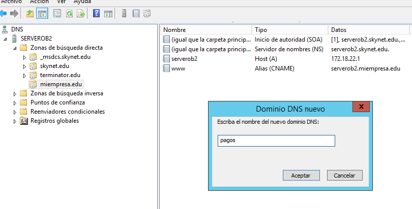

# Práctica IIS-Parte 4 Certificado SSL

## Crea una nueva zona de búsqueda directa en los servicios DNS asociado al dominio miEmpresa.

Lo primero que tenemos que crear es una zona directa nueva en el DNS llamada `miempresa.edu`.

Tenemos que crear dos registros en el DNS tipo `A=serverob2` y `CNAME=www`.

### Creación de Directorio E:\miempresa

Vamos al disco duro E:\ y creamos el directorio `miempresa`

## Creación de Sitio Web en IIS

Entramos en el administrador de IIS y agregamos un `sitio web nuevo`.

Se comprueba que hemos creado el sitio web nuevo.

Ya tenemos el sitio web `www.miempresa.edu` operativa, agregamos un index.html para comprobar que funciona con el puerto 80

### Creación de un subdominio llamado `pagos.miempresa.edu`, pero debemos configurarlo mediante conexión segura vía `https`.

- Primero tenemos que ir a los DNS para agregar un subdominio llamado `pagos`.

- Agregamos un sitio Web nuevo llamado `pagos.miempresa.edu`

Por ahora lo agregamos sin `https`, necesitamos generar un certificado autofirmado. Ese será nuestro siguiente paso.

## Siguiendo los pasos detallados en el documento PDF de Carpetas Seguras y Privadas, crea un nuevo sitio web (denominado ‘pagos’) como subdominio de miEmpresa (pagos.miEmpresa.com) y configura este último para ser accedido de forma segura, vía ‘https’.

### Crea el sitio web, asociado a una carpeta (miEmpresa\pagos) y con la configuración adecuada en IIS y en los servicios DNS. Comprueba el acceso (aún vía ‘http’) con un navegador desde el propio servidor y desde un cliente W7.

### Configuración A: Siguiendo los pasos del tutorial correspondiente, configura el nuevo sitio para que se pueda acceder (sólo) como sitio web seguro (https) con un Certificado Autofirmado.

### Configuración B: Crearemos un nuevo sitio seguro (tienda.miempresa.com) con la generación de un Certificado Digital a través de la aplicación OpenSSL. Para empezar, realizaremos la solicitud de un nuevo certificado de servidor para nuestro sitio seguro (crear fichero certreq.txt).

### Descargar e instalar OpenSSL para Windows

### A través de OpenSSl genera un nuevo certificado de servidor, siguiendo los pasos que se detallan en tutorial web (y comprobando los ficheros generados en cada paso): generar una clave privada de la entidad certificadora, crear un certificado digital de la entidad certificadora y, finalmente, crear un certificado digital de nuestra web.

### Importar el nuevo certificado de servidor creado para completar la petición pendiente en nuestro sitio seguro ‘pagos’.

## Requerir que nuestros sitio seguros sólo se pueda acceder mediante una conexión segura y reiniciar los sitios web.

## Finalmente, acceder mediante http y mediante https a los sitios seguros desde el propio servidor y desde un cliente W7, aceptando los posibles problemas con la entidad certificadora
