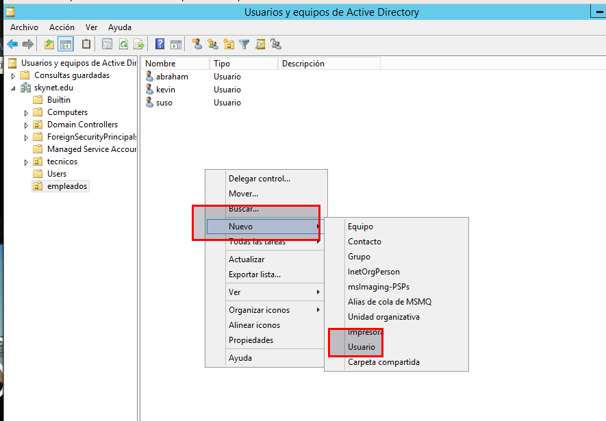

# Práctica de Windows 2012 Server - Carpetas Privadas

## 1. Guiándote por los pasos detallados en el apartado de carpetas privadas del documento PDF de Carpetas Seguras y Privadas, vamos a crear un nuevo sitio web (empleados.miEmpresa.com) destinado a almacenar información privada de los empleados, con las siguientes características:

## 2. Crear una carpeta empleados (dentro de miempresa) y, dentro de esta, tres o cuatro subcarpetas personales con nombres de empleados y una, denominada común, a la que tendrán acceso todos los empleados, pero no otros usuarios sin identificar.

Primero creamos la carpeta `empleados en mi empresa.edu` con las siguientes subcarpetas de los siguientes usuarios.

Comprobamos que se creo correctamente.

## 3. Creamos los usuarios

Tenemos que ir a `usuarios y equipos de active directory` y creamos los siguientes usuarios.

Con el botón secundario del ratón le damos a `nuevo usuarios`.

- Escribimos el nombre del usuario

- Escribimos la contraseña del nuevo usuario.

Captura de todos los usuarios creados.

### 3.1 Creamos el grupo

Vamos a `usuarios y equipos de active directory`

Creamos el grupo `comun`

Agregamos los usuarios creados.

## 4. Crearemos el nuevo sitio web, como subdominio de nuestro dominio principal, asociado a la carpeta genérica empleados.

Vamos al IIS y creamos un sitio web llamado empleados.miempresa.edu

- Establecemos los valores que tenemos en la imagen.

### 4.1 Configurar o actualizar DNS para empleados.miempresa.edu

Tenemos que entrar en el `Administrador de DNS` y establecemos un nuevo alias llamado `empleados`

- Ya tenemos el nuevo registro del DNS y por lo tanto ya tenemos operativo el sitio Web para que funcione.

- Realizamos un `nslookup` para comprobar su funcionamiento.

### 4.2 Activar el Examen de directorios.

Vamos al sitio Web de empleados.miempresa.edu y vamos a `examen de directorios -> habilitar`

- habilitar

#### 4.2.1 Autenticación de los Directorios de los usuarios del Sitio Web empleados.miempresa.edu

Tenemos que ir a Autenticación y tenemos que deshabilitar el anónimo y habilitar el Autenticación básica.

Tenemos que realizar el mismo proceso con las demás carpetas de los usuarios.

## 5. Permisos en las Carpetas de los usuarios.

Vamos a realizar la prueba con una carpeta y luego debemos realizar el mismo trabajo para las demás carpetas.

Seleccionamos la carpeta de kevin y le damos propiedades.

- Vamos a Seguridad y luego a opciones avanzadas.

- Quitamos la herencia.

- Quitamos todos la herencia.

Agregamos el usuario para la carpeta y solo pueda entrar ese usuario.

- Le damos permiso total para el usuario kevin.

En la Carpeta publico agregamos el grupo nuevo llamado comun.

### 5.1 Quitar Herencia a la carpeta empleados.

Vamos a la carpeta de empleados y le quitamos la herencia.

- Quitamos la herencia.

- Agregamos el grupo comun y Administradores

- Agregamos el grupo IIS_USER

## 6. Colocar un fichero index.html diferente en cada una de las carpetas creadas, con el objetivo de poder comprobar el acceso desde un navegador.

Creamos en cada carpeta de usuario un index.html

## 7. Agregar función de Autenticación Básica a nuestro Servicio de IIS a través de la Administración del Servidor.

Agregamos la función de Autenticación Básica a nuestro servicio de IIS.

- Vamos Autenticación y activamos Autenticación Básica.

## 8. Comprobamos el acceso, tanto desde el servidor como desde el cliente W7, a las diferentes carpetas con distintos usuarios.

Realizamos comprobación con las siguientes conexiones de los usuarios.

Conectamos a empleados.miempresa.edu

- Si queremos entrar en la página de Abraham debemos escribir su usuario y contraseña y accedemos.

Como ya estamos logeado con el usuario Abraham y este está dentro del grupo comun, entonces podemos entrar a la carpeta publica sin ningún problema.

