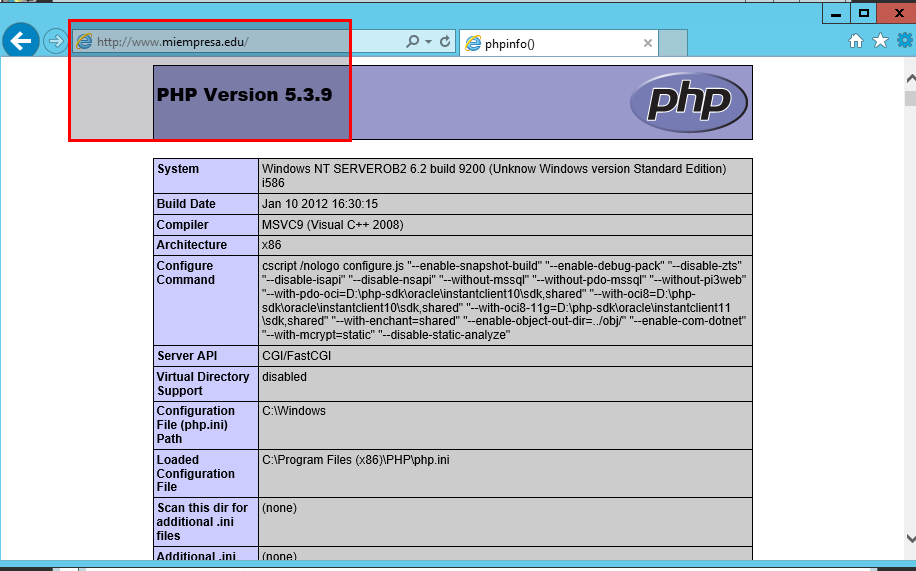
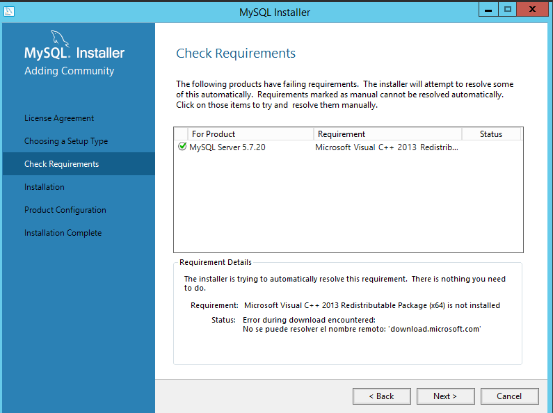
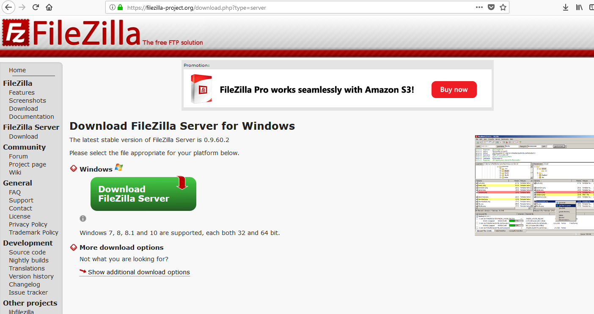

# Práctica de Windows 2012 Server - Internet Information Server (IIS)
## Instalación de PHP, MySQL, PHPMyAdmin y FTP

## 1. Instalación de PHP
Tenemos que ir a la página http://windows.php.net y descargamos la version de `php-5.3.9-nts.msi`

- Ya tenemos descargado el fichero de `php-5.3.9.msi` procesamos con la instalación.

- Le damos siguiente.

- Seleccionamos IIS FastCGI para su correcto funcionamiento con el IIS.

- Si nos sale el siguiente mensaje es que no tenemos una característica instalada en el IIS.

- Tenemos que ir `Administrador del Servidor -> Agregar nuevos roles y tenemos que desplegar el Servidor IIS -> Desarrollo de Aplicación -> CGI`

- Le damos siguiente y instalamos el `CGI`

- Comienza la Instalación.

- Ya tenemos instalado el `CGI` volvemos a iniciar la instalación de `php-5` y ya no sale el mensaje. Instalamos las siguientes opciones.

- Proceso de instalación completada.

- Si queremos comprobar que el servicio php esta funcionando correctamente tenemos que crear un fichero en la carpeta miempresa, llamado `index.php`

- Vamos al navegador y escribimos `www.miempresa.edu` y no muestra una información de nuestro Equipo y la versión de PHP.

## 2. Instalación de MySQL 5.7.20

Tenemos que ir a la página de MySQL y comenzamos a descargar el fichero.

- Tenemos descargado el fichero de `MySQL` y comenzamos con la instalación.

- Siguiente.

- Seleccionamos solo `Server Only`

- Execute para comprobar que esta correcta. Comprobamos que nos falta unas librerias de Microsoft Visual C++ 2013, las instalamos.

- Ya podemos comenzar con la instalación.

- Esperamos que se descargue `MySQL` y termina la instalación. Por lo tanto ya lo tenemos instalado.

- Es necesario comprobar que nuestro sistemas Operativo tiene instalado el `Microsoft-Net Framework 4` Por lo tanto lo descargamos de su página oficial.

- Se comprueba que está actualizado y instalado.

- Se comprueba que la instalación está terminada y solo falta configurar el tipo de conexión.

- Seleccionamos la que viene por defecto.

- Dejamos la configuración por defecto.

- Escribimos la contraseña de root.

- Vamos a crear un usuario nuevo para la base de datos llamado `roberto`

- Se comprueba que está agregado el nuevo usuario y le damos siguiente.

- Dejamos la configuración por defecto.

- Dejamos por defecto la configuración.

- Siguiente.

- Execute

- Terminada la instalación y configuración de `MySQL`

## 3. Crear Sitio Web phpmyadmin.miempresa.edu

Primero tenemos que ir al IIS y creamos un nuevo sitio web llamado `phpmyadmin.miempresa.edu` y le decimos la ruta.

- Comprobamos que se creo correctamente.

## 4. Actualizar Registro en el Servidor DNS

Tenemos que ir al Servidor `DNS` y creamos un nuevo registro de alias llamado phpmyadmin.

## 5. Instalación phpmyadmin

En la página oficial de phpmyadmin descargamos la versión `phpmyadmin4.0.10.20`

- Se descarga un fichero comprimido lo que tenemos que realizar es pasar todo ese contenido a la carpeta que tenemos creada en mi `empresa/phpmyadmin` y copiamos todo el fichero de `phpmyadmin`.

- Abrimos cualquier navegador y escribimos `phpmyadmin.miempresa.edu` y debe verse como la siguiente imagen.

- Entramos con el usuario root y establecemos su contraseña.

- Realizamos el mismo procedimiento desde un Equipo cliente `Windows 10` y escribimos en el navegador `phpmyadmin.miempresa.edu`

- Comprobamos que funciona correctamente y se conecta con el usuario `roberto`

## 6. Instalación FTP-Server Filezilla

Descargamos de la página de Filezilla su aplicación para servidor y comenzamos con la instalación. Con este programa vamos a crear un servicio de `ftp` en nuestro windows server 2012

- Ya tenemos descargado la aplicación de `filezilla-server` comenzamos con la instalación.

- Aceptamos los términos.

- Le damos siguiente.

- Le damos siguiente.

- Le damos siguiente.

- Le damos instalar

- Terminada la instalación.

- Abrimos la aplicación y vamos a `Users -> creamos un usuario llamado ftpuser`
