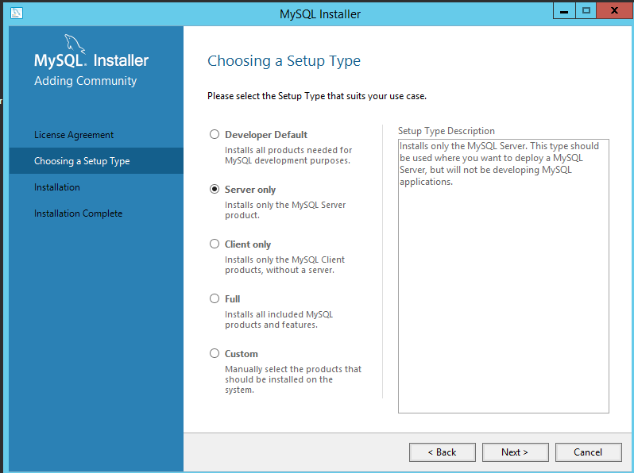
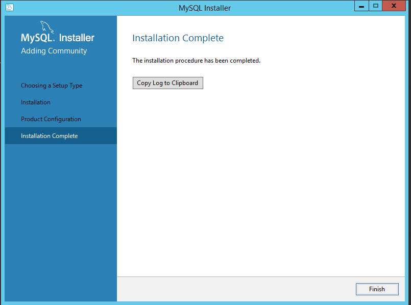
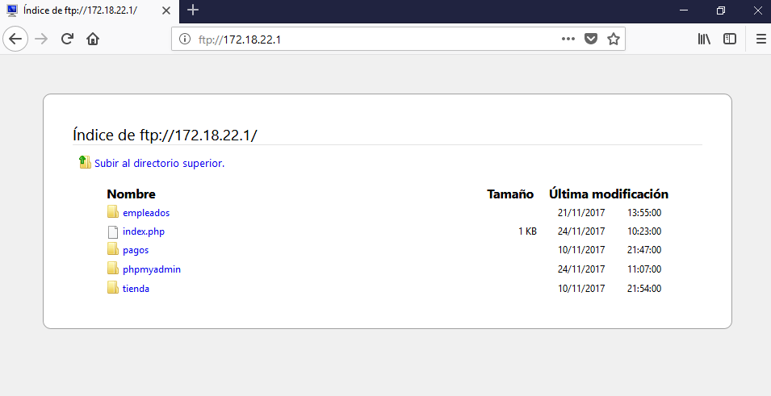
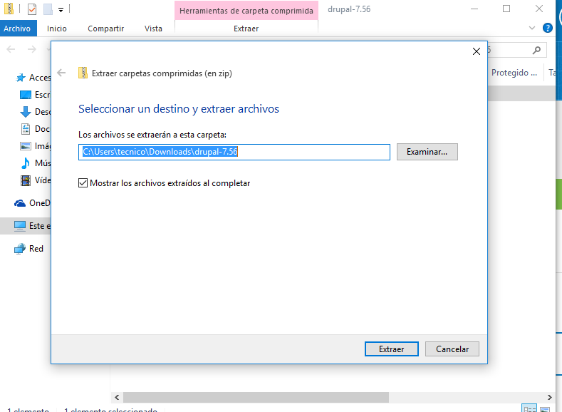
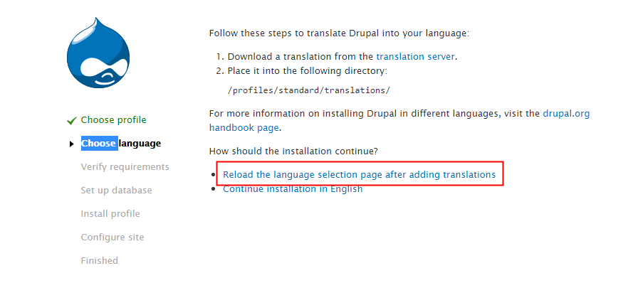
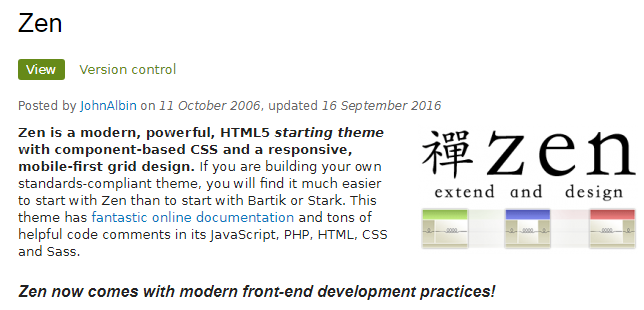
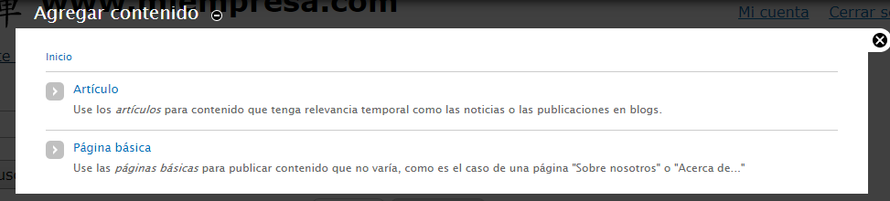
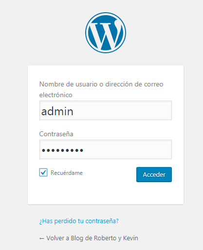

# Práctica de Windows 2012 Server - Internet Information Server (IIS)
## Instalación de PHP, MySQL, PHPMyAdmin y FTP

- [1. Instalación de PHP](#1)
- [2. Instalación de MySQL](#2)
- [3. Creación Sitio Web phpmyadmin.miempresa.edu](#3)
- [4. Actualización Registro en el Servidor DNS](#4)
- [5. Instalación de PHPMyAdmin](#5)
- [6. Instalación de FTP](#6)
    - [6.1 Configuración Firewall](#7)
    - [6.2 Comprobamos desde navegador del cliente FTP](#8)
    - [6.3 Comprobamos desde un cliente FTP-Filezilla](#9)
- [7. Instalación y Configuración de Drupal](#10)
    - [7.1 Creación de Base de DAtos cms](#11)
    - [7.2 Instalación Drupal](#12)
    - [7.3 Configurando el diseño de Drupal](#13)
- [8. Instalación de WordPress](#14)

## 1. Instalación de PHP
Tenemos que ir a la página http://windows.php.net y descargamos la version de `php-5.3.9-nts.msi`

- Ya tenemos descargado el fichero de `php-5.3.9.msi` procesamos con la instalación.

- Le damos siguiente.

- Seleccionamos IIS FastCGI para su correcto funcionamiento con el IIS.

- Si nos sale el siguiente mensaje es que no tenemos una característica instalada en el IIS.

- Tenemos que ir `Administrador del Servidor -> Agregar nuevos roles y tenemos que desplegar el Servidor IIS -> Desarrollo de Aplicación -> CGI`

- Le damos siguiente y instalamos el `CGI`

- Comienza la Instalación.

- Ya tenemos instalado el `CGI` volvemos a iniciar la instalación de `php-5` y ya no sale el mensaje. Instalamos las siguientes opciones.

- Proceso de instalación completada.

- Si queremos comprobar que el servicio php esta funcionando correctamente tenemos que crear un fichero en la carpeta miempresa, llamado `index.php`

- Vamos al navegador y escribimos `www.miempresa.edu` y no muestra una información de nuestro Equipo y la versión de PHP.

## 2. Instalación de MySQL 5.7.20

Tenemos que ir a la página de MySQL y comenzamos a descargar el fichero.

- Tenemos descargado el fichero de `MySQL` y comenzamos con la instalación.

- Siguiente.

- Seleccionamos solo `Server Only`

- Execute para comprobar que esta correcta. Comprobamos que nos falta unas librerias de Microsoft Visual C++ 2013, las instalamos.

- Ya podemos comenzar con la instalación.

- Esperamos que se descargue `MySQL` y termina la instalación. Por lo tanto ya lo tenemos instalado.

- Es necesario comprobar que nuestro sistemas Operativo tiene instalado el `Microsoft-Net Framework 4` Por lo tanto lo descargamos de su página oficial.

- Se comprueba que está actualizado y instalado.

- Se comprueba que la instalación está terminada y solo falta configurar el tipo de conexión.

- Seleccionamos la que viene por defecto.

- Dejamos la configuración por defecto.

- Escribimos la contraseña de root.

- Vamos a crear un usuario nuevo para la base de datos llamado `roberto`

- Se comprueba que está agregado el nuevo usuario y le damos siguiente.

- Dejamos la configuración por defecto.

- Dejamos por defecto la configuración.

- Siguiente.

- Execute

- Terminada la instalación y configuración de `MySQL`

## 3. Crear Sitio Web phpmyadmin.miempresa.edu

Primero tenemos que ir al IIS y creamos un nuevo sitio web llamado `phpmyadmin.miempresa.edu` y le decimos la ruta.

- Comprobamos que se creo correctamente.

## 4. Actualizar Registro en el Servidor DNS

Tenemos que ir al Servidor `DNS` y creamos un nuevo registro de alias llamado phpmyadmin.

## 5. Instalación phpmyadmin

En la página oficial de phpmyadmin descargamos la versión `phpmyadmin4.0.10.20`

- Se descarga un fichero comprimido lo que tenemos que realizar es pasar todo ese contenido a la carpeta que tenemos creada en mi `empresa/phpmyadmin` y copiamos todo el fichero de `phpmyadmin`.

- Abrimos cualquier navegador y escribimos `phpmyadmin.miempresa.edu` y debe verse como la siguiente imagen.

- Entramos con el usuario root y establecemos su contraseña.

- Realizamos el mismo procedimiento desde un Equipo cliente `Windows 10` y escribimos en el navegador `phpmyadmin.miempresa.edu`

- Comprobamos que funciona correctamente y se conecta con el usuario `roberto`

## 6. Instalación FTP-Server Filezilla

Descargamos de la página de Filezilla su aplicación para servidor y comenzamos con la instalación. Con este programa vamos a crear un servicio de `ftp` en nuestro windows server 2012

- Ya tenemos descargado la aplicación de `filezilla-server` comenzamos con la instalación.

- Aceptamos los términos.

- Le damos siguiente.

- Le damos siguiente.

- Le damos siguiente.

- Le damos instalar

- Terminada la instalación.

- Abrimos la aplicación y vamos a `Users -> creamos un usuario llamado ftpuser`

- Le damos add y escribimos el usuario.

- Escribimos `ftpuser`

Vamos a la pestaña llamada `shared folders` y establecemos la ruta que deseamos compartir para el usuario `ftpuser`

- Establecemos los permisos necesarios para que el usuario `ftpuser` pueda trabajar sobre ese recursos compartido.

### 6.1 Firewall

Tenemos que establecer una nueva regla en el corta fuegos del servidor para que puedan acceder al ftp mediante el puerto 21. `Panel de Control -> Firewall Avanzado -> nueva regla`

- Se nos abre una nueva ventana y establecemos los puertos que deseamos abrir, en este caso `20, 21` y el protocolo `TCP`

- Permitimos la conexión.

- Seleccionamos para que se aplique en el `dominio, privado y público`

- Establecemos un nombre a la regla `ftp`

- Comprobamos que la regla está habilitada.

### 6.2 Comprobamos desde navegador del cliente el FTP

Escribimos la dirección IP del servidor `ftp` y comprobamos que podemos acceder a los recursos compartidos, antes nos pide una autenticación del usuario `ftpuser`.

- Realizamos el mismo procedimiento pero con nombre y comprobamos que funciona correctamente.

- Podemos visualizar las carpetas que tiene acceso el usuario `ftpuser`

### 6.3 Comprobamos desde un cliente FTP-Filezilla

Ejecutamos el programa cliente de filezilla en nuestro equipo cliente y solo tenemos que establecer la `dirección IP o subdominio`, escribimos el usuario con su contraseña y accedemos a su directorio.

## 7. Instalación y Configuracion de Drupal 7.56

Lo primero que tenemos que realizar es ir a la página oficial de drupal y descargar la siguiente versión `drupal 7.56`(Seleccionamos esa versión porque es compatible con nuestro php).

- Guardamos el fichero de drupal, que viene comprimido en un zip.

- Descomprimimos el fichero drupal.

- Nos conectamos al cliente filezilla y buscamos la ruta donde Descomprimimos el fichero de `drupal` y lo pasamos al servidor.

### 7.1 Creación de Base de Datos cms

Primero tenemos que crear la base de datos `cms`

- Creamos el usuario cms.

- Se creo correctamente el usuario.

- Establecemos privilegios al `usuario cms` para la base de datos `cms`

### 7.2 Instalación de Drupal.

Solo tenemos que ir al navegador del cliente y escribir la siguiente dirección Web. `www.miempresa.com`

Seleccionamos por defecto la `standard`.

- Tenemos que descargar de la página web que nos indicar `translation server` y descargamos nuestro idioma.

Lo pasamos por filezilla al recurso compartido para `drupal`.

- La ruta sería `profiles -> standard -> translations`

- Recargamos la página.

- Seleccionamos el idioma.

- Escribimos el nombre de la base de datos `cms` con el usuario `cms`

- Esperamos que instale los módulos correspondientes.

- Establecemos la información que nos pide.

- Seguimos estableciendo la información que nos pide en el formulario y le damos guardar.

- Ya tenemos configurado y instalado el `Drupal`.

    Nota:

    Problema al instalar el Drupal, tenemos que ir al fichero de
    configuración `web.conf` y renombrarlo de la siguiente manera
    `web.conf.old`.

- Ya tenemos configurado y instalado el drupal en nuestro servidor y por lo tanto al acceder con nuestro dominio `www.miempresa.com` nos tiene que visualizar el contenido de drupal.

- Instalación del modulo para traducir el contenido.

- Tenemos que ir a la pestaña apariencia y Seleccionamos instalar tema nuevo.

- Buscamos el tema de `zen`.

- Buscamos en la misma página y descargamos el tema de `zen`.

- Solo nos falta añadir el tema y demos darle activar y establecer como preterminado.

- Tenemos el tema añadido y establecido como preterminado.

- Comprobamos y visualizamos que es diferente al que viene por defecto en `drupal`

### 7.3 Configurando el diseño de Drupal

Vamos a crear un artículo en `drupal`. Para ello nos dirigimos al menú superior, pulsamos en contenido y clic en agregar contenido.

Podemos ver el contenido creado.

Comprobamos que podemos crear varios artículos a la vez.

Vamos agregar un menú, en que se muestran los enlaces importantes de nuestra página web.

Añadimos un titulo y una pequeña descripción. Pulsamos en guardar y podemos gestionar nuestro menú.

También se pueden crear bloques y situarlos en cualquier lugar de la página. Por ejemplo nosotros lo situaremos en el lateral izquierdo.

Final de la página.

## 8. Instalación de WordPress

Primero tenemos que agregar un sitio web llamado `blog.miempresa.com`

Segundo tenemos que agregar un dns en el dominio de `empresa.com` llamado `blog`

Creamos un usuario en el ftp llamado `WordPress` y le damos permisos total para modificar la carpeta de WordPress.

Creamos una base de datos de WordPress y reutilizamos el usuario cms para que tenga privilegios en la base de datos `WordPress`.

Descargamos de la página web del WordPress desde el equipo cliente y lo pasamos por `ftp`

Entramos al navegador del cliente y escribimos lo siguiente `blog.miempresa.com` y comenzamos con la instalación de WordPress. Solo tenemos que seguir el asistente.

- Descargamos el WordPress

- Seleccionamos el idioma español.

- Requisitos para instalar el WordPress

- Nombre de la base de datos y el usuario.

- Comienzo de la instalación de la WordPress

- Usuario para administrar el WordPress

- Ya podemos acceder al WordPress

Termina la instalación y comprobamos como tenemos instalado el `WordPress`.

