# Webmin


## 1. Instalación de Webmin

Primero tenemos que descargar de la página oficial el `webmin`.

- [Enlace Webmin](http://www.webmin.com/download.html)

```console

roberto@serverob:~/Descargas$ wget http://prdownloads.sourceforge.net/webadmin/webmin_1.870_all.deb
--2017-12-19 13:52:37--  http://prdownloads.sourceforge.net/webadmin/webmin_1.870_all.deb
Resolviendo prdownloads.sourceforge.net (prdownloads.sourceforge.net)... 216.34.181.59
Conectando con prdownloads.sourceforge.net (prdownloads.sourceforge.net)[216.34.181.59]:80... conectado.
Petición HTTP enviada, esperando respuesta... 301 Moved Permanently
Ubicación: http://downloads.sourceforge.net/project/webadmin/webmin/1.870/webmin_1.870_all.deb [siguiente]
--2017-12-19 13:52:37--  http://downloads.sourceforge.net/project/webadmin/webmin/1.870/webmin_1.870_all.deb
Resolviendo downloads.sourceforge.net (downloads.sourceforge.net)... 216.34.181.59
Conectando con downloads.sourceforge.net (downloads.sourceforge.net)[216.34.181.59]:80... conectado.
Petición HTTP enviada, esperando respuesta... 302 Found
Ubicación: https://netcologne.dl.sourceforge.net/project/webadmin/webmin/1.870/webmin_1.870_all.deb [siguiente]
--2017-12-19 13:52:37--  https://netcologne.dl.sourceforge.net/project/webadmin/webmin/1.870/webmin_1.870_all.deb
Resolviendo netcologne.dl.sourceforge.net (netcologne.dl.sourceforge.net)... 78.35.24.46, 2001:4dd0:1234:6::5f
Conectando con netcologne.dl.sourceforge.net (netcologne.dl.sourceforge.net)[78.35.24.46]:443... conectado.
Petición HTTP enviada, esperando respuesta... 200 OK
Longitud: 15606622 (15M) [application/octet-stream]
Grabando a: “webmin_1.870_all.deb”

webmin_1.870_all.deb         100%[============================================>]  14,88M  7,15MB/s    in 2,1s    

2017-12-19 13:52:40 (7,15 MB/s) - “webmin_1.870_all.deb” guardado [15606622/15606622]

roberto@serverob:~/Descargas$ ls
webmin_1.870_all.deb

```
- Instalación de Webmin después de descargar de la página oficial el `webmin`

```console
roberto@serverob:~/Descargas$ sudo dpkg -i webmin_1.870_all.deb
Seleccionando el paquete webmin previamente no seleccionado.
(Leyendo la base de datos ... 240724 ficheros o directorios instalados actualmente.)
Preparando para desempaquetar webmin_1.870_all.deb ...
Desempaquetando webmin (1.870) ...
dpkg: problemas de dependencias impiden la configuración de webmin:
 webmin depende de libauthen-pam-perl; sin embargo:
  El paquete `libauthen-pam-perl' no está instalado.
 webmin depende de apt-show-versions; sin embargo:
  El paquete `apt-show-versions' no está instalado.

dpkg: error al procesar el paquete webmin (--install):
 problemas de dependencias - se deja sin configurar
Procesando disparadores para systemd (229-4ubuntu10) ...
Procesando disparadores para ureadahead (0.100.0-19) ...
Se encontraron errores al procesar:
 webmin
roberto@serverob:~/Descargas$ sudo apt install -f
Leyendo lista de paquetes... Hecho
Creando árbol de dependencias       
Leyendo la información de estado... Hecho
Corrigiendo dependencias... Listo
Los paquetes indicados a continuación se instalaron de forma automática y ya no son necesarios.
  linux-headers-4.4.0-21 linux-headers-4.4.0-21-generic linux-image-4.4.0-21-generic
  linux-image-extra-4.4.0-21-generic
Utilice «sudo apt autoremove» para eliminarlos.
Se instalarán los siguientes paquetes adicionales:
  apt-show-versions libauthen-pam-perl
Se instalarán los siguientes paquetes NUEVOS:
  apt-show-versions libauthen-pam-perl
0 actualizados, 2 nuevos se instalarán, 0 para eliminar y 368 no actualizados.
1 no instalados del todo o eliminados.
Se necesita descargar 53,5 kB de archivos.
Se utilizarán 242 kB de espacio de disco adicional después de esta operación.
¿Desea continuar? [S/n] s
Des:1 http://es.archive.ubuntu.com/ubuntu xenial/universe amd64 libauthen-pam-perl amd64 0.16-3build2 [23,9 kB]
Des:2 http://es.archive.ubuntu.com/ubuntu xenial/universe amd64 apt-show-versions all 0.22.7 [29,6 kB]
Descargados 53,5 kB en 0s (142 kB/s)    
Seleccionando el paquete libauthen-pam-perl previamente no seleccionado.
(Leyendo la base de datos ... 267201 ficheros o directorios instalados actualmente.)
Preparando para desempaquetar .../libauthen-pam-perl_0.16-3build2_amd64.deb ...
Desempaquetando libauthen-pam-perl (0.16-3build2) ...
Seleccionando el paquete apt-show-versions previamente no seleccionado.
Preparando para desempaquetar .../apt-show-versions_0.22.7_all.deb ...
Desempaquetando apt-show-versions (0.22.7) ...
Procesando disparadores para man-db (2.7.5-1) ...
Configurando libauthen-pam-perl (0.16-3build2) ...
Configurando apt-show-versions (0.22.7) ...
** initializing cache. This may take a while **
Configurando webmin (1.870) ...
Webmin install complete. You can now login to https://serverob:10000/
as root with your root password, or as any user who can use sudo
to run commands as root.
Procesando disparadores para systemd (229-4ubuntu10) ...
Procesando disparadores para ureadahead (0.100.0-19) ...
roberto@serverob:~/Descargas$

```

## 2. Uso de webmin

Una vez hemos instalado webmin podemos empezar a utilizarlo accediendo desde un navegador. Webmin por defecto utiliza acceso mediante `https` y el puerto `10000`.

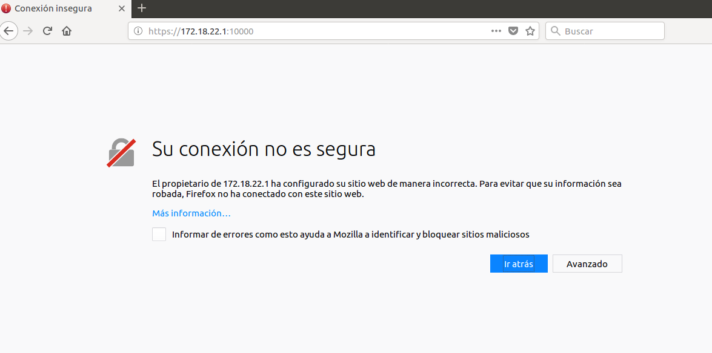

Al este utilizar un certificado autofirmado nos indica que el acceso no es seguro, por lo que debemos añadir una excepción para esta conexión.

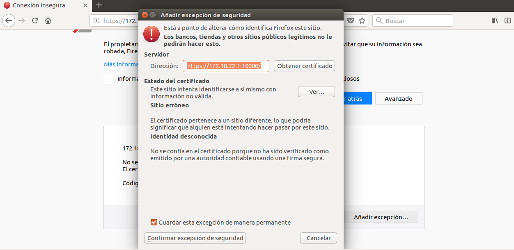

Vemos que después de permitirlo nos pide un usuario y contraseña para acceder a la aplicación, estos usuarios utilizan a los usuarios de `UNIX`, por lo que utilizaremos el usuario de nuestra máquina.

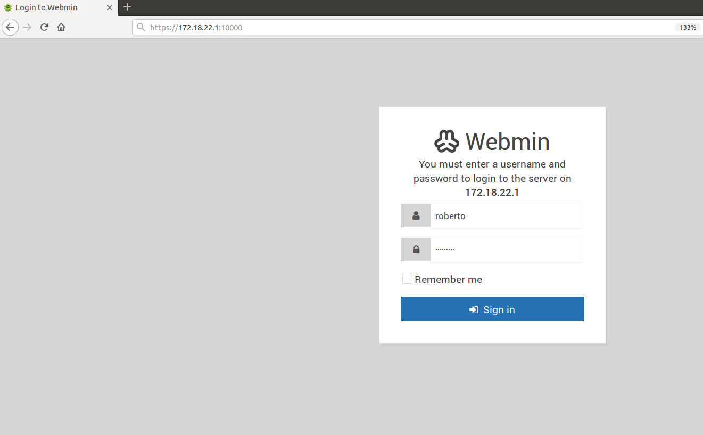

Una vez hemos conseguido acceder podemos empezar a gestionar diferentes servicios que nuestra máquina dispone, podemos acceder a estos a través de la barra lateral.

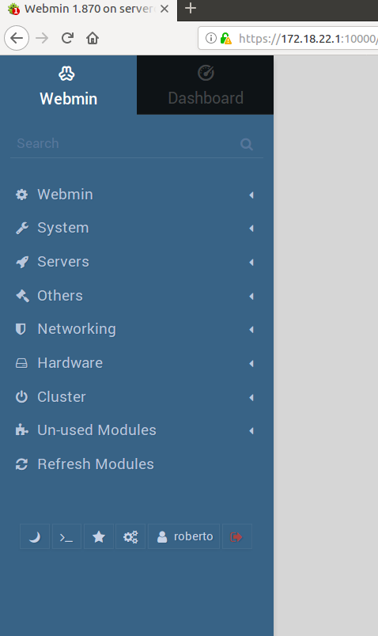

Como para nuestro caso nos interesa administrar el servidor web apache, las bases de datos mysql y nuestro servidor DNS BIND, accederemos a la pestaña `Servers`. En este pestaña Webmin detectara los servicios que están agregados actualmente en nuestro servidor y podemos gestionar cada uno de ellos fácilmente.

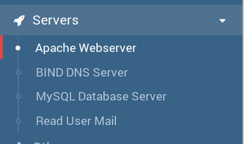

### 2.1 Gestionar Apache desde Webmin

Pinchando en la opción `Apache Webserver` podemos editar las opciones de nuestro servidor. En la primera pestaña nos mostrara la configuración global, en la parte superior también encontraremos distintos botones con los que podemos actualizar nuestros cambios o arrancar y parar el servidor web.

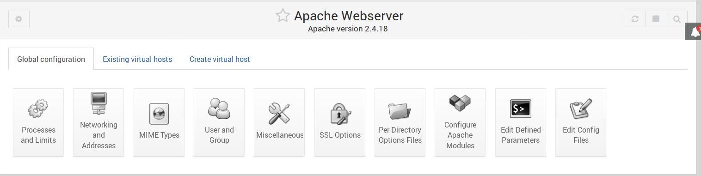

En la segunda pestaña podemos visualizar los virtual host que ya tenemos creados en nuestro servidor, en la captura se pueden llegar a ver los sitios web `pagos`, `empleados` y `phpmyadmin` que utilizamos en la práctica anterior. Desde aquí también podremos modificar estos virtual host o eliminarlos.

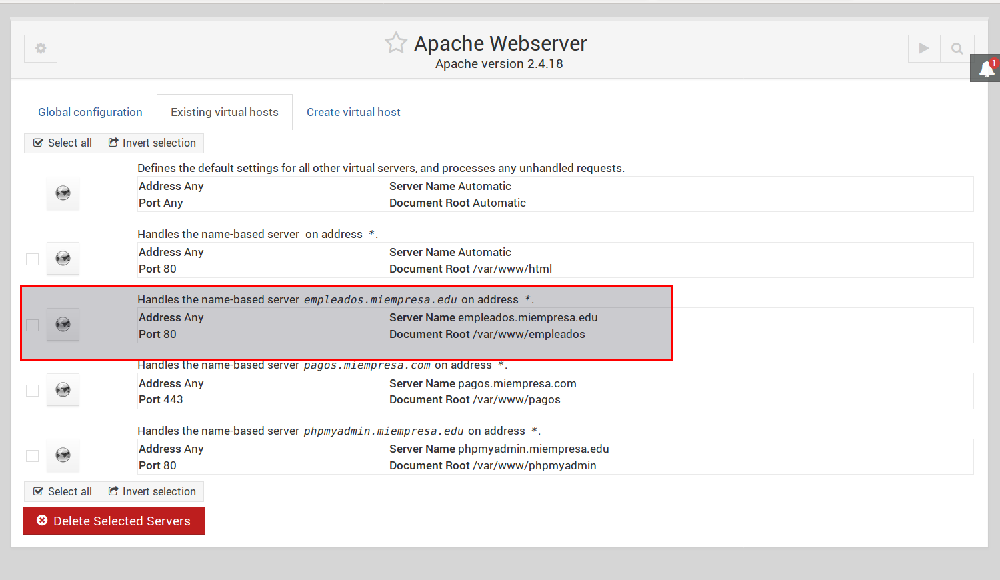

En la última pestaña podemos crear nuevos virtual hosts.

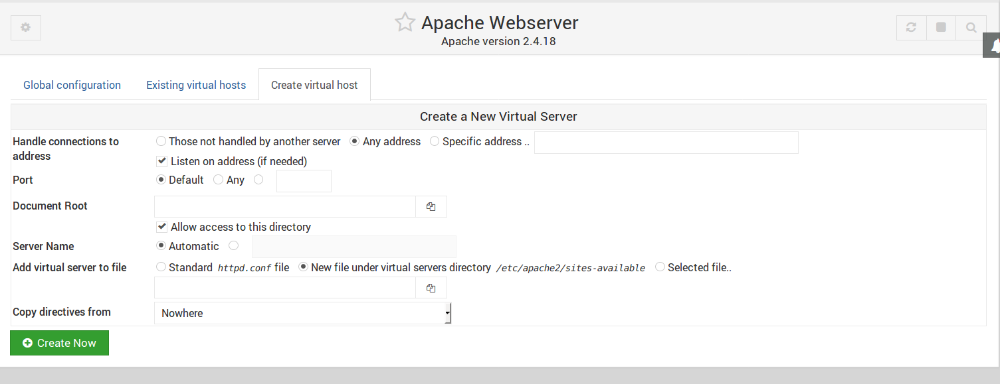

### 2.2. Gestionar BIND DNS server desde Webmin

Al igual que con el servidor apache, en el caso del servidor DNS nos encontraremos con una interfaz en la que podemos modificar las opciones globales del servicio, así como unos botones en la parte superior que nos permiten guardar los cambios realizados y parar o arrancar el servicio.

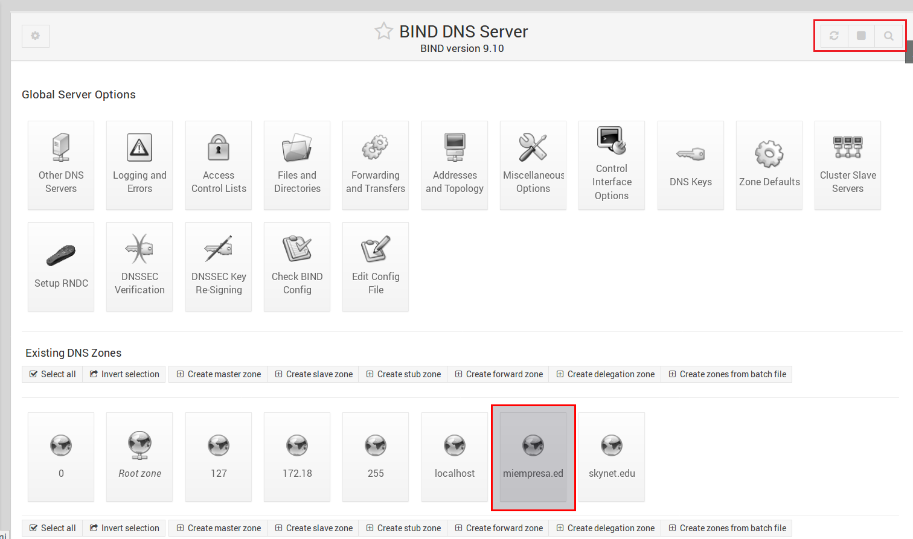

En la captura también se puede apreciar que aparecen las zonas que hemos ya hemos creado, así como diferentes botones que nos permiten crear zonas nuevas. Si accedemos a la master zone que creamos para la practica anterior (`miempresa.edu`), encontraremos diferentes botones que nos permiten saber los registros de la zona.

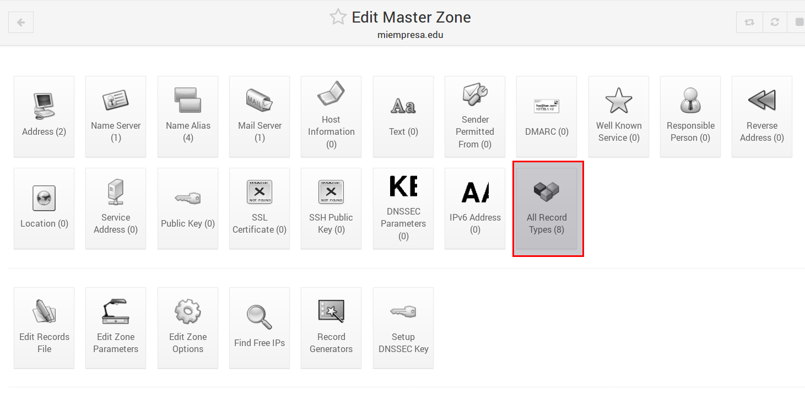

Seleccionando `All record Types` podemos ver todos los registros de la zona. Desde aquí podemos eliminarlos si queremos.

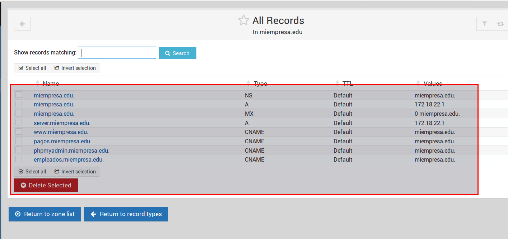

Para añadir elementos tendremos que acceder a la opción de cada tipo de registro.

- Registro tipo `A`:

  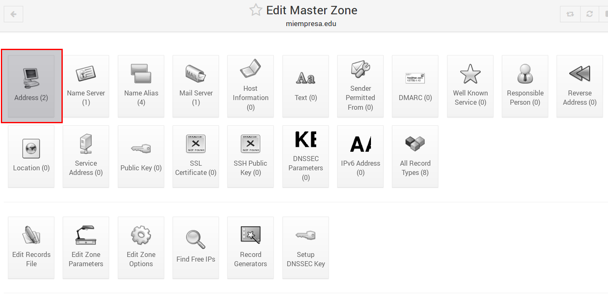

  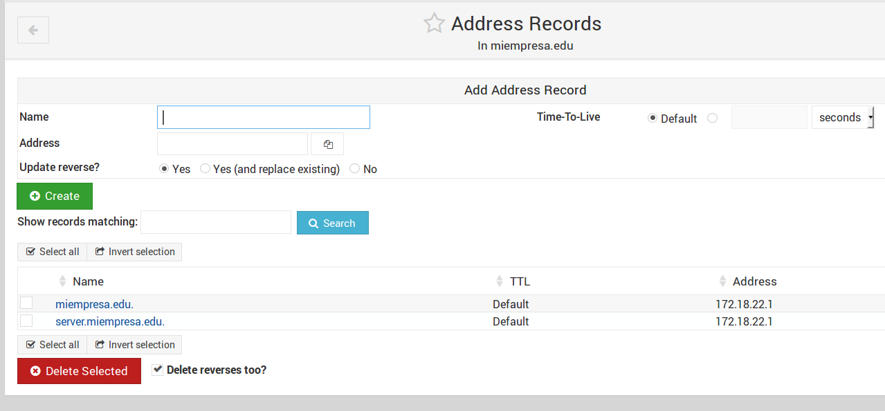

  > Aquí podemos ver los registros tipo `A` de nuestro servidor, borrarlos, editarlos, o añadir nuevos registros.

- Registro tipo `Alias`:

  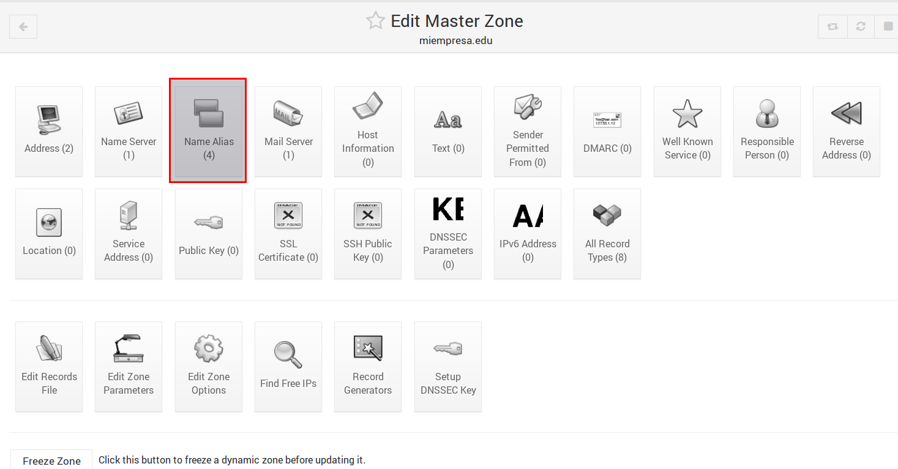

  

También disponemos de otras opciones en la zona maestra que nos permitirán congelarla, eliminarla o transformarla en una `Slave zone`.

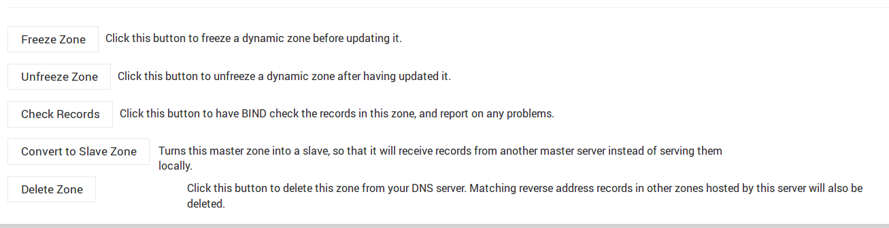

### 2.3. Gestionar mysql desde Webmin

Para poder acceder al servidor mysql nos pedirá primero un usuario administrador.

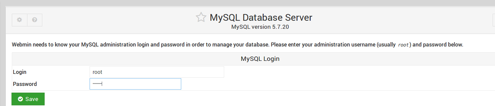

Desde aquí podremos gestionar nuestras bases de datos y las opciones globales del servidor.


## 3. Otras opciones de Webmin

Aparte de gestionar nuestros servicios también podemos utilizar webmin para otros propósitos como podrían ser:

- Saber los recursos que esta consumiendo nuestro servidor.

  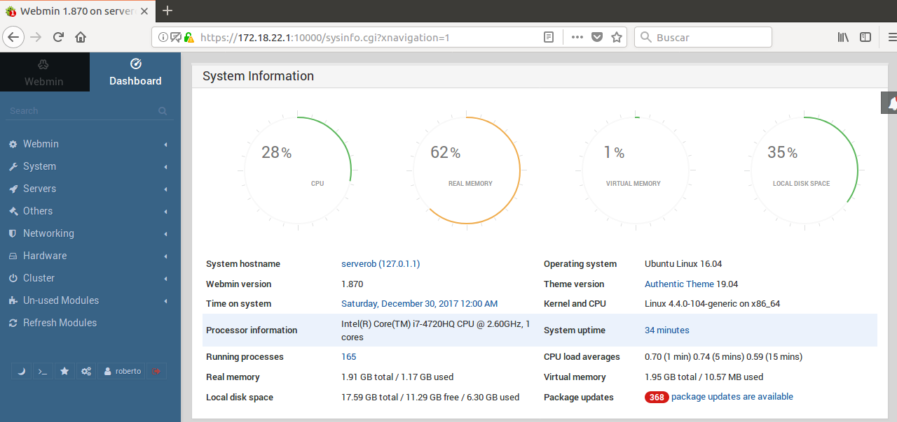

- Comprobar las particiones de nuestro disco.

  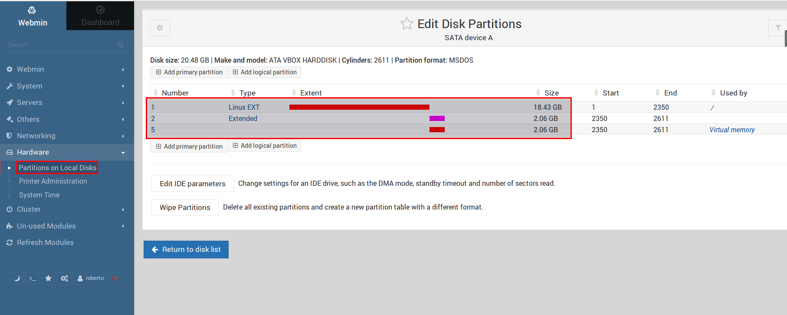

- Instalar nuevos módulos utilizando la opción `unused modules`.

También podemos modificar algunos parámetros de webmin como puede ser el tema de la aplicación o el idioma de los menús.

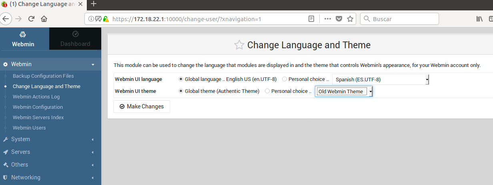

Una vez dicho esto podemos dar por finalizada la actividad.  
