# U6-A2 | Instalación y Configuración de un Servidor de Correo en GNU/Linux

## 1. Instalar el servicio SMTP en Ubuntu, utilizando el servidor Postfix

Tenemos que abrir una terminal en `ubuntu` y solo tenemos que escribir el siguiente comando.

- `sudo apt install postfix`

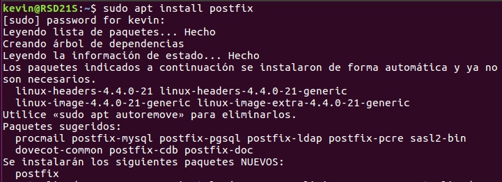

- En el proceso de instalación nos saldra un aviso indicandonos que tipo de configuración del servidor de correo se ajusta mejor para nuestra necesidad.

En este caso vamos a marcar el correo `SMTP`.

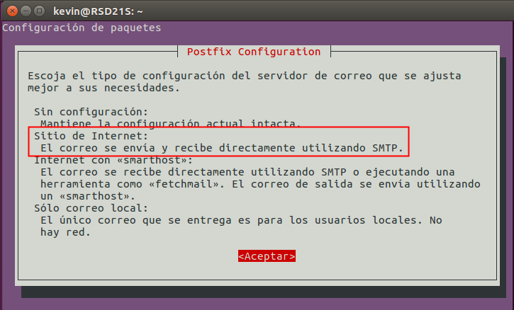

- Seleccionamos el tipo de configuración de correo, `sitio de Internet`.

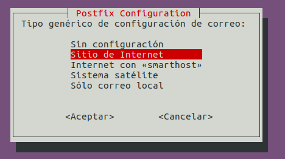

- Escribimos el nombre del ssitema de correo, por ejemplo escribimos `miempresa.com`

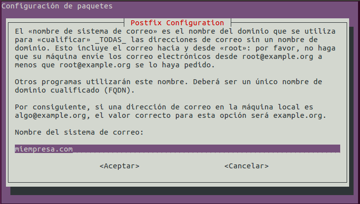

Comprobamos que el servicio `SMTP` está escuchando.

El comando `netstat` nos indica los puertos o servicios que está a la escucha el servidor.

- Solo tenemos que utilizar el siguiente comando `netstat -utap`

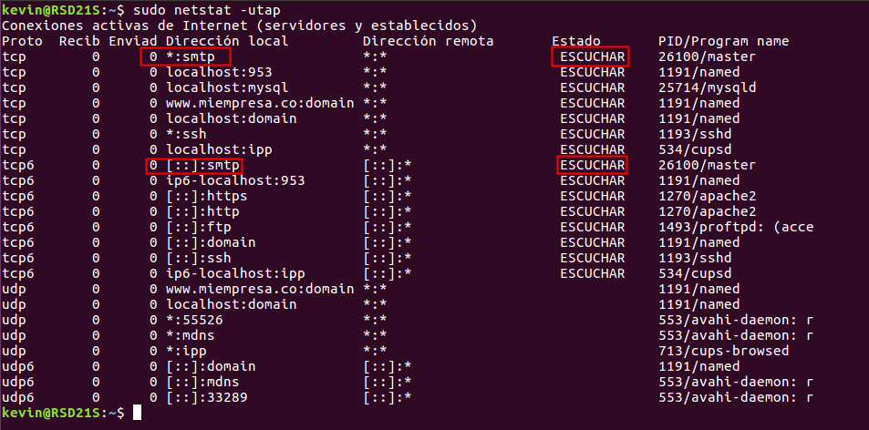

Si queremos ver que el servicio esta funcionando y no tiene ningún error.

- `sudo systemctl status postfix`

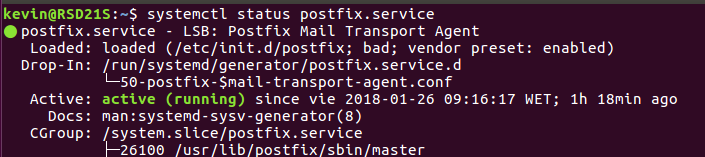

- `netstat -ntap`

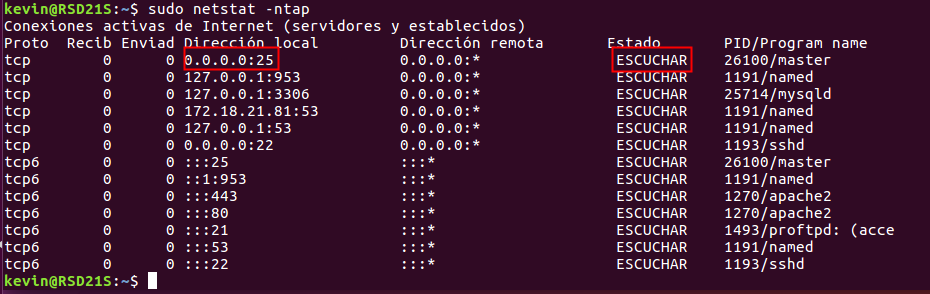

## 2. Realiza una prueba de envio de mensaje entre dos usuarios de UNIX mediante telnet

Escribimos el comando `telnet` para comprobar que podemos conectarnos al puerto `25` de nuestro servidor.

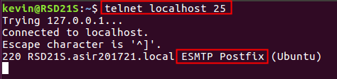

Creamos dos usuarios llamados `eric` y `stan` y vamos al fichero `/etc/passwd` para ver si están creado correctamente.

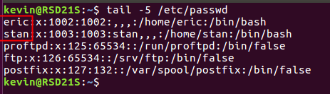

Con el usuario `eric` realizamos un envío de mail al usuario `stan`.

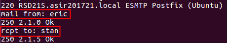

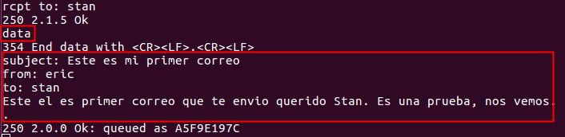

- Le damos quit para salir de la conexión.

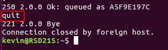

- Establecemos conexión con el usuario `stan`

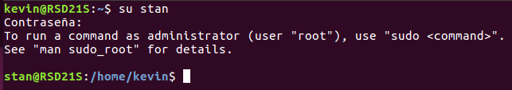

- Vamos a la siguiente ruta para comprobar el mail `/var/spool/mail`

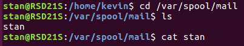

- Vemos que tenemos un fichero llamado `stan` vamos a realizar un `cat` para comprobar su contenido.

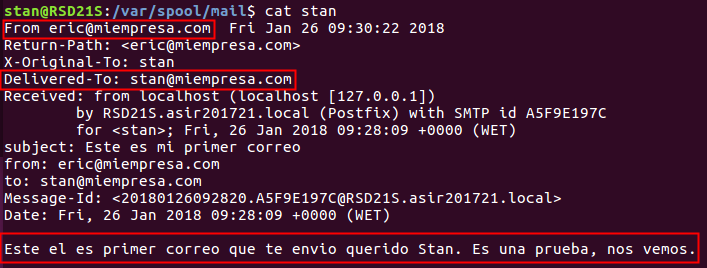

En el fichero de `stan` vemos que tenemos el correo enviado de `eric`

## 3. Crear una Zona Maestra en bind9

Tenemos que ir a la siguiente ruta `/etc/bind/named.conf.local` y modificamos el fichero para crear una zona maestra nueva.

Solo tenemos que escribir lo que tenemos en el marco rojo de la foto.

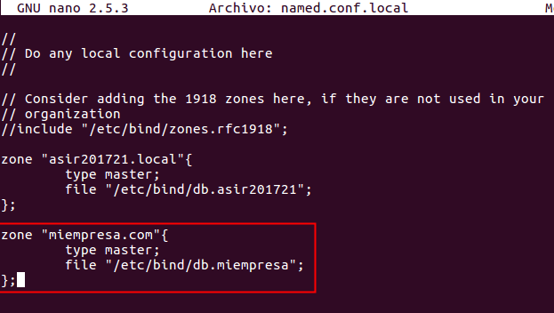

- Tenemos que abrir el fichero `db.miempresa` para crear los registros nuevos.
    - `smtp -> 172.18.21.81`
    - `pop -> 172.18.21.81`

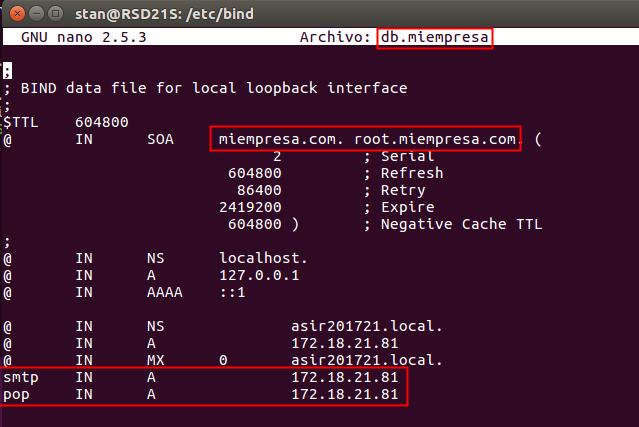

Realizamos una comprobación para ver si funciona la resolución de nombre.

- `ping smtp.miempresa.com`

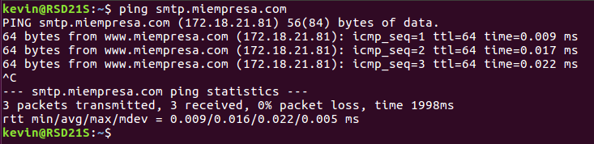

- `ping pop.miempresa.com`

## 4. Instalación de cliente de correo en Ubuntu

Solo tenemos que abrir una terminal y escribir el siguiente comando para instalar la aplicación `evolution`

- `sudo apt install evolution`

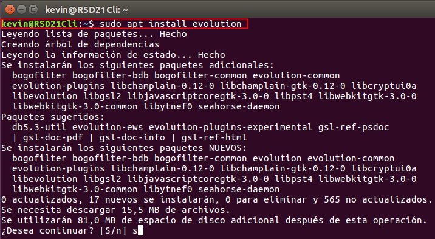

- Comienza la configuración de `Evolution` solo tenemos que darle siguiente.

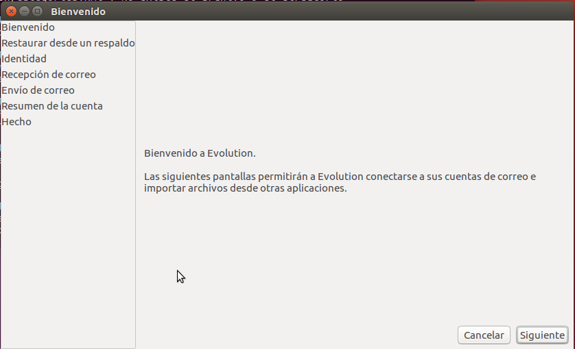

En el Equipo cliente debemos tener configurado en la tarjeta de red las `DNS` de nuestro servidor `ubuntu`.

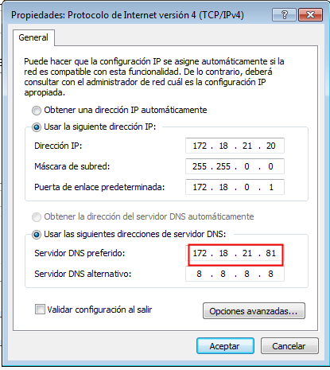

- Escribimos el mail del usuario `eric`

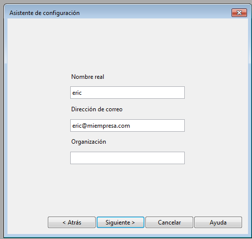

- Configuramos con el correo normal `pop`

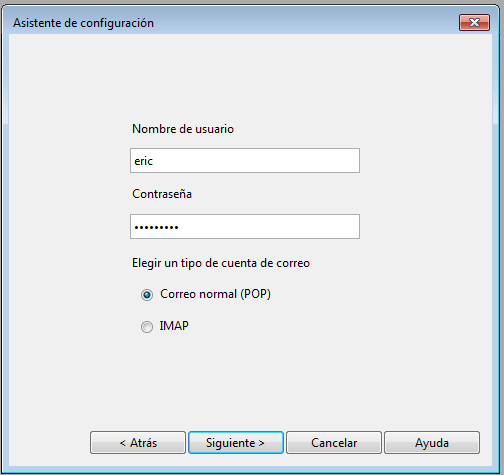

- Configuramos el servidor entrada `pop.miempresa.com`
- Configuramos el servidor saliente `smtp.miempresa.com`

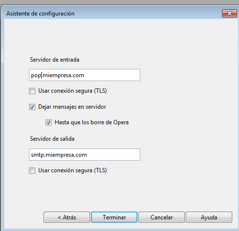

- Comprobamos que tenemos la cuenta mail de `eric` configurado.

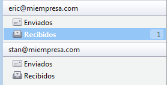

Vamos a enviar un correo desde el usuario `eric` a `stan`

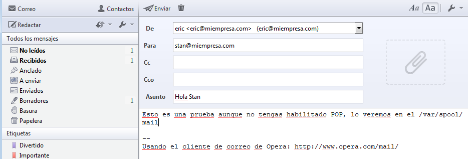

Tenemos que ir al servidor y en la siguiente ruta `/var/spool/mail`

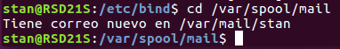

Vemos el correo que recibio `stan` del usuario `eric`.

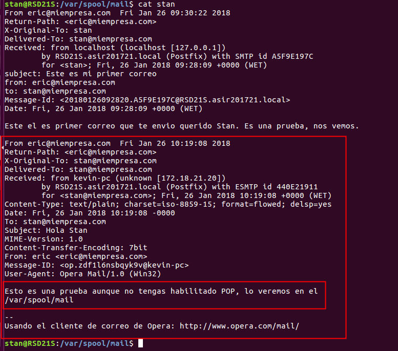

Ahora vamos a realizar el mismo procedimiento de envió de correo pero en este caso desde `stan` a `eric`.

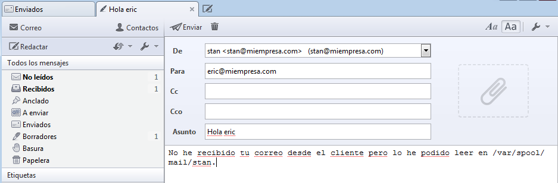

 Vamos al servidor y comprobamos `/var/spool/mail` que tenemos el correo de `stan` a `eric`.

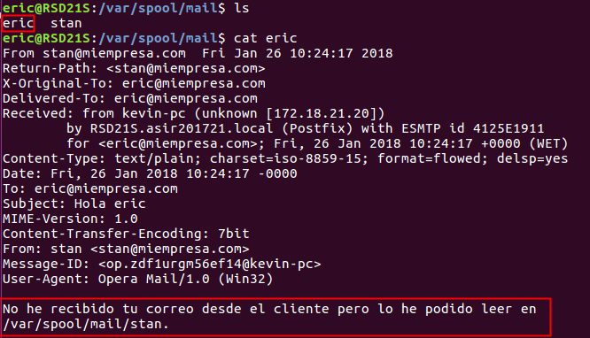

## 5. Instalación del servicio IMAP

Tenemos que abrir una terminal y escribimos el siguiente comando para instalar el servicio de correo `IMAP`.

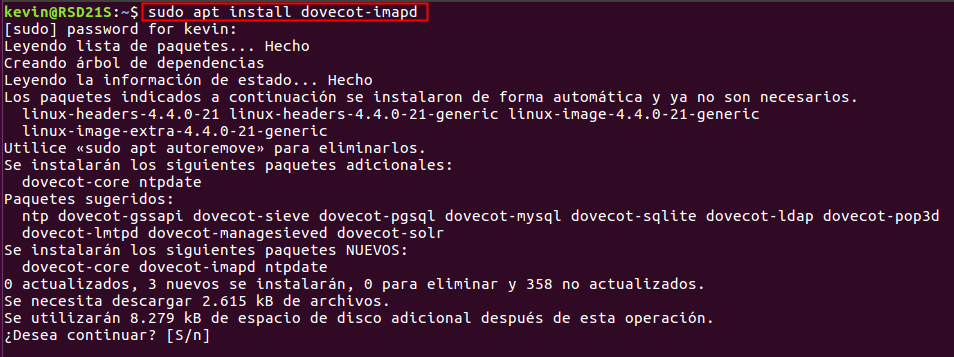

- Comprobamos que el servicio está funcionando correctamente.

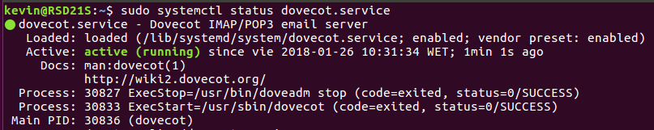

- Realizamos una comprobación de puerto a la escucha.
    - `netstat -utap | grep imap`

## 6. Instalación de Squirrelmail

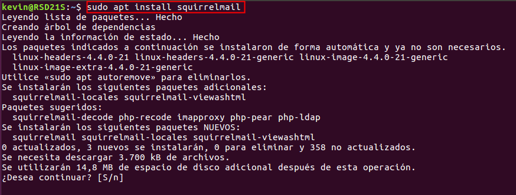
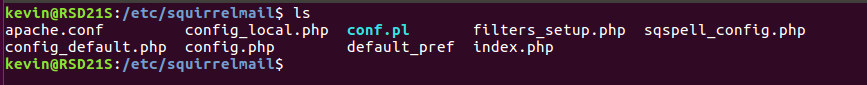
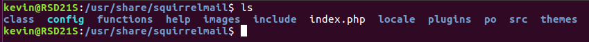
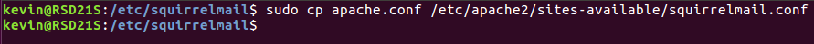
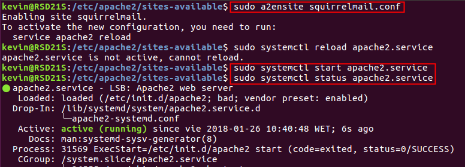
