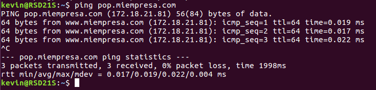
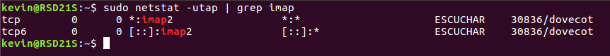
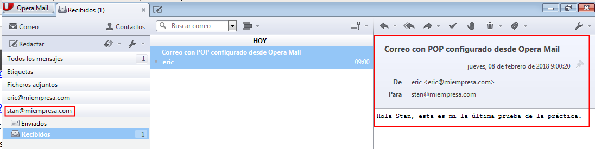

# U6-A2 | Instalación y Configuración de un Servidor de Correo en GNU/Linux

## 1. Instalar el servicio SMTP en Ubuntu, utilizando el servidor Postfix

Tenemos que abrir una terminal en `ubuntu` y solo tenemos que escribir el siguiente comando.

- `sudo apt install postfix`

- En el proceso de instalación nos saldra un aviso indicandonos que tipo de configuración del servidor de correo se ajusta mejor para nuestra necesidad.

En este caso vamos a marcar el correo `SMTP`.

- Seleccionamos el tipo de configuración de correo, `sitio de Internet`.

- Escribimos el nombre del sistema de correo, por ejemplo escribimos `miempresa.com`

Comprobamos que el servicio `SMTP` está escuchando.

El comando `netstat` nos indica los puertos o servicios que está a la escucha el servidor.

- Solo tenemos que utilizar el siguiente comando `netstat -utap`

Si queremos ver que el servicio esta funcionando y no tiene ningún error.

- `sudo systemctl status postfix`

- `netstat -ntap`

## 2. Realiza una prueba de envio de mensaje entre dos usuarios de UNIX mediante telnet

Escribimos el comando `telnet` para comprobar que podemos conectarnos al puerto `25` de nuestro servidor.

Creamos dos usuarios llamados `eric` y `stan` y vamos al fichero `/etc/passwd` para ver si están creado correctamente.

Con el usuario `eric` realizamos un envío de mail al usuario `stan`.

- Le damos quit para salir de la conexión.

- Establecemos conexión con el usuario `stan`

- Vamos a la siguiente ruta para comprobar el mail `/var/spool/mail`

- Vemos que tenemos un fichero llamado `stan` vamos a realizar un `cat` para comprobar su contenido.

En el fichero de `stan` vemos que tenemos el correo enviado de `eric`

## 3. Crear una Zona Maestra en bind9

Tenemos que ir a la siguiente ruta `/etc/bind/named.conf.local` y modificamos el fichero para crear una zona maestra nueva.

Solo tenemos que escribir lo que tenemos en el marco rojo de la foto.

- Tenemos que abrir el fichero `db.miempresa` para crear los registros nuevos.
    - `smtp -> 172.18.21.81`
    - `pop -> 172.18.21.81`

Realizamos una comprobación para ver si funciona la resolución de nombre.

- `ping smtp.miempresa.com`

- `ping pop.miempresa.com`

## 4. Instalación de cliente de correo en Windows

Solo tenemos que instalar un gestor de correo en `Windows` en este caso será el `OperaMail`.

En el Equipo cliente debemos tener configurado en la tarjeta de red las `DNS` de nuestro servidor `ubuntu`.

Abrimos el `OperaMail` y creamos una cuenta de un usuario nuevo de correo.

- Escribimos el mail del usuario `eric`

- Configuramos con el correo normal `pop`

- Configuramos el servidor entrada `pop.miempresa.com`
- Configuramos el servidor saliente `smtp.miempresa.com`

- Comprobamos que tenemos la cuenta mail de `eric` configurado.

Vamos a enviar un correo desde el usuario `eric` a `stan`

Tenemos que ir al servidor y en la siguiente ruta `/var/spool/mail`

Vemos el correo que recibio `stan` del usuario `eric`.

Ahora vamos a realizar el mismo procedimiento de envió de correo pero en este caso desde `stan` a `eric`.

 Vamos al servidor y comprobamos `/var/spool/mail` que tenemos el correo de `stan` a `eric`.

## 5. Instalación del servicio IMAP

Tenemos que abrir una terminal y escribimos el siguiente comando para instalar el servicio de correo `IMAP`.

- Comprobamos que el servicio está funcionando correctamente.

- Realizamos una comprobación de puerto a la escucha.
    - `netstat -utap | grep imap`

## 6. Instalación de Squirrelmail

Comenzamos con la instalación de `Squirrelmail`.

- Escribimos el siguiente comando para instalar el `Sequirrelmail`

- `sudo apt install squirrelmail`

- Ruta de ficheros de configuración de `squirrelmail` en `/etc/squirrelmail`

- Ruta del directorio de la aplicación `squirrelmail` en `/usr/share/squirrelmail`

## 7. Creación de un Virtual Host en Apache2

Tenemos que ir a la ruta de `sites-available` creamo un fichero nuevo de virtual host con el nombre de `squirrelmail.conf`.

Con el siguiente comando `a2ensite squirrelmail.conf` creamos un enlace simbólico en `sites-enabled`.

Realizamos también un reinicio del servicio de `apache2` y comprobamos su estado.

## 8. Conectar a Squirrelmail desde el Servidor Ubuntu.

Solo tenemos que abrir un navegador y escribir `localhost/squirrelmail` y se nos muestra una página de autenticación.

## 9. Conectar a Squirrelmail desde Cliente Windows.

Solo tenemos que abrir un navegador y escribir `miempresa.com/squirrelmail` y escribimos el nombre del usuario `eric` para acceder al correo.

- Comprobamos la bandeja de entrada de `eric` y vemos que recibio un correo de `stan`

Vamos a enviar un correo a `stan` por lo tanto tenemos que ir a `compose`.

- Escribimos el mail de `stan` y escribimos un texto de prueba y le damos a `send`

- Vemos en la bandeja de salida que se envió un correo de `eric` a `stan`

Entramos en la cuenta de `stan`

Comprobamos en la bandeja de entrada de `stan` que tenemos varios mensajes de `eric`.

Vamos a conectar al correo de `eric` desde la cuenta de `stan`, solo tenemos que darle reply.

Escribimos el correo de `eric` y el texto que le vamos a enviar.

Vamos a la cuenta de `eric` para comprobar si nos llego el correo de `stan`.

- Comprobamos que en la bandeja de entrada de `eric` tenemos un correo de `stan`

- Abrimos dicho correo y vemos el resultado.

## 10. Comprobamos que en el servidor están los contenedores de los correos de stan y eric

Tenemos que ir a la siguiente ruta en el servidor `/var/mail`

Vemos que tenemos dos contenedores de los correos de `eric` y `stan`.

- Comprobamos si el correo de `eric` tiene correo de `stan`.

- Comprobamos si el correo de `stan` tiene correo de `stan`.

## 11. Instalación de POP3

Solo tenemos que abrir una terminal y escribir el siguiente comando.

- `sudo apt install dovecot-pop3d`

Comprobamos los puertos de `POP3`

Comprobamos que el servicio de `dovecot` con el `POP` y `IMAP` está activado y funcionando.

### 11.1 Configurar en Dovecot del servidor para que funcione el POP

Tenemos que ir a la siguiente ruta `/etc/dovecot/conf.d` para escribir dentro del fichero de configuración `10-auth.conf`.

- Modificamos la linea de `ssl` y establecemos `no`
  - `ssl = no`

- Modificamos la línea de `disable_plaintext_auth` y establecemos `no`
  - `disable_plaintext_auth = no`

- Ya tenemos configurado y solo tenemos que reiniciar el servicio de `dovecot.service`

## 12. Configurar cuenta de correo en Windows con OperaMail.

Abrimos el programa de correo `OperaMail` y seguimos el asistente para crear una cuenta de correo para `eric`

- Escribimos el correo y su contraseña. Importante marcar el `correo normal POP`

- Escribimos en el servidor de entrada `pop.miempresa.com`
- Escribimos en el servidor de salida `smtp.miempresa.com`

- Realizamos el mismo procedimiento con la cuenta de correo para `stan`

- Configuramos el nombre de usuario y su contraseña.

- Escribimos en el servidor de entrada `pop.miempresa.com`
- Escribimos en el servidor de salida `smtp.miempresa.com`

Vamos a realizar una prueba de envio de correo desde la cuenta de `eric` a `stan`.

- Comprobamos que el correo llega a la bandeja de entrada de `stan`.

Vamos a realizar un correo desde la cuenta de `stan` a `eric`

- Comprobamos que llega correctamente el correo de `stan` en `eric`

Vamos al Servidor de correo de `Ubuntu` y comprobamos en `/var/mail` que tenemos todavía los contenedores de `stan`

- Comprobamos también el contenedor de correo de `eric`

Por defecto en los ficheros de configuración de `dovecot` no elimina los contenedores de correo de los usuarios `eric` y `stan`.
