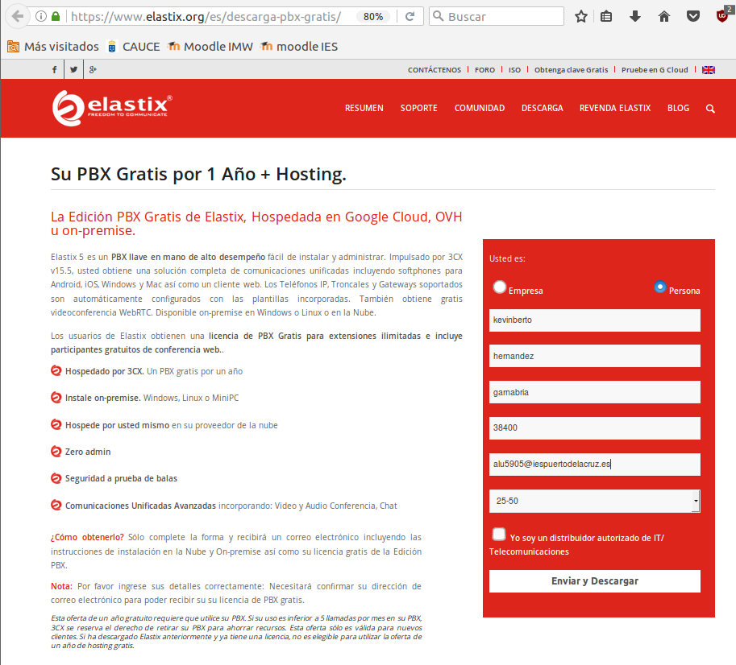
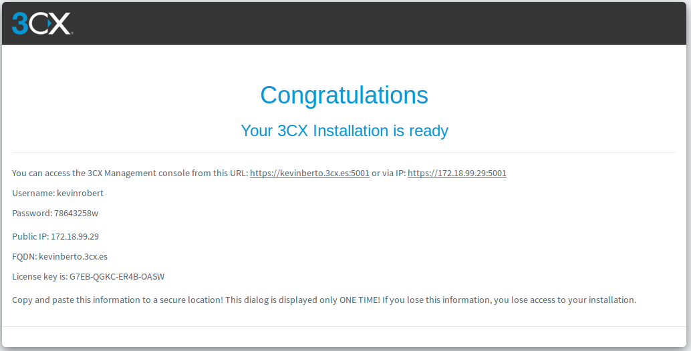
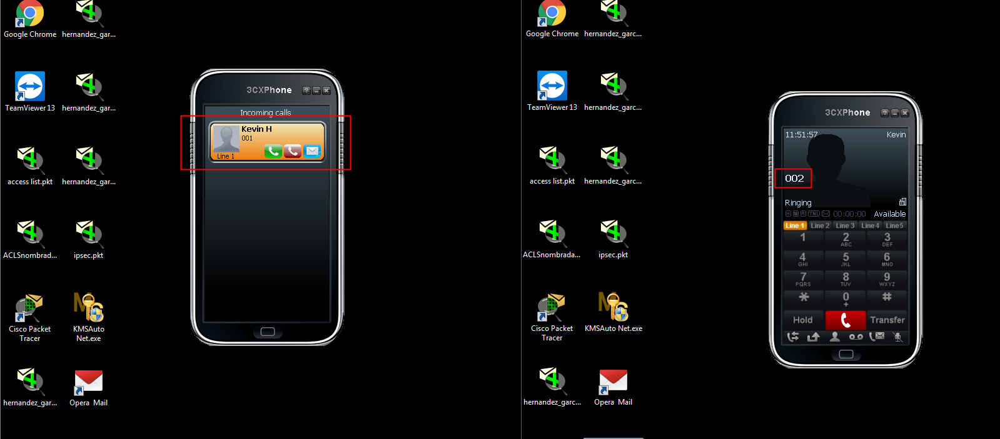

# U9-A1 | Instalación y Configuración del Servicio VoIP en Linux

Vamos a realizar la práctica de `VOIP` en Linux con la distribución de `Elastix`. Tenemos que descargar en la página oficial de `Elastix` https://www.elastix.org/es/.

Le damos a descargar `Elastix ver 5.0`.

Le damos a Download y tenemos descargado la iso de `Elastix`.

## 1. Preparando la máquina virtual para Elastix.

Abrimos el virtual box y creamos una máquina nueva.

Seleccionamos la iso de elastix y la colocamos en el `CD-ROM` virtual.

## 2. Instalación de Elastix.

Comenzamos la Instalación en el modo gráfico.

Escribimos el nombre del host en nuestro caso `kevinrobert`.

Seleccionamos el idioma = `Español`

Seleccionamos la ubicación = `Español`

Escribimos la contraseña del usuario `root`.

Seleccionamos nuestro horario en `Islas Canarias`.

Comenzamos con la Instalación por lo tanto no pedirá una confirmación de que las particiones se van a eliminar.

Ya tenemos instalado el `elastix`.

Tenemos que seleccionar la opción 1 para poder configurar `elastix` mediante el navegador.

Comprobamos que nos indica nuestra ip privada `172.18.19.29` y el puerto `5015`.

## 3. Configuración de VOIP

Abrimos un navegador en un equipo cliente y establecemos la siguiente IP.

- Nos pedirá que tenemos que registrarnos en la siguiente página y nos dará una clave para acceder a la Configuración del software.

Tenemos que registranos en el formulario y por correo obtendremos el código.

En el correo nos sale una verificación y solo debemos darle al enlace.

Ya tenemos el código y lo copiamos en el navegador.

Con el código le damos siguiente.

Establecemos el usuario y su contraseña.

En este caso no vamos a utilizar la IP pública, una privada.

El tipo de IP pública es estática. Pero como habíamos comentado en el apartado anterior será una IP privada.

Escribimos nuestro subdominio.

En la siguiente captura son los puertos que vamos a utilizar para los siguiente protocolos.

Seleccionamos el adaptador de red.

Ya comienza la Configuración y solo debemos esperar.

En la siguiente captura es la longitud que nosotros queremos para la extensión de llamadas.

Escribimos el email para el usuario `Admin`.

Seleccionamos el idioma

Escribimos el primer operador con su número de extensión.

Seleccionamos nuestra ubicación.

Seleccionamos en que idioma queremos nuestro prompts = `Español`

La siguiente captura es la confirmación del registro.

Esperamos que termine de configurar con los parámetros configurados.

Ya tenemos configurado  nuestro servicio de `VOPIP`.

Comprobamos que podemos entrar y administrar el software de `VOIP`.

Vemos todas las acciones que nos deja administrar.

Agregamos una nueva extensión.

Comprobamos que ya tenemos registrada 3 extensión.

## 4. Instalación del cliente

En nuestro caso primero probamos con el cliente `ekiga`, pero tuvimos bastantes problemas para realizar la conexión, el servidor los detectaba pero no realizaba llamadas, por lo que intentamos utilizar el cliente `3cx softphone`. Para ello vamos a descargar el programa desde su página oficial.

- Al instalarlo nos solicita un perfil SIP, por lo que añadiremos el perfil de `kevin`.

  

  

  

Una vez especificada la extensión y las credenciales necesarias vemos que el teléfono esta operativo.

- Instalamos el softphone y repetimos todos los pasos en un nuevo equipo cliente, pero esta vez con la configuración SIP de `roberto`.

## 4.1. Comprobaciones

Vamos a realizar llamadas de comprobación:

- Preparamos los telefonos y vemos que ambos estan a la espera.

  

- Realizamos una llamada desde `Kevin` hasta `Roberto`, y vemos que efectivamente `Roberto` recibe la llamada.

- Esto también vemos que funciona de viceversa.

- Si respondemos a la llamada podemos comprobar que se inicia la conversación y sale un temporizador de tiempo de llamada

- Para finalizar si accedemos a la interfaz web de `Elastix` podemos comprobar que ambos usuarios están conectados.

- En el apartado de `teléfonos` podemos comprobar que los teléfonos conectados se encuentran a través de clientes Windows y que están siendo usando con las cuentas de `kevin` y `roberto`

## ANEXO. Clientes móviles

En este apartado no pudimos completarlo por que no tuvimos forma de establecer conexión con la red de clase, pero si pudimos hacer la instalación del cliente.

- Para esto solo descargarmos la aplicación de la PlayStore en android.

  

- La interfaz de la aplicación es similar a la versión de escritorio.

  

- Y como indicamos previamente no pudimos establecer la conexión porque no teníamos acceso a la red y nuestro servidor no dispone de una IP Externa valida. 

Una vez dicho esto podemos dar por finalizada la práctica.
