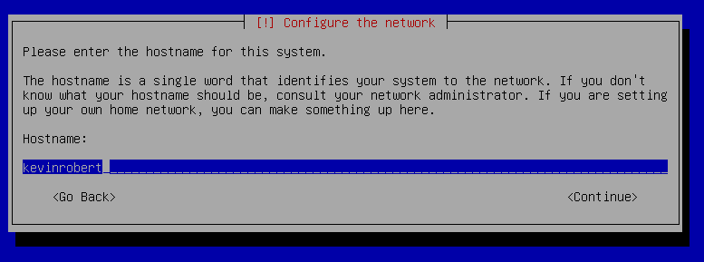
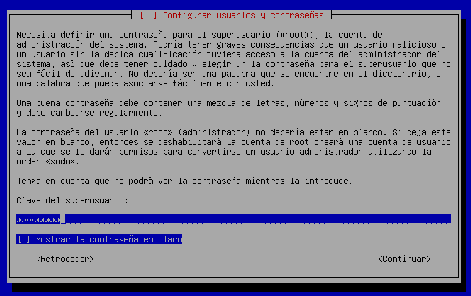
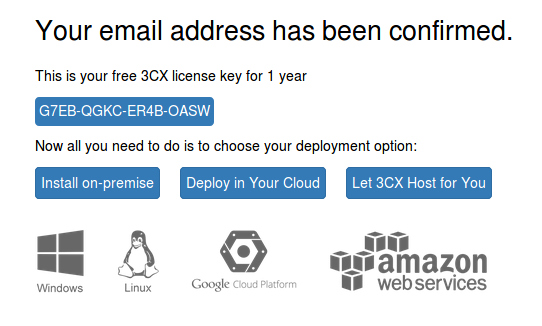

# U9-A1 | Instalación y Configuración del Servicio VoIP en Linux

Vamos a realizar la práctica de `VOIP` en Linux con la distribución de `Elastix`. Tenemos que descargar en la página oficial de `Elastix` https://www.elastix.org/es/.

Le damos a descargar `Elastix ver 5.0`.

Le damos a Download y tenemos descargado la iso de `Elastix`.

## 1. Preparando la máquina virtual para Elastix.

Abrimos el virtual box y creamos una máquina nueva.

Seleccionamos la iso de elastix y la colocamos en el `CD-ROM` virtual.

## 2. Instalación de Elastix.

Comenzamos la Instalación en el modo gráfico.

Escribimos el nombre del host en nuestro caso `kevinrobert`.

Seleccionamos el idioma = `Español`

Seleccionamos la ubicación = `Español`

Escribimos la contraseña del usuario `root`.

Seleccionamos nuestro horario en `Islas Canarias`.

Comenzamos con la Instalación por lo tanto no pedirá una confirmación de que las particiones se van a eliminar.

Ya tenemos instalado el `elastix`.

Tenemos que seleccionar la opción 1 para poder configurar `elastix` mediante el navegador.

Comprobamos que nos indica nuestra ip privada `172.18.19.29` y el puerto `5015`.

## 3. Configuración de VOIP

Abrimos un navegador en un equipo cliente y establecemos la siguiente IP.

- Nos pedirá que tenemos que registrarnos en la siguiente página y nos dará una clave para acceder a la Configuración del software.

Tenemos que registranos en el formulario y por correo obtendremos el código.

En el correo nos sale una verificación y solo debemos darle al enlace.

Ya tenemos el código y lo copiamos en el navegador.

Con el código le damos siguiente.

Establecemos el usuario y su contraseña.

En este caso no vamos a utilizar la IP pública, una privada.

El tipo de IP pública es estática. Pero como habíamos comentado en el apartado anterior será una IP privada.

Escribimos nuestro subdominio.

En la siguiente captura son los puertos que vamos a utilizar para los siguiente protocolos.

Seleccionamos el adaptador de red.

Ya comienza la Configuración y solo debemos esperar.

En la siguiente captura es la longitud que nosotros queremos para la extensión de llamadas.

Escribimos el email para el usuario `Admin`.

Seleccionamos el idioma

Escribimos el primer operador con su número de extensión.

Seleccionamos nuestra ubicación.

Seleccionamos en que idioma queremos nuestro prompts = `Español`

La siguiente captura es la confirmación del registro.

Esperamos que termine de configurar con los parámetros configurados.

Ya tenemos configurado  nuestro servicio de `VOPIP`.

Comprobamos que podemos entrar y administrar el software de `VOIP`.

Vemos todas las acciones que nos deja administrar.

Agregamos una nueva extensión.

Comprobamos que ya tenemos registrada 3 extensión.

## 4. Equipo Cliente Instalación de ekiga

Abrimos una terminal y instalamos el software `ekiga`.

Abrimos el programa y le damos cuentas y luego añadir una cuenta SIP.

Escribimos los siguiente parámetros para que se pueda conectar a nuestro sistema de `VOIP`.

Realizamos los mismo pasos con otro cliente, en el que incluiremos al usuario `kevin`.

En la siguiente captura vemos como ambos están funcionando al mismo tiempo.

- Si accedemos a la interfaz web de elastix podemos ver que ambas cuentas están configurados al mismo tiempo en este momento.

  

- Y en el apartado de los teléfonos podemos comprobar que ambas sesiones están en los softphone de `Ekiga`.

  

## 5. Comprobar con una llamada
