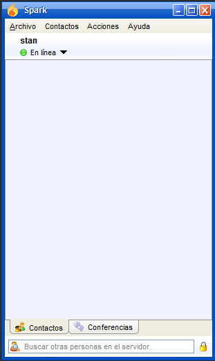
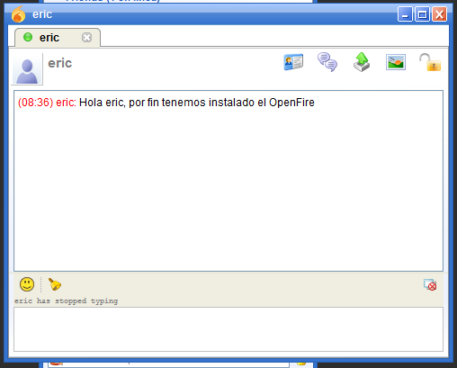
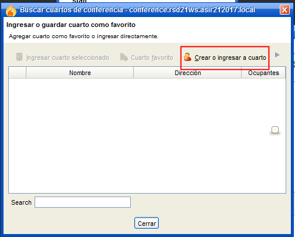
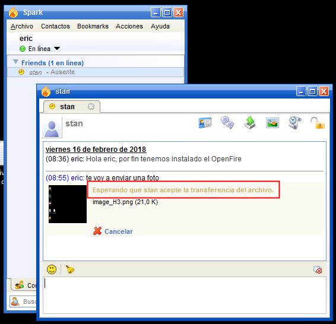
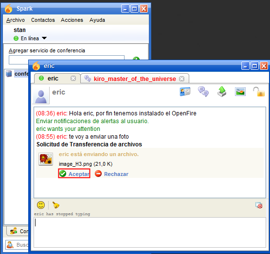

# U7-A1 | Instalación y Configuración de un Servidor de Mensajería Instantánea Openfire en Windows Server 2012

## 1. Comprobar en nuestro servidor tenemos instalado los servicio IIS, PHP, MySQL y phpMyAdmin.

Comprobamos que tenemos instalado el servicio de `IIS`.

Comprobamos que tenemos instalado el servicio de `MySQL`.

Comprobamos que tenemos instalado el `phpMyAdmin`.

## 2. Descargar Openfire

Vamos a la página web oficial de la aplicación de Mensajería `Openfire`.

Seleccionamos `Openfire_4_2_2_bundledJRE_x64.exe` lo descargamos y al comenzar con la instalación seleccionamos el idioma `Español`.

Seguimos el asistente de instalación de `Openfire`.

Marcamos la casilla de iniciar el servicio de `Openfire`.

## 3. Crear una Base de Datos para Openfire

Abrimos un navegador y entramos a la aplicación de `phpMyAdmin` y creamos la base de datos.

- Creamos un usuario para la base de datos de `Openfire`.

Le damos permiso al usuario para que tenga acceso completo a la base de datos de `Openfire`.

## 4. Configuración de Openfire

Tenemos que abrir en un navegador y poner `localhost:9090` el `9090` es el puerto para abrir la aplicación de `Openfire`.

