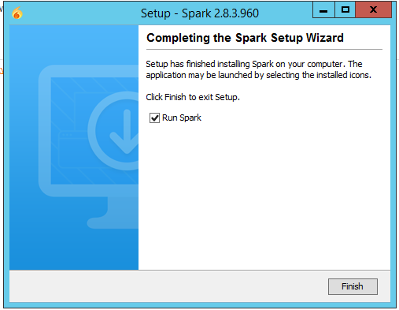

# U7-A1 | Instalación y Configuración de un Servidor de Mensajería Instantánea Openfire en Windows Server 2012

## 1. Comprobar en nuestro servidor tenemos instalado los servicio IIS, PHP, MySQL y phpMyAdmin.

Comprobamos que tenemos instalado el servicio de `IIS`.

Comprobamos que tenemos instalado el servicio de `MySQL`.

Comprobamos que tenemos instalado el `phpMyAdmin`.

## 2. Descargar Openfire

Vamos a la página web oficial de la aplicación de Mensajería `Openfire`.

Seleccionamos `Openfire_4_2_2_bundledJRE_x64.exe` lo descargamos y al comenzar con la instalación seleccionamos el idioma `Español`.

Seguimos el asistente de instalación de `Openfire`.

Marcamos la casilla de iniciar el servicio de `Openfire`.

## 3. Crear una Base de Datos para Openfire

Abrimos un navegador y entramos a la aplicación de `phpMyAdmin` y creamos la base de datos.

- Creamos un usuario para la base de datos de `Openfire`.

Le damos permiso al usuario para que tenga acceso completo a la base de datos de `Openfire`.

## 4. Configuración de Openfire

Tenemos que abrir en un navegador y poner `localhost:9090` el `9090` es el puerto para abrir la aplicación de `Openfire`.

Seleccionamos el idioma `Español`

- Lo dejamos por defecto y le damos siguiente.

- Conexión Estándar y continuar.

- Seleccionamos la base de datos `MySQL` y escribimos el nombre de la base de datos `openfire`.

- La configuración del perfil lo dejamos por defecto.

- Cuenta de administrador.

Escribimos en el navegador del servidor `localhost:9090`

- Escribimos el nombre del `usuario` y `contraseña`.

Comprobamos que podemos acceder a la configuración de `openfire`.

- Comprobamos que podemos acceder desde el navegador del equipo cliente con el el dominio `miempresa.com:8080`

## 5. Instalación de la aplicación Spark

Vamos a la página y descargamos el `Spark`

Descargamos el `spark_2_8_3`

Le damos a instalar y siguiente.

Seguimos el asistente de la aplicación `Spark`

Ya termino la instalación.

- Se abre la aplicación con `Spark`

Vamos al equipo cliente y instalamos el `Spark`

## 6. Creación de Usuario para Openfire

Creación de usuario de `eric`

Creamos el usuario `stan`

Listado de usuarios creados.

Tenemos que abrir la aplicación de `Spark` y marcas las siguientes casillas.

Iniciamos la aplicación `Spark` y nos logeamos con el usuario `Stan`

Comprobamos que podemos acceder a la cuenta de `stan`

Nos logeamos con el usuario `Eric`

Vemos que entramos con la cuenta de `eric`

Vamos a agregar el contacto de eric.

Lo metemos en el grupo de amigos.

Envió un mensaje a `eric`

Vemos que el mensaje llega correctamente.

Vamos a crear una conferencia nueva.

Le damos a crear conferencia

Establecemos el nombre a la sala.

Para entrar en la sala solo tenemos que buscarla en conferencia y nos unimos.

Los dos usuarios escriben algo en la sala.

Se puede enviar fotos.

El usuario acepta la foto y la puede visualizar

## 7. Instalación de SparkWeb

Vamos a la página web y descargamos la aplicación de `SparkWeb`

Descomprimimos la carpeta de `SparkWeb` en la unidad `c:`

Comprobamos su contenido.

Vamos al `IIS` y creamos una virtual host nuevo.

Vamos al Servicio de `DNS` y lo llamamos `sparkweb.miempresa.com`

Añadimos al documento predeterminado `SparkWeb.html`

Instalamos el adobe flash player.

Intentamos acceder a la página, pero no funciona el botón login.

