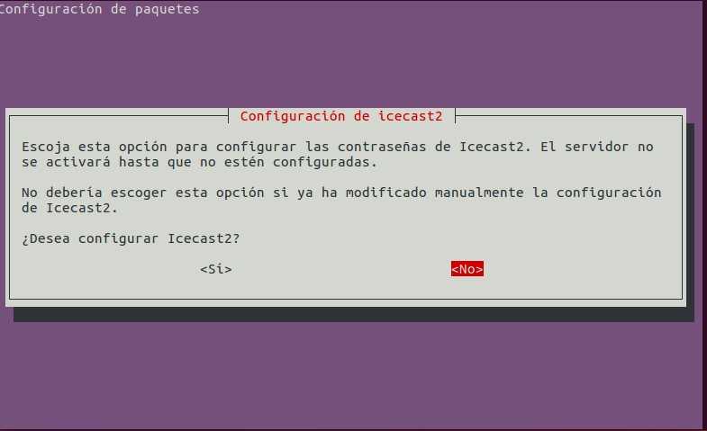
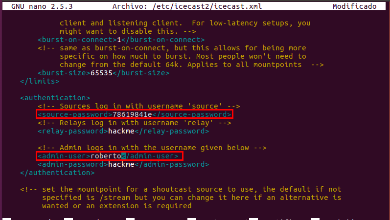

# Instalación y Configuración de un Servidor Multimedia (Audio)

## 1. Descargar e Instalación el paquete IceCast

Primero tenemos que escribir el siguiente comando `apt install icecast2`

```console
roberto@serverob:~$ sudo apt install icecast2
Leyendo lista de paquetes... Hecho
Creando árbol de dependencias       
Leyendo la información de estado... Hecho
Los paquetes indicados a continuación se instalaron de forma automática y ya no son necesarios.
  linux-headers-4.4.0-103 linux-headers-4.4.0-103-generic linux-headers-4.4.0-21
  linux-headers-4.4.0-21-generic linux-image-4.4.0-103-generic
  linux-image-4.4.0-21-generic linux-image-extra-4.4.0-103-generic
  linux-image-extra-4.4.0-21-generic
Utilice «sudo apt autoremove» para eliminarlos.
Paquetes sugeridos:
  ices2
Se instalarán los siguientes paquetes NUEVOS:
  icecast2
0 actualizados, 1 nuevos se instalarán, 0 para eliminar y 468 no actualizados.
Se necesita descargar 1.309 kB de archivos.
Se utilizarán 2.111 kB de espacio de disco adicional después de esta operación.
Des:1 http://es.archive.ubuntu.com/ubuntu xenial/universe amd64 icecast2 amd64 2.4.2-1 [1.309 kB]
Descargados 1.309 kB en 0s (2.170 kB/s)
Preconfigurando paquetes ...
Seleccionando el paquete icecast2 previamente no seleccionado.
(Leyendo la base de datos ... 302510 ficheros o directorios instalados actualmente.)
Preparando para desempaquetar .../icecast2_2.4.2-1_amd64.deb ...
Desempaquetando icecast2 (2.4.2-1) ...
Procesando disparadores para doc-base (0.10.7) ...
Procesando 1 archivo doc-base añadido...
Procesando disparadores para man-db (2.7.5-1) ...
Procesando disparadores para systemd (229-4ubuntu10) ...
Procesando disparadores para ureadahead (0.100.0-19) ...
Configurando icecast2 (2.4.2-1) ...
Procesando disparadores para systemd (229-4ubuntu10) ...
Procesando disparadores para ureadahead (0.100.0-19) ...
roberto@serverob:~$

```

En un momento de las instalación nos pedirá que tenemos que configurar el servicio de `IceCast`



Tenemos que editar el siguiente fichero de configuración `/etc/icecast/icecast2.xml`



```console
roberto@serverob:~$ sudo nano /etc/icecast2/icecast.xml
[sudo] password for roberto:
roberto@serverob:~$ sudo cat /etc/icecast2/icecast.xml | grep -e source-password -e admin-user -e admin-password
        <source-password>78619841e</source-password>
        <admin-user>roberto</admin-user>
        <admin-password>78619841e</admin-password>
roberto@serverob:~$
```
El siguiente fichero para editar es `/etc/default/icecast` y tenemos que cambiar de `false` a `true`.


```console
roberto@serverob:~$ sudo cat /etc/default/icecast2 | grep ENABLE
ENABLE=true
roberto@serverob:~$
```

Tenemos que iniciar el servicio de `icecast2.service`

```console
roberto@serverob:~$ sudo systemctl start icecast2
roberto@serverob:~$ sudo systemctl status icecast2
● icecast2.service - LSB: Icecast2 streaming media server
   Loaded: loaded (/etc/init.d/icecast2; bad; vendor preset: enabled)
   Active: active (exited) since vie 2018-02-23 23:02:32 WET; 31min ago
     Docs: man:systemd-sysv-generator(8)

feb 23 23:02:32 serverob systemd[1]: Starting LSB: Icecast2 streaming media server...
feb 23 23:02:32 serverob icecast2[3229]:  * Starting streaming media server icecast2
feb 23 23:02:32 serverob icecast2[3229]:  * icecast2 daemon is disabled - read /etc/def
feb 23 23:02:32 serverob icecast2[3229]:    ...done.
feb 23 23:02:32 serverob systemd[1]: Started LSB: Icecast2 streaming media server.
feb 23 23:34:14 serverob systemd[1]: Started LSB: Icecast2 streaming media server.
lines 1-11/11 (END)
```
## 2. Instalación el codificador vorbis ices2

Tenemos que escribir el siguiente comando `ices2`

```console
roberto@serverob:~$ sudo apt install ices2
[sudo] password for roberto:
Leyendo lista de paquetes... Hecho
Creando árbol de dependencias       
Leyendo la información de estado... Hecho
Los paquetes indicados a continuación se instalaron de forma automática y ya no son necesarios.
  linux-headers-4.4.0-103 linux-headers-4.4.0-103-generic linux-headers-4.4.0-21
  linux-headers-4.4.0-21-generic linux-image-4.4.0-103-generic
  linux-image-4.4.0-21-generic linux-image-extra-4.4.0-103-generic
  linux-image-extra-4.4.0-21-generic
Utilice «sudo apt autoremove» para eliminarlos.
Se instalarán los siguientes paquetes NUEVOS:
  ices2
0 actualizados, 1 nuevos se instalarán, 0 para eliminar y 468 no actualizados.
Se necesita descargar 55,7 kB de archivos.
Se utilizarán 187 kB de espacio de disco adicional después de esta operación.
Des:1 http://es.archive.ubuntu.com/ubuntu xenial/universe amd64 ices2 amd64 2.0.2-2 [55,7 kB]
Descargados 55,7 kB en 0s (124 kB/s)
Seleccionando el paquete ices2 previamente no seleccionado.
(Leyendo la base de datos ... 302605 ficheros o directorios instalados actualmente.)
Preparando para desempaquetar .../ices2_2.0.2-2_amd64.deb ...
Desempaquetando ices2 (2.0.2-2) ...
Procesando disparadores para doc-base (0.10.7) ...
Procesando 1 archivo doc-base añadido...
Procesando disparadores para man-db (2.7.5-1) ...
Configurando ices2 (2.0.2-2) ...
roberto@serverob:~$
```

Creamos un directorio para el codificador y copiar el fichero de configuración por defecto:


```console
roberto@serverob:~$ sudo mkdir /etc/ices2
roberto@serverob:~$ sudo cp /usr/share/doc/ices2/examples/ices-playlist.xml /etc/ices2/
roberto@serverob:~$ ls -l /etc/ices2/
total 8
-rw-r--r-- 1 root root 4329 feb 23 23:57 ices-playlist.xml
roberto@serverob:~$

```

Ahora editamos el fichero de configuración del codificador y establecemos los   
parámetros de nuestra emisora mediante las siguientes etiquetas:


```console
roberto@serverob:~$ sudo cat /etc/ices2/ices-playlist.xml | grep -e name -e genre -e description -e name="file" -e port -e password -e mount
    <!-- optional filename to write process id to -->
            <name>Mi Estación de Radio</name>
            <genre>Rock</genre>
            <description>Radio musical dedicada al pop y al rock</description>
            to returns a filename to start playing. -->
            <param name="type">basic</param>
            <param name="file">/etc/icecast2/playlist.txt</param>
            <param name="random">0</param>
            <param name="restart-after-reread">0</param>
            <param name="once">0</param>
            mountpoints on the same server). Each of them can have different
            This example defines two instances as two mountpoints on the
                You define hostname and port for the server here, along with
                the source password and mountpoint.  -->
            <hostname>localhost</hostname>
            <port>8000</port>
            <password>78619841e</password>
            <mount>/radiostation</mount>
roberto@serverob:~$

```


- Recopilar  unos  cuantos  ficheros  de  audio  en  formato  ogg  y  copiarlos  en  el  
directorio `/tmp/música`


Generar la lista de reproducción:
