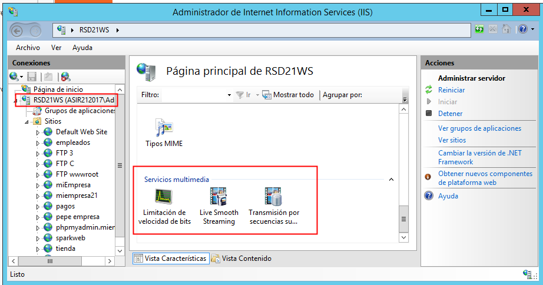
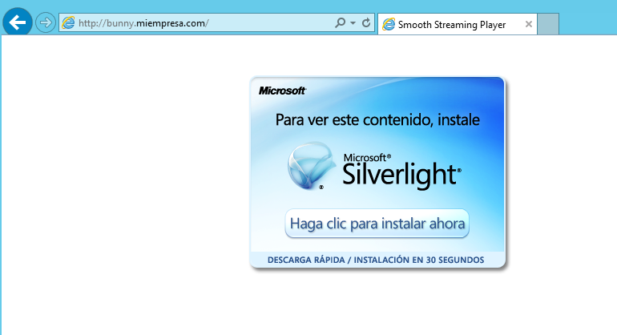

# U8-A1 | Instalación y configuración de un Servidor Multimedia Windows 2012 Server

En esta actividad vamos a instalar y configurar en nuestra MV con Windows 2012 server el servidor Multimedia `IIS Media Services`, con el cual dar soporte streaming para nuestro servidor web `IIS`.

En este parte utilizaremos:

- Nuestra MV con `Windows 2012 Server`.
- Una máquina cliente con `Windows 7`.

## 1. Descarga e instalación de `IIS Media Services`

Para empezar hay que indicar que no encontraremos el servicio desde el administrador de nuestro servidor, por lo que debemos descargar el servicio accediendo a la [página oficial de Microsoft](https://www.microsoft.com/es-es/download/details.aspx?id=27955).

- Una vez descargado solo instalamos el paquete con la configuración por defecto.

  

  

  

Al finalizar la instalación podemos comprobar desde el `administrador de IIS` que tanto en las opciones globales como en las opciones de cada web se nos han añadido parámetros de `Servicios Multimedia`.

- Opciones globales:

  

- Opciones sitio web empleados:

  

## 2. Crear sitios Web con ejemplos de emisión

Vamos a crear dos nuevos sitios web. En estos vamos a colocar los siguientes ejemplos de emisiones multimedia codificadas:

- `Big Buck Bunny`.
- `Elephants Dream`.

En nuestro caso descargamos ambos archivos desde un servidor en el aula.

Una vez descargados descomprimimos los archivos y las carpetas generadas las vamos a utilizar como directorios raíz de nuestros sitios nuevos.

Agregamos los dos sitios web, cada uno enlazado a la ruta física correspondiente:

- `Bunny`:

    

    

- `Elephants`:

    

Para finalizar con la creación de nuestro sitio vamos a crear un nuevo registro `DNS` para cada web, permitiendo que sea accesible por los clientes fácilmente.

## 3. Cliente de reproducción `SmoothMediaPlayer`

Para poder visualizar nuestro contenido debemos descargar un cliente de reproducción y añadirlo a nuestra web. El elegido para esta práctica es el reproductor `SmoothMediaPlayer`, un reproductor de streaming propietario de Microsoft. Lo descargamos nuevamente desde su [página oficial](https://www.microsoft.com/en-us/download/details.aspx?id=36057).

Esta página nos descarga un ejecutable que nos extrae los archivos necesarios para la implementación en las páginas web.

Vamos a descomprimir y copiar los archivos `.html` y `.xap` en nuestros dos sitios web. Al archivo `SmoothStreamingPlayer.html` lo renombraremos como `index.html` para que nuestro sitio lo reconozca como página principal. (Esto también lo podemos hacer admitiendo el nombre anterior en los ajustes del servidor.)

- `Bunny`:

    

    

- `Elephants`:

    

Tenemos que modificar la línea 66 de los `index.html`, especificándole la ruta del archivo `.ism` de nuestros sitios.

- `Bunny`:

    

- `Elephants`:

    

## 4. Instalar Microsoft Silverlight

Al intentar acceder a nuestros nuevos sitios, en el caso de que no tengamos `Microsoft Silverlight`, la página nos indicará que debemos instalarlo.

Desde la página que nos enlaza seleccionaremos el primer link. Que nos descarga un ejecutable.

Comenzaremos la instalación por defecto, desmarcando las opciones adicionales.

> **Nota:** `Microsoft Silverlight` es una herramienta que requiere de los navegadores que dispongan de plugins `NPAPI` (Netscape Plugin Application Programming Interface), los cuales actualmente se encuentran en desuso en los navegadores actuales más conocidos (Chrome, firefox, Opera, Microsoft Edge...).
>
>El único navegador que sigue utilizando estos plugins es Internet Explorer (`IE`), y en el caso de nuestro servidor viene con una configuración de seguridad que bloquea el uso de `Microsoft Silverlight`.
>
> Sí queremos deshabilitar estas configuraciones de seguridad debemos dirigirnos a `Administrador del servidor` -> `Servidor local` -> `Propiedades` y desactivamos `configuración de seguridad mejorada de IE`.
>
>
>
>

## 5. Comprobaciones

Vamos a comprobar que podemos acceder a las emisiones multimedia desde nuestro servidor y nuestro cliente.

- Servidor:

  

  

- Cliente:

  

  

  > Si utilizamos otros navegadores como `Google Chrome` vemos que `Microsoft Silverlight` no esta soportado.
  >
  >

## 6. Ajuste: `Limitación de velocidad de Bits`

En los ajustes de `IIS` referentes a `Servicios Multimedia` nos podemos encontrar la opción `Limitación de velocidad de bits`. Una opción muy interesante que analizaremos en este punto.

Esta opción nos permite limitar la velocidad de transmisión, de manera que ahorres banda ancha y puedas tener un mayor número de usuarios simultáneos.

Por defecto esta opción viene deshabilitada, para probarla podemos hacer que todos los archivos `.mp4` se retransmitan con una capacidad máxima de `500 kbps`.

Después de esto solo debemos habilitar la opción.

## 7. Ajuste: `Presentaciones de transmisión por secuencias suave`

En los ajustes `Servicios multimedia` también nos encontramos la característica "Presentaciones de transmisión por secuencias suave" o `Smooth streaming`.

Está característica nos permite añadir nuevas secuencias en nuestras emisiones multimedia codificadas.

Desde aquí podemos comprobar los puntos de acceso a la presentación y los contenidos de la misma, que vemos que se separan en una pista de audio y ocho pista de video en el caso de `Big Buck Bunny`.

