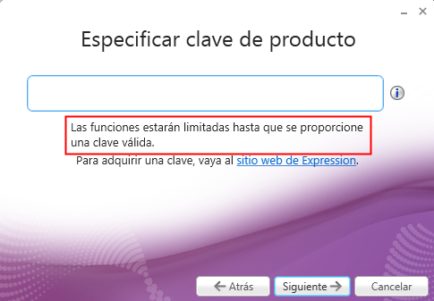

# U8-A1-parte-II | Instalación y Configuración de un Servidor Multimedia – Codificación de contenidos propios

En esta práctica vamos a continuar utilizando los medios multimedia en nuestros sitios web de `IIS`, pero en esta ocasión utilizaremos medios propios.

## 1. Instalación de `Microsoft Expression Encoder`

Lo primero que tenemos que hacer es descargar el programa que codificara nuestros archivos a un formato valido para que se pueda visualizar utilizando `Microsoft Silverlight`.

Para esto vamos a instalar la herramienta `Microsoft Expression Encoder`. Para utilizar esta herramienta vamos a necesitar activar la característica `Infraestructura e interfaces de usuario` -> `Experiencia de escritorio`.

Reiniciamos el servidor y descargamos `Microsoft Expression Encoder` desde su [página oficial](https://www.microsoft.com/es-es/download/details.aspx?id=27870).

- Comencemos la instalación con los valores por defecto.

    

    

    

    

    

## 2. Creación del sitio web

Vamos a crear un `virtual host` dentro de nuestro servidor web `IIS`, en esta ocasión lo llamaremos `playlist.miempresa.com`.

Para ello vamos a crear una nueva carpeta física que por ahora estará vacía.

En este sitio vamos a utilizar archivos multimedia, por lo que vamos a descargar un archivo de audio y otro de vídeo que utilizaremos más adelante.

## 3. Creación de DNS

Ahora vamos a añadir a nuestro nuevo sitio a nuestro servidor DNS creando un nuevo registro.

## 4. Crear un nuevo proyecto Silverlight

Ahora vamos a codificar los archivos multimedia que hemos seleccionado utilizando `Microsoft Expression Encoder`. Abriremos el programa y seleccionaremos crear un `proyecto silverlight`.

Comenzado el proyecto añadimos los elementos multimedia, seleccionamos la ruta donde queremos que se guarden los resultados y pulsamos el botón `Codificar`. Dependiendo del tamaño del video y la capacidad de nuestro servidor el proceso puede ser bastante largo.

Al acabar la codificación podemos comprobar que en la ruta `C:\streaming\playlist` vemos que se han generado los archivos codificados.

> **Nota:** En este paso no desmarcamos la opción en la salida de `crear una subcarpeta por id. de trabajo`, y en nuestro caso no nos interesa que este dentro de una subcarpeta por lo que simplemente tuvimos que sacar el contenido a la carpeta padre.
>
>
>
>

Para que podamos acceder directamente a nuestro sitio utilizando la URL `playlist.miempresa.com` debemos añadir `Default.html` a los documentos predeterminados o renombrar el archivo.

## 5. Comprobaciones

Por último vamos a comprobar que nuestro sitio funciona.

- Servidor:

    

    > Vemos que al acceder podemos seleccionar y reproducir ambos archivos.

    

- Cliente:

    

    > Desde el cliente también funciona correctamente.

Hecho esto podemos dar por finalizada la actividad.
