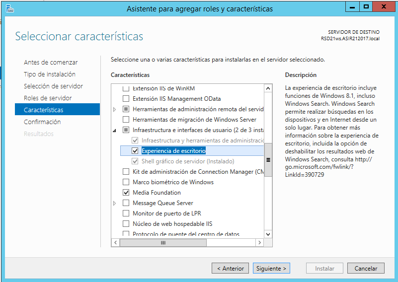
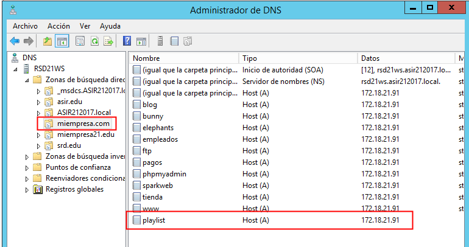

# U8-A1-parte-II | Instalación y Configuración de un Servidor Multimedia – Codificación de contenidos propios

En esta práctica vamos a continuar utilizando los medios multimedia en nuestros sitios web de `IIS`, pero en esta ocasión utilizaremos medios propios.

## 1. Instalación de `Microsoft Expression Encoder`

Lo primero que tenemos que hacer es descargar el programa que codificara nuestros archivos a un formato valido para que se pueda visualizar utilizando `Microsoft Silverlight`.

Para esto vamos a instalar la herramienta `Microsoft Expression Encoder`. Para utilizar esta herramienta vamos a necesitar activar la característica `Infraestructura e interfaces de usuario` -> `Experiencia de escritorio`.

Reiniciamos el servidor y descargamos `Microsoft Expression Encoder` desde su [página oficial](https://www.microsoft.com/es-es/download/details.aspx?id=27870).

- Comencemos la instalación con los valores por defecto.

    

    

    

    

    

## 2. Creación del sitio web

Vamos a crear un `virtual host` dentro de nuestro servidor web `IIS`, en esta ocasión lo llamaremos `playlist.miempresa.com`.

Para ello vamos a crear una nueva carpeta física que por ahora estará vacía.

En este sitio vamos a utilizar archivos multimedia, por lo que vamos a descargar un archivo de audio y otro de vídeo que utilizaremos más adelante.

## 3. Creación de DNS

Ahora vamos a añadir a nuestro nuevo sitio a nuestro servidor DNS creando un nuevo registro.

## 4. Crear un nuevo proyecto Silverlight
