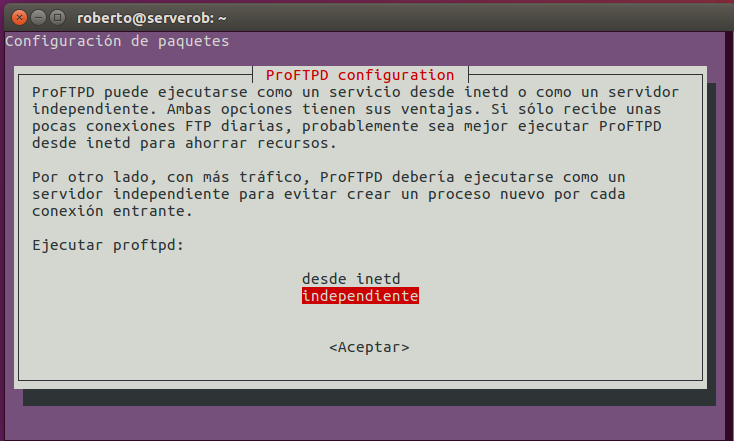
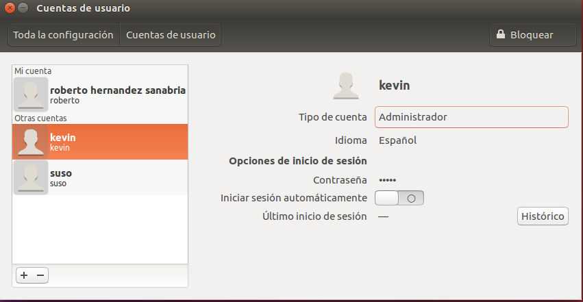
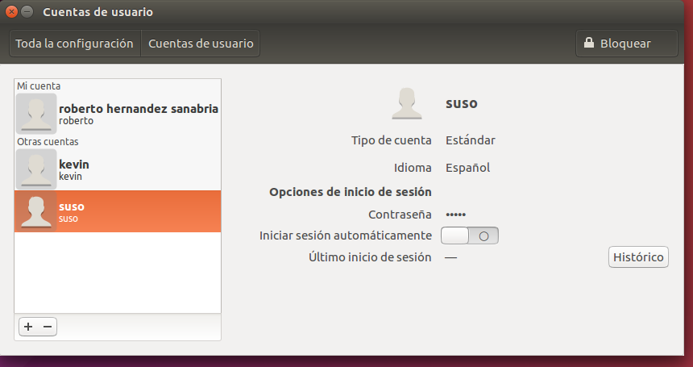
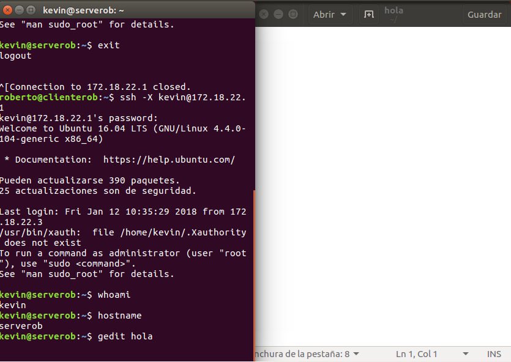

# Servicio FTP en Ubuntu

## 1. Instalación de FTP en Ubuntu

Primero tenemos que actualizar los repositios de Ubuntu.

- `sudo apt update`

```console
roberto@serverob:~$ sudo apt update
[sudo] password for roberto:
Obj:1 http://es.archive.ubuntu.com/ubuntu xenial InRelease
Obj:2 http://es.archive.ubuntu.com/ubuntu xenial-updates InRelease             
Des:3 http://security.ubuntu.com/ubuntu xenial-security InRelease [102 kB]     
Obj:4 http://es.archive.ubuntu.com/ubuntu xenial-backports InRelease           
Des:5 http://security.ubuntu.com/ubuntu xenial-security/main amd64 Packages [424 kB]
Des:6 http://security.ubuntu.com/ubuntu xenial-security/main i386 Packages [384 kB]
Des:7 http://security.ubuntu.com/ubuntu xenial-security/main Translation-en [186 kB]
Des:8 http://security.ubuntu.com/ubuntu xenial-security/restricted amd64 Packages [7.224 B]
Des:9 http://security.ubuntu.com/ubuntu xenial-security/restricted i386 Packages [7.224 B]
Des:10 http://security.ubuntu.com/ubuntu xenial-security/restricted Translation-en [2.152 B]
Des:11 http://security.ubuntu.com/ubuntu xenial-security/universe amd64 Packages [195 kB]
Des:12 http://security.ubuntu.com/ubuntu xenial-security/universe i386 Packages [160 kB]
Des:13 http://security.ubuntu.com/ubuntu xenial-security/universe Translation-en [101 kB]
Des:14 http://security.ubuntu.com/ubuntu xenial-security/multiverse amd64 Packages [3.208 B]
Des:15 http://security.ubuntu.com/ubuntu xenial-security/multiverse i386 Packages [3.380 B]
Descargados 1.574 kB en 1s (1.219 kB/s)
Leyendo lista de paquetes... Hecho
Creando árbol de dependencias       
Leyendo la información de estado... Hecho
Se pueden actualizar 386 paquetes. Ejecute «apt list --upgradable» para verlos.

```

Para instalar el servicio `proftpd` tenemos que escribir el siguiente comando.

- `sudo apt install proftpd`

```console

roberto@serverob:~$ sudo apt install proftpd
Leyendo lista de paquetes... Hecho
Creando árbol de dependencias       
Leyendo la información de estado... Hecho
Nota, seleccionando «proftpd-basic» en lugar de «proftpd»
Los paquetes indicados a continuación se instalaron de forma automática y ya no son necesarios.
  linux-headers-4.4.0-21 linux-headers-4.4.0-21-generic
  linux-image-4.4.0-21-generic linux-image-extra-4.4.0-21-generic
Utilice «sudo apt autoremove» para eliminarlos.
Se instalarán los siguientes paquetes adicionales:
  libmemcached11 libmemcachedutil2
Paquetes sugeridos:
  openbsd-inetd | inet-superserver proftpd-doc proftpd-mod-ldap
  proftpd-mod-mysql proftpd-mod-odbc proftpd-mod-pgsql proftpd-mod-sqlite
  proftpd-mod-geoip
Se instalarán los siguientes paquetes NUEVOS:
  libmemcached11 libmemcachedutil2 proftpd-basic
0 actualizados, 3 nuevos se instalarán, 0 para eliminar y 386 no actualizados.
Se necesita descargar 2.081 kB de archivos.
Se utilizarán 4.772 kB de espacio de disco adicional después de esta operación.
¿Desea continuar? [S/n] s
Des:1 http://es.archive.ubuntu.com/ubuntu xenial/main amd64 libmemcached11 amd64 1.0.18-4.1 [82,7 kB]
Des:2 http://es.archive.ubuntu.com/ubuntu xenial/main amd64 libmemcachedutil2 amd64 1.0.18-4.1 [9.490 B]
Des:3 http://es.archive.ubuntu.com/ubuntu xenial/universe amd64 proftpd-basic amd64 1.3.5a-1build1 [1.989 kB]
Descargados 2.081 kB en 2s (815 kB/s)      
Preconfigurando paquetes ...
Seleccionando el paquete libmemcached11:amd64 previamente no seleccionado.
(Leyendo la base de datos ... 267227 ficheros o directorios instalados actualmente.)
Preparando para desempaquetar .../libmemcached11_1.0.18-4.1_amd64.deb ...
Desempaquetando libmemcached11:amd64 (1.0.18-4.1) ...
Seleccionando el paquete libmemcachedutil2:amd64 previamente no seleccionado.
Preparando para desempaquetar .../libmemcachedutil2_1.0.18-4.1_amd64.deb ...
Desempaquetando libmemcachedutil2:amd64 (1.0.18-4.1) ...
Seleccionando el paquete proftpd-basic previamente no seleccionado.
Preparando para desempaquetar .../proftpd-basic_1.3.5a-1build1_amd64.deb ...
Desempaquetando proftpd-basic (1.3.5a-1build1) ...
Procesando disparadores para libc-bin (2.23-0ubuntu9) ...
Procesando disparadores para systemd (229-4ubuntu10) ...
Procesando disparadores para ureadahead (0.100.0-19) ...
Procesando disparadores para man-db (2.7.5-1) ...
Configurando libmemcached11:amd64 (1.0.18-4.1) ...
Configurando libmemcachedutil2:amd64 (1.0.18-4.1) ...
Configurando proftpd-basic (1.3.5a-1build1) ...
Aviso: No se puede acceder al directorio personal /run/proftpd que especificó: No such file or directory.
Añadiendo el usuario del sistema `proftpd' (UID 124) ...
Añadiendo un nuevo usuario `proftpd' (UID 124) con grupo `nogroup' ...
No se crea el directorio personal `/run/proftpd'.
Añadiendo el usuario del sistema `ftp' (UID 125) ...
Añadiendo un nuevo usuario `ftp' (UID 125) con grupo `nogroup' ...
Creando el directorio personal `/srv/ftp' ...
'/usr/share/proftpd/templates/welcome.msg' -> '/srv/ftp/welcome.msg.proftpd-new'
Procesando disparadores para libc-bin (2.23-0ubuntu9) ...
Procesando disparadores para systemd (229-4ubuntu10) ...
Procesando disparadores para ureadahead (0.100.0-19) ...
roberto@serverob:~$

```
En un instante de la instalación nos pedirá que seleccionemos dos opciones.



- `Inetd`: Para pocas conexiones diarias.
- `Independiente`: Para muchas conexiones diarias.

## 2. Crear dos usuarios llamado kevin y suso

Solo tenemos que crear dos usuarios con el comando `useradd "nombre-Usuario"`.

```console

roberto@serverob:~$ sudo adduser kevin
Añadiendo el usuario `kevin' ...
Añadiendo el nuevo grupo `kevin' (1001) ...
Añadiendo el nuevo usuario `kevin' (1001) con grupo `kevin' ...
Creando el directorio personal `/home/kevin' ...
Copiando los ficheros desde `/etc/skel' ...
Introduzca la nueva contraseña de UNIX:
Vuelva a escribir la nueva contraseña de UNIX:
passwd: contraseña actualizada correctamente
Cambiando la información de usuario para kevin
Introduzca el nuevo valor, o presione INTRO para el predeterminado
	Nombre completo []: kevin
	Número de habitación []:
	Teléfono del trabajo []:
	Teléfono de casa []:
	Otro []:
¿Es correcta la información? [S/n] s
roberto@serverob:~$ sudo adduser suso
Añadiendo el usuario `suso' ...
Añadiendo el nuevo grupo `suso' (1002) ...
Añadiendo el nuevo usuario `suso' (1002) con grupo `suso' ...
Creando el directorio personal `/home/suso' ...
Copiando los ficheros desde `/etc/skel' ...
Introduzca la nueva contraseña de UNIX:
Vuelva a escribir la nueva contraseña de UNIX:
passwd: contraseña actualizada correctamente
Cambiando la información de usuario para suso
Introduzca el nuevo valor, o presione INTRO para el predeterminado
	Nombre completo []: suso
	Número de habitación []:
	Teléfono del trabajo []:
	Teléfono de casa []:
	Otro []:
¿Es correcta la información? [S/n] s
roberto@serverob:~$

```
### 2.1 Establecemos los siguiente privilegios para los usuarios.

Un usuario tiene que tener privilegio de `Administrador` y el otro usuario como `Estándar`.

Tenemos que ir a `Cuentas de usuario`

- Kevin: `Administrador`



- Suso: `Estándar`



## 3. Tenemos que instalar el servicio ssh

Tenemos que instalar el servicio ssh.

```console

roberto@serverob:~$ sudo apt install ssh
Leyendo lista de paquetes... Hecho
Creando árbol de dependencias       
Leyendo la información de estado... Hecho
Los paquetes indicados a continuación se instalaron de forma automática y ya no son necesarios.
  linux-headers-4.4.0-21 linux-headers-4.4.0-21-generic
  linux-image-4.4.0-21-generic linux-image-extra-4.4.0-21-generic
Utilice «sudo apt autoremove» para eliminarlos.
Se instalarán los siguientes paquetes adicionales:
  ncurses-term openssh-client openssh-server openssh-sftp-server ssh-import-id
Paquetes sugeridos:
  ssh-askpass libpam-ssh keychain monkeysphere rssh molly-guard
Se instalarán los siguientes paquetes NUEVOS:
  ncurses-term openssh-server openssh-sftp-server ssh ssh-import-id
Se actualizarán los siguientes paquetes:
  openssh-client
1 actualizados, 5 nuevos se instalarán, 0 para eliminar y 385 no actualizados.
Se necesita descargar 1.230 kB de archivos.
Se utilizarán 5.244 kB de espacio de disco adicional después de esta operación.
¿Desea continuar? [S/n] s
Des:1 http://es.archive.ubuntu.com/ubuntu xenial-updates/main amd64 openssh-client amd64 1:7.2p2-4ubuntu2.2 [587 kB]
Des:2 http://es.archive.ubuntu.com/ubuntu xenial-updates/main amd64 openssh-sftp-server amd64 1:7.2p2-4ubuntu2.2 [38,7 kB]
Des:3 http://es.archive.ubuntu.com/ubuntu xenial-updates/main amd64 openssh-server amd64 1:7.2p2-4ubuntu2.2 [338 kB]
Des:4 http://es.archive.ubuntu.com/ubuntu xenial-updates/main amd64 ssh all 1:7.2p2-4ubuntu2.2 [7.076 B]
Des:5 http://es.archive.ubuntu.com/ubuntu xenial/main amd64 ncurses-term all 6.0+20160213-1ubuntu1 [249 kB]
Des:6 http://es.archive.ubuntu.com/ubuntu xenial/main amd64 ssh-import-id all 5.5-0ubuntu1 [10,2 kB]
Descargados 1.230 kB en 2s (506 kB/s)
Preconfigurando paquetes ...
(Leyendo la base de datos ... 267353 ficheros o directorios instalados actualmente.)
Preparando para desempaquetar .../openssh-client_1%3a7.2p2-4ubuntu2.2_amd64.deb ...
Desempaquetando openssh-client (1:7.2p2-4ubuntu2.2) sobre (1:7.2p2-4ubuntu2.1) ...
Seleccionando el paquete openssh-sftp-server previamente no seleccionado.
Preparando para desempaquetar .../openssh-sftp-server_1%3a7.2p2-4ubuntu2.2_amd64.deb ...
Desempaquetando openssh-sftp-server (1:7.2p2-4ubuntu2.2) ...
Seleccionando el paquete openssh-server previamente no seleccionado.
Preparando para desempaquetar .../openssh-server_1%3a7.2p2-4ubuntu2.2_amd64.deb ...
Desempaquetando openssh-server (1:7.2p2-4ubuntu2.2) ...
Seleccionando el paquete ssh previamente no seleccionado.
Preparando para desempaquetar .../ssh_1%3a7.2p2-4ubuntu2.2_all.deb ...
Desempaquetando ssh (1:7.2p2-4ubuntu2.2) ...
Seleccionando el paquete ncurses-term previamente no seleccionado.
Preparando para desempaquetar .../ncurses-term_6.0+20160213-1ubuntu1_all.deb ...
Desempaquetando ncurses-term (6.0+20160213-1ubuntu1) ...
Seleccionando el paquete ssh-import-id previamente no seleccionado.
Preparando para desempaquetar .../ssh-import-id_5.5-0ubuntu1_all.deb ...
Desempaquetando ssh-import-id (5.5-0ubuntu1) ...
Procesando disparadores para man-db (2.7.5-1) ...
Procesando disparadores para ufw (0.35-0ubuntu2) ...
Procesando disparadores para systemd (229-4ubuntu10) ...
Procesando disparadores para ureadahead (0.100.0-19) ...
Configurando openssh-client (1:7.2p2-4ubuntu2.2) ...
Configurando openssh-sftp-server (1:7.2p2-4ubuntu2.2) ...
Configurando openssh-server (1:7.2p2-4ubuntu2.2) ...
Creating SSH2 RSA key; this may take some time ...
2048 SHA256:m9FMig6mZuuXE47oYL5Z6Ch9bERi9o7ZS088ZJ5iNfo root@serverob (RSA)
Creating SSH2 DSA key; this may take some time ...
1024 SHA256:fIiaa/KUBX5AnEecoNg/wCjONVb3lo2x5QH0QipbUbg root@serverob (DSA)
Creating SSH2 ECDSA key; this may take some time ...
256 SHA256:0+VFKiIShDegREsG+fzi3p7y1jVpas7mBh6ZIFuSGXA root@serverob (ECDSA)
Creating SSH2 ED25519 key; this may take some time ...
256 SHA256:B30qOnWYmln1BO22XWgoaF2l7QQN3KB3Ae1aTsDCH44 root@serverob (ED25519)
Configurando ssh (1:7.2p2-4ubuntu2.2) ...
Configurando ncurses-term (6.0+20160213-1ubuntu1) ...
Configurando ssh-import-id (5.5-0ubuntu1) ...
Procesando disparadores para systemd (229-4ubuntu10) ...
Procesando disparadores para ureadahead (0.100.0-19) ...
Procesando disparadores para ufw (0.35-0ubuntu2) ...
```

Ya tenemos instalado el servicio.

### 3.1 Modificar fichero /etc/ssh/sshd_config

Tenemos que ir a la siguiente ruta `/etc/ssh/sshd_config`

```console
roberto@serverob:~$ sudo nano /etc/ssh/
moduli                    sshd_config               ssh_host_dsa_key.pub      ssh_host_ecdsa_key.pub    ssh_host_ed25519_key.pub  ssh_host_rsa_key.pub      
ssh_config                ssh_host_dsa_key          ssh_host_ecdsa_key        ssh_host_ed25519_key      ssh_host_rsa_key          ssh_import_id             
roberto@serverob:~$ sudo nano /etc/ssh/sshd_config
```

- Tenemos que ver si `X11Forwarding yes`

```console
roberto@serverob:~$ sudo cat /etc/ssh/sshd_config | grep X11
X11Forwarding yes
X11DisplayOffset 10
roberto@serverob:~$
```
### 3.2 Conectarnos desde un Equipo Cliente ubuntu al server ftp Ubuntu mediante ssh_host_dsa_key

Solo tenemos que escribir en la terminal el siguiente comando `ssh -X kevin@172.18.22.1`

```console
roberto@clienterob:~$ ssh -X kevin@172.18.22.1
kevin@172.18.22.1's password:
Welcome to Ubuntu 16.04 LTS (GNU/Linux 4.4.0-104-generic x86_64)

 * Documentation:  https://help.ubuntu.com/

Pueden actualizarse 390 paquetes.
25 actualizaciones son de seguridad.

Last login: Fri Jan 12 10:35:29 2018 from 172.18.22.3
/usr/bin/xauth:  file /home/kevin/.Xauthority does not exist
To run a command as administrator (user "root"), use "sudo <command>".
See "man sudo_root" for details.

kevin@serverob:~$ whoami
kevin
kevin@serverob:~$ hostname
serverob
kevin@serverob:~$
```

Comprobamos con una aplicación, en mi caso `gedit`.


