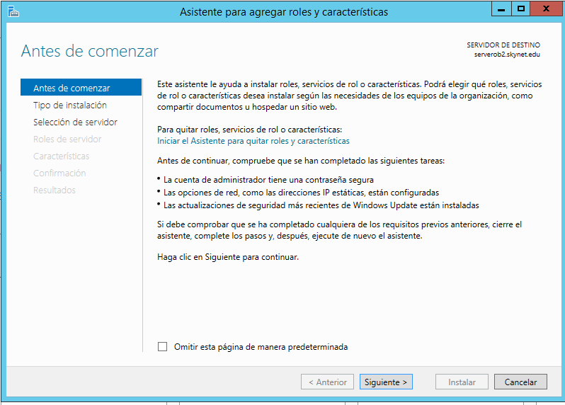
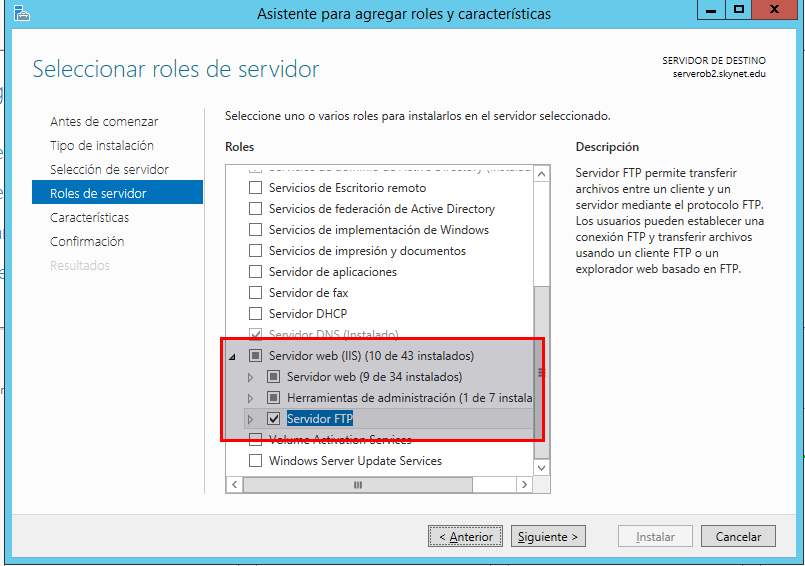
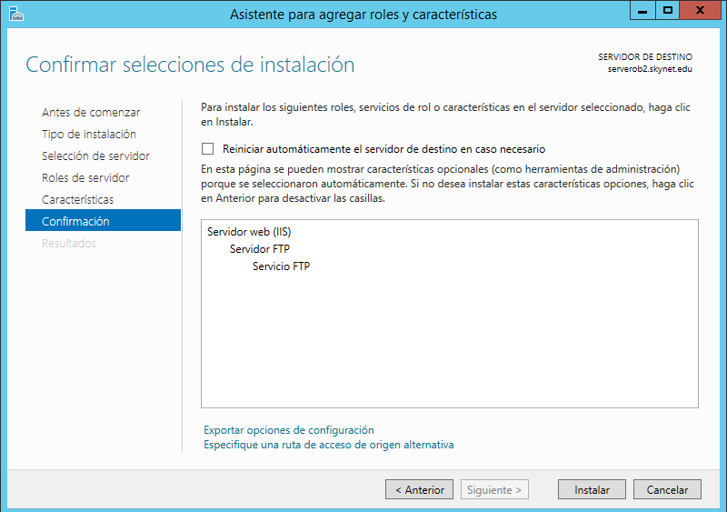
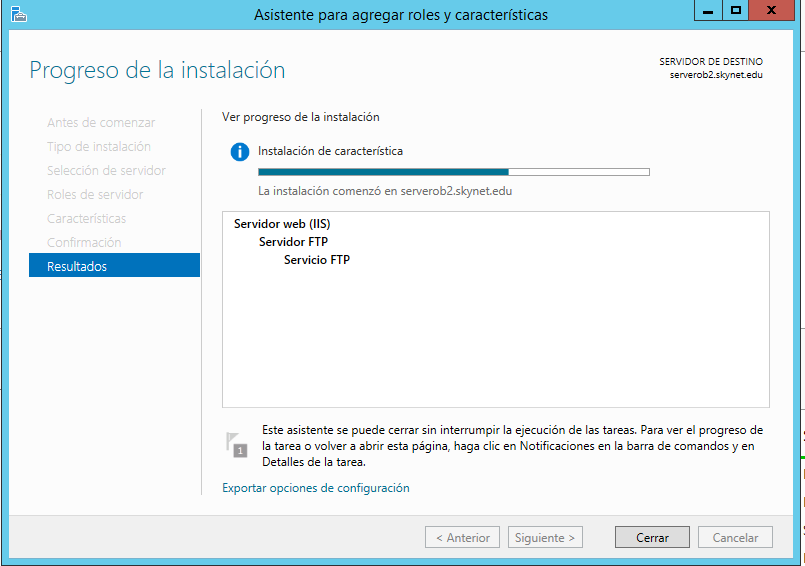

# Servicio FTP en Windows Server 2012

## 1. Agregar roles de FTP en Windows Server 2012

Tenemos que ir al administrador del servidor y le damos agregar roles.

Le damos siguiente.

Activamos la pestaña de Servidor `FTP`.

Le damos a instalar y comenzará la instalación del servicio de `FTP`.

