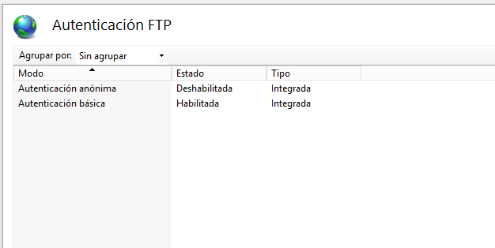
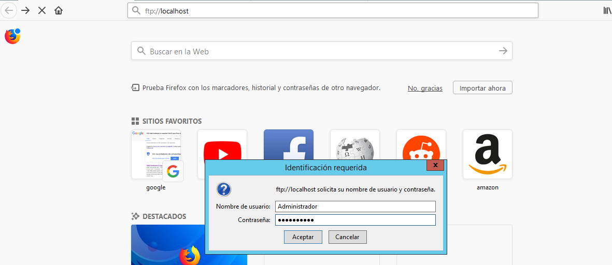
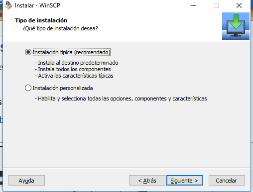
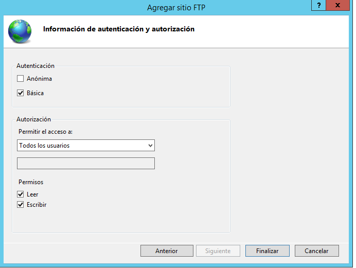

# Servicio FTP en Windows Server 2012

## 1. Agregar roles de FTP en Windows Server 2012

Tenemos que ir al administrador del servidor y le damos agregar roles.

Le damos siguiente.

Activamos la pestaña de Servidor `FTP`.

Le damos a instalar y comenzará la instalación del servicio de `FTP`.

## 2. Configurar FTP

Tenemos que ir a `administrador del servidor -> herramientas -> Administrador de Internet Information Services (IIS)`.

En Sitios web le damos `agregar sitio FTP`

- Se abre una nueva ventana y debemos configurar los siguientes paramétros.

Le damos siguiente.

Tenemos que configurar en la siguiente ventana la `dirección IP, si quieres que tenga SSL y habilitar un virtual host`.

- Configuramos en el siguiente paso, la autenticación, en este caso marcamos.
    - Anónima: `Desactivado`
    - Básica: `Habilitado`

- Permitir acceso a usuarios especificados:
    - `Administrador`
    - Permiso: `Leer y Escribir`

Ya tenemos configurado el FTP.

## 3. Configurar en el DNS el alias ftp.miempresa.edu

Tenemos que ir `administrador del servidor -> DNS`

Creamos el nuevo alias llamado `ftp`

Configuración final

## 4. Comprobamos los ficheros de configuración del ftp

Los siguientes ficheros son para configurar el servidor ftp.

- `Aislamiento de usuarios`: Es para que los usuarios no puedan subir mas arriba de su raíz establecida.

- `Autenticación Básica`: Establecer que solo puedan conectarse los usuarios básicos de Windows o anónimos.

- `Compatibilidad con el firewall:` Establecer reglas para el firewall

- `Configuración SSL de FTP`: Configurar ftp para modo seguro y encriptado.

- `Examen de Directorio`: Directorio raíz.

- `Reglas de autorización`: Lo usuarios que pueden conectarse al `FTP`

## 5. Conectarnos al FTP desde un navegador del servidor.

Tenemos que abrir el navegador y escribir el siguiente link `ftp://localhost`

Comprobamos y vemos todos los ficheros de la unidad `C:\`.

### 5.1 Accedemos desde un Equipo Cliente al ftp

Iniciamos o ejecutamos un navegador y escribimos lo siguiente. `ftp://ftp.miempresa.edu`.

- Comprobamos que desde el cliente podemos conectarnos al `FTP`

### 5.2 Instalación de WinSCP en el Equipo Cliente

Tenemos que entrar en la [página web de WinSCP](https://winscp.net/eng/docs/free_ftp_client_for_windows) y descargar el WinSCP cliente.

- Comenzamos la instalación `WinSCP`.

- Abrimos el `WinSCP` y establecemos el `usuario y la contraseña`.

Comprobamos que iniciamos al `FTP` desde el Equipo Cliente.

## 6. Configurar al directorio wwwroot de Inetpub para todos los usuarios.

Tenemos que agregar un sitio ftp nuevo.

Tenemos que configurar el enlace y SSL

Establecemos `permitir SSL` y establecemos un certificado SSL.

- Establecemos que todos los usuarios se puedan conectar.

- Importante tenemos que cambiar el `puerto ftp` porque entra en conflicto con el otro sitio de `FTP`.

### 6.1 En el Equipo Cliente nos conectamos al Servidor FTP mediante WinSCP.

Abrimos el programa de WinSCP y comprobamos si podemos iniciar sesión mediante `cifrado explícito`

Comprobamos que podemos acceder al FTP.

## 7. Crear un Sitio Nuevo FTP para usuarios anónimos.

Tenemos que ir al `IIS y crear un sitio FTP nuevo`.

Le damos siguiente.

Importante cambiar el puerto en este caso `2122` para no crear conflicto con los otros sitios FTP

Configuramos la autenticación y autorización.`Solo para anónimos`

Permiso solo de `Leer`.

### 7.1 Conectarnos desde el Programa WinSCP desde el Cliente.

Abrimos el WinSCP.

Accedemos al recurso de `FTP`.

Comprobamos si el usuario anónimos puede cambiar permisos.

Comprobamos que no puede cambiar nada, solo tiene permiso de lectura.

## 8. Comprobar que funciona el DNS con todos los FTP creados mediante WinSCP desde el Equipo Cliente.

Tenemos que abrir el WinSCP en el Equipo Cliente.

- Conexión con el Sitio `FTP` para un usuario especifico `Administrador`.

- Conexión con el Sitio `FTP` para todos los usuarios

- Conexión con el Sitio `FTP` para anónimos

