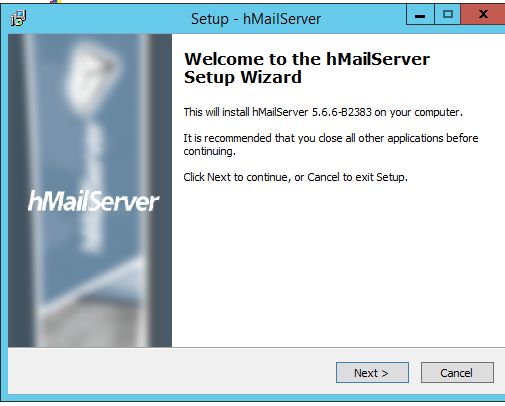

# ¿Que es HMailServer?

HMailServer es un servidor de correo gratuito y libre, para Microsoft Windows desarrollado en Suecia.

Es compatible con los protocolos habituales (IMAP, SMTP, POP3) e incorpora una biblioteca COM que puede usarse para su integración con otro software, o para realizar tareas complejas de manera automatizada a través de scripts. Admite también dominios virtuales, listas de distribución, antivirus, anti-spam, alias, dominios distribuidos, seguridad integrada con el Directorio Activo de Windows, Backup y bastantes cosas más.

## 1. Descargar HMailServer

Vamos a la página Web de [HMailServer](https://www.hmailserver.com/download) y descargamos la última versión.

## 2. Instalación de HMailServer.

- Al comenzar con la instalación nos dice que no puede instalar el `Net Framework 3.5`.

- Tenemos que ir `agregar roles nuevos -> Instalar Net Framework 3.5`

- Le damos siguiente para comenzar con la instalación.

Comprobamos que termina la instalación.

- Se nos abre una nueva ventana que nos permite conectar al `HMailServer`.

## 3. Crear dos dominios llamados `srd.edu` y `asir.edu`

Entramos a la aplicación o servicio de `HMailServer` y agregamos el siguiente dominio.

- `srd.edu`

- `asir.edu`

- Comprobamos que están creado los dos dominios independientes al Directorio Activo.

## 4. Ejecuta los diagnósticos para ambos dominios y soluciona el error de backup asignando una carpeta para tal fin. Establece copia de seguridad de los mensajes.

Vamos a `Utilities -> Diagnostics` seleccionamos un dominio.

- Comprobamos que da errores de backup porque no tenemos asignada ninguna carpeta.

- Comprobamos los cambios realizados.

- Comprobamos que ya no nos muestra el error de backup.

- Pero muestra un mensaje de `MX` es problema de DNS.

## 5. Crea dos cuentas para dos usuarios ficticios en cada uno de los dos dominios. Investiga y configura las cuentas con diferentes opciones (cuota de disco, auto-reply, forwarding, signature, etc.)

## 6. Configura el servicio DNS para crear las entradas mail.srd.edu y mail.asir.edu que apunten a la dirección ip del servidor windows 2012.

Vamos al `DNS` y vamos a crear dos zonas maestras nuevas.

