# Windows 2012 Server SMTP

## 1. Agregar Roles de SMTP

Tenemos que ir a `administrador del servidor -> agregar nuevos roles`

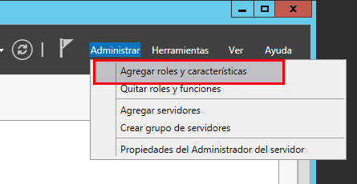

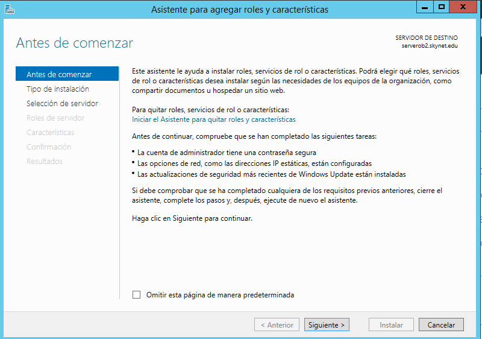

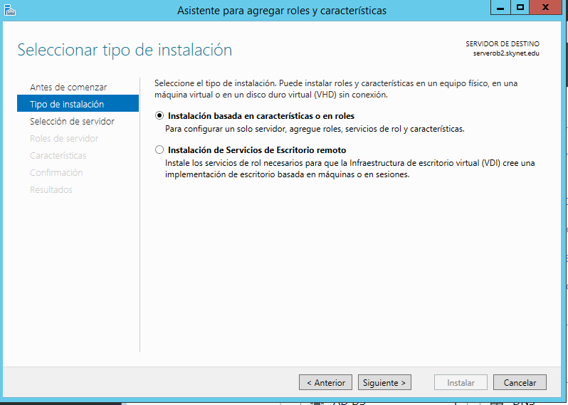

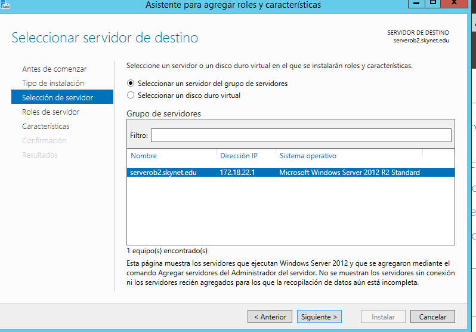

- Seleccionamos características. Marcamos `SMTP`

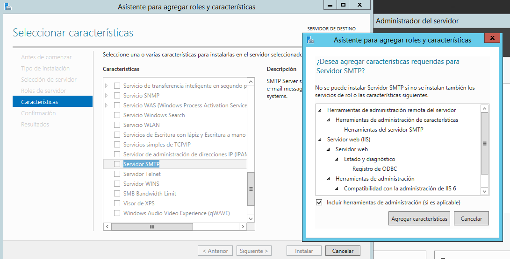

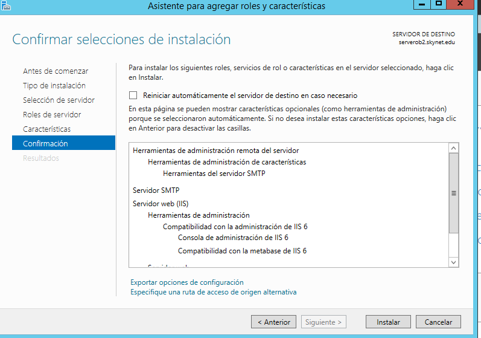

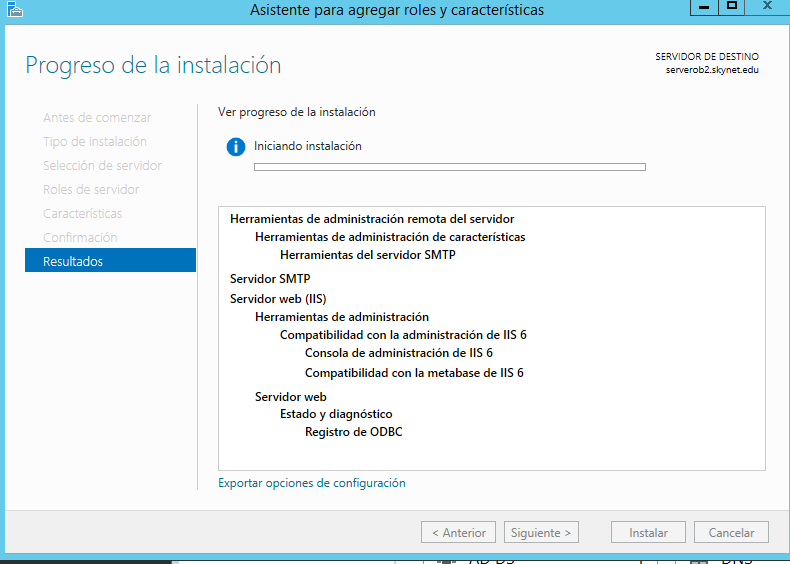

Vamos a `herramientas -> Administrador de Internet Information Services (IIS) 6.0`

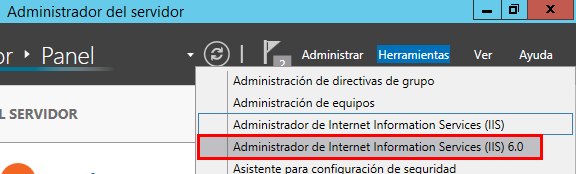

- Seleccionamos el `SMTP Virtual Server` y con el botón secundario del ratón le damos a `propiedades`

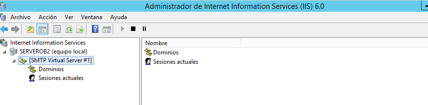

### 1.1 Configuramos la `Dirección IP`

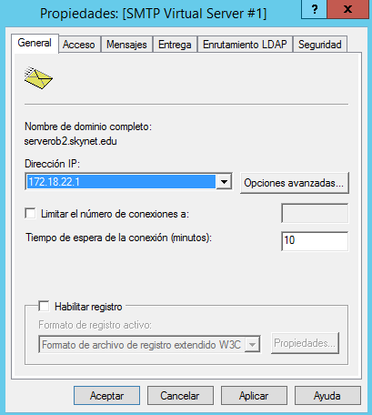

### 1.2 Limitar el número de conexiones a 50

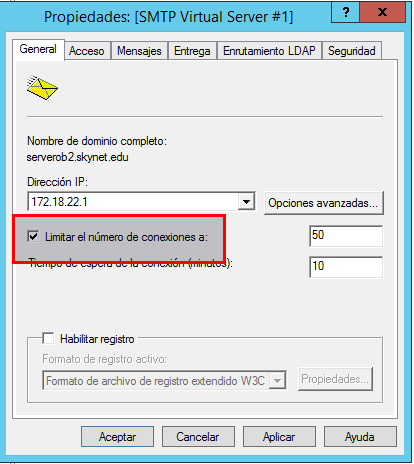

### 1.3 Habilitar el registro en formato W3C, diario y en una carpeta determinada.

### 1.4 Configurar envío de mensajes dentro de nuestra red local: Aceptar la conexión al servidor y la retransmisión de mensajes a todos los equipos menos los que aparecen en la lista (incluir una IP cualquiera en la lista para impedir su acceso y retransmisión)

### 1.5 Establecer autenticación anónima

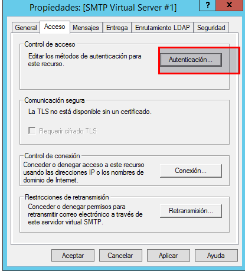

- Seleccionamos autenticación.

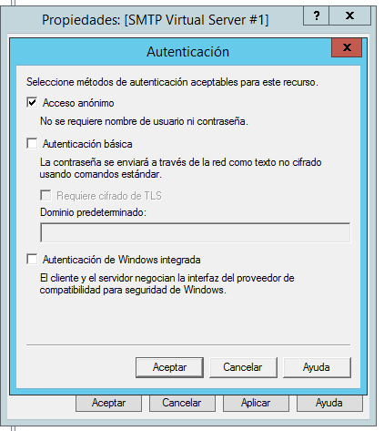

### 1.6 Echar un vistazo al resto de opciones de configuración del servidor. Aplicar cambios y reiniciar servicio.

### 1.7 Comprobar la existencia del dominio AD predeterminado. Crea un dominio de tipo alias para disponer de cuentas en otro dominio.

### 1.8 Comprueba carpetas de correo creados en C:\Inetpub\mailroot.
