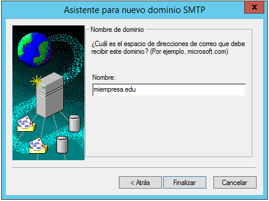

# Windows 2012 Server SMTP

## 1. Agregar Roles de SMTP

Tenemos que ir a `administrador del servidor -> agregar nuevos roles`

- Seleccionamos características. Marcamos `SMTP`

Vamos a `herramientas -> Administrador de Internet Information Services (IIS) 6.0`

- Seleccionamos el `SMTP Virtual Server` y con el botón secundario del ratón le damos a `propiedades`

### 1.1 Configuramos la `Dirección IP`

### 1.2 Limitar el número de conexiones a 50

### 1.3 Habilitar el registro en formato W3C, diario y en una carpeta determinada.

Vamos a la pestaña general, habilitamos en el registro, le damos propiedades.

### 1.4 Configurar envío de mensajes dentro de nuestra red local: Aceptar la conexión al servidor y la retransmisión de mensajes a todos los equipos menos los que aparecen en la lista (incluir una IP cualquiera en la lista para impedir su acceso y retransmisión)

En caso que queremos denegar una IP, solo tenemos que agregar dicha dirección IP

### 1.5 Establecer autenticación anónima

- Seleccionamos autenticación.

### 1.6 Echar un vistazo al resto de opciones de configuración del servidor. Aplicar cambios y reiniciar servicio.

- Comprobamos la pestaña de mensajes. En este apartado es para limitar el tamaño de los mensajes.

- Entrega de los mensajes

- Enrutamiento con LDAP

- Seguridad

### 1.7 Comprobar la existencia del dominio AD predeterminado. Crea un dominio de tipo alias para disponer de cuentas en otro dominio.

En dominios le damos nuevo.

- Escribimos el nombre del dominio.

### 1.8 Comprueba carpetas de correo creados en C:\Inetpub\mailroot.

Comprobamos que se crearón correctamente las carpetas de correo.

## 2. En el cliente Windows 7:

### 2.1 Comprobar acceso al nuevo nombre DNS creado en el servidor.

### 2.2 Configurar el cliente de correo Live mail agregando dos cuentas de correo cualesquiera (usuarios AD -dominio- y no AD). Se deberá especificar: usuario / buzón, contraseña,  servidor SMTP.

### 2.3 Enviar varios correos desde / hacia las diferentes cuentas y comprobar envío (real o ficticio) y carpetas mailroot. Las carpetas existentes en mailroot alojan mensajes en cola (Queue), mensajes para destinatarios desconocidos (Badmail) y mensajes entregados (Drop)

## 3. Nueva configuración de servicio SMTP a través del administrador de aplicaciones (IIS) 6.0. Establecer autenticación básica de Windows. Probar diferentes configuraciones de dominio predeterminado, cifrado TLS, etc.

## 4. En el cliente Windows:

### 4.1 Configurar las cuentas según los parámetros especificados en el servidor. Enviar varios correos desde / hacia las diferentes cuentas y comprobar envío y carpetas mailroot. En este caso sólo tendrán acceso al servidor SMTP cuentas del dominio y correspondientes a usuarios de AD.
